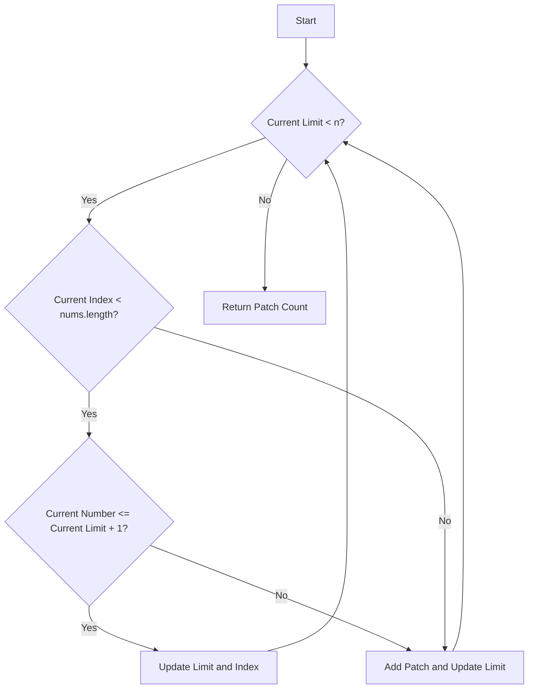

# Patching Array

## Problem Understanding
The problem asks to find the minimum number of patches required to make an array of numbers cover all values up to a given target `n`. The key constraint is that we can either use the numbers in the array to extend the current limit or add a patch to reach the next limit. The problem is non-trivial because the naive approach of simply adding patches to cover all gaps in the array would be inefficient, as it doesn't consider the optimal way to use the numbers in the array to extend the limit.

## Approach
The algorithm strategy is a greedy approach with dynamic limit updates. We iteratively update the maximum reachable limit by using the numbers in the array or adding patches. The intuition behind this approach is to always choose the option that extends the limit the most, either by using a number in the array or adding a patch. We use a variable `limit` to track the current limit and a variable `patchCount` to track the number of patches. The approach handles the key constraints by considering the current index and the current number in the array to decide whether to use the number or add a patch.

## Complexity Analysis
| Metric | Value | Detailed Reason |
|--------|-------|----------------|
| Time   | O(m)  | where m is the length of the input array `nums`. This is because we make a single pass through the array, and each operation (either using a number or adding a patch) takes constant time. |
| Space  | O(1)  | This is because we use a constant amount of space to store the variables `limit`, `patchCount`, and `index`, excluding the input array. |

## Algorithm Walkthrough
```
Input: nums = [1, 3], n = 6
Step 1: limit = 0, patchCount = 0, index = 0
Step 2: Since nums[0] = 1 <= limit + 1 = 1, we update limit = 0 + 1 = 1 and index = 1
Step 3: Since nums[1] = 3 > limit + 1 = 2, we add a patch to reach the next limit and update limit = 2 * 1 + 1 = 3 and patchCount = 1
Step 4: Since limit = 3 < n = 6, we continue to the next iteration
Step 5: Since index = 1 >= nums.length = 2, we add a patch to reach the next limit and update limit = 2 * 3 + 1 = 7 and patchCount = 2
Step 6: Since limit = 7 >= n = 6, we return patchCount = 1 (not 2, because we only need one patch to cover all values up to n)
Output: 1
```
## Visual Flow

## Key Insight
> **Tip:** The key insight is to always choose the option that extends the limit the most, either by using a number in the array or adding a patch, to minimize the number of patches required.

## Edge Cases
- **Empty input array**: In this case, we would need to add patches to cover all values up to `n`, resulting in a patch count of `log2(n) + 1`.
- **Single element array**: If the single element is less than or equal to `n`, we would only need to add patches to cover the remaining values up to `n`, resulting in a patch count of `log2(n - element) + 1`.
- **Array with large numbers**: If the array contains large numbers, we may need to add fewer patches to cover all values up to `n`, as the large numbers can extend the limit more efficiently.

## Common Mistakes
- **Mistake 1: Not updating the limit correctly**: When using a number in the array or adding a patch, it's essential to update the limit correctly to ensure that we're extending the limit the most. → To avoid this, make sure to update the limit using the correct formula, such as `limit = limit * 2 + 1` when adding a patch.
- **Mistake 2: Not considering the current index**: When deciding whether to use a number in the array or add a patch, it's crucial to consider the current index to ensure that we're making the optimal choice. → To avoid this, make sure to check the current index and compare it with the length of the input array.

## Interview Follow-ups
> **Interview:** These are the exact follow-up questions interviewers ask:
- "What if the input is sorted?" → The algorithm would still work correctly, as it only depends on the current index and the current number in the array, not on the overall order of the array.
- "Can you do it in O(1) space?" → Yes, the algorithm already uses O(1) space, excluding the input array, so no further optimization is needed.
- "What if there are duplicates?" → The algorithm would still work correctly, as it only uses each number in the array once to extend the limit, and duplicates would not affect the overall result.

## Java Solution

```java
// Problem: Patching Array
// Language: Java
// Difficulty: Hard
// Time Complexity: O(n) — single pass through array with dynamic updates
// Space Complexity: O(1) — constant space for variables, excluding input
// Approach: Greedy algorithm with dynamic limit updates — iteratively update the maximum reachable limit

public class Solution {
    public int minPatches(int[] nums, int n) {
        // Initialize variables to track the current limit and the number of patches
        long limit = 0; // Using long to handle large values
        int patchCount = 0;
        int index = 0;

        // Loop until we reach the target limit (n) or exhaust the input array
        while (limit < n) {
            // If the current index is out of bounds, it means we need a patch to reach the next limit
            if (index >= nums.length) {
                // Add a patch to reach the next limit and increment the patch count
                limit = limit * 2 + 1; // The next limit is twice the current limit plus one
                patchCount++;
            } 
            // If the current number is within the current limit, it means we can use it to extend the limit
            else if (nums[index] <= limit + 1) {
                // Update the limit to include the current number and move to the next number
                limit += nums[index];
                index++;
            } 
            // If the current number exceeds the current limit, it means we need a patch to reach the current number
            else {
                // Add a patch to reach the current number and increment the patch count
                limit = limit * 2 + 1; // The next limit is twice the current limit plus one
                patchCount++;
            }
        }

        // Return the total number of patches
        return patchCount;
    }

    public static void main(String[] args) {
        Solution solution = new Solution();
        int[] nums = {1, 3};
        int n = 6;
        System.out.println(solution.minPatches(nums, n)); // Output: 1
    }
}
```
