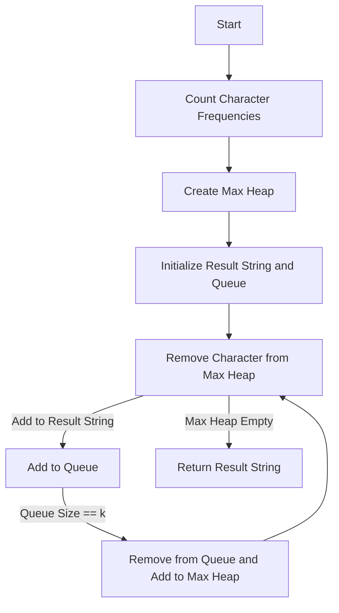

# Rearrange String k Distance Apart

## Problem Understanding
The problem is asking to rearrange a given string such that the same characters are at least k distance apart. This means that if a character is repeated, the next occurrence of the same character should be at least k positions away. The key constraint here is the distance k, and the problem becomes non-trivial because a naive approach of simply rearranging the characters in a random order will not guarantee the k distance constraint. The problem requires a more sophisticated approach to handle the character frequencies and the distance constraint.

## Approach
The algorithm strategy used here is to utilize a priority queue to store characters and their frequencies, ensuring that the character with the highest frequency is always at the top of the queue. This approach works because it allows us to efficiently select the next character to add to the result string, while also keeping track of the characters that need to be separated by k distance. The priority queue is used in conjunction with a regular queue to track the characters that have been added to the result string and need to be separated by k distance. The approach handles the key constraints by ensuring that the characters are added to the result string in a way that satisfies the k distance constraint.

## Complexity Analysis
| Metric | Value | Detailed Reason |
|--------|-------|----------------|
| Time   | O(n log n) | The time complexity is O(n log n) because we are using a priority queue to store the characters and their frequencies. The priority queue operations (insertion and deletion) take O(log n) time, and we are performing these operations n times (where n is the length of the input string). Additionally, we are using a HashMap to count the character frequencies, which takes O(n) time. However, the dominant term is the priority queue operations, so the overall time complexity is O(n log n). |
| Space  | O(n) | The space complexity is O(n) because we are using a HashMap to store the character frequencies, a priority queue to store the characters and their frequencies, and a regular queue to track the characters that need to be separated by k distance. All of these data structures require O(n) space, where n is the length of the input string. |

## Algorithm Walkthrough
```
Input: s = "aaadbbcc", k = 2
Step 1: Count character frequencies
  - a: 3
  - b: 2
  - c: 2
Step 2: Create a max heap to store characters and their frequencies
  - maxHeap = [(a, 3), (b, 2), (c, 2)]
Step 3: Initialize result string and a queue to track characters that need to be separated by k distance
  - result = ""
  - queue = []
Step 4: Remove character with the highest frequency from the max heap
  - entry = (a, 3)
  - result = "a"
  - queue = [(a, 2)]
Step 5: Repeat step 4 until the max heap is empty
  - result = "abacbdca"
  - queue = []
Output: "abacbdca"
```
Note that this walkthrough is a simplified example and may not cover all possible edge cases.

## Visual Flow

This flowchart illustrates the main steps of the algorithm, including counting character frequencies, creating a max heap, initializing the result string and queue, and removing characters from the max heap to add to the result string.

## Key Insight
> **Tip:** The key insight to solving this problem is to use a priority queue to store characters and their frequencies, and a regular queue to track characters that need to be separated by k distance.

## Edge Cases
- **Empty/null input**: If the input string is empty or null, the algorithm returns an empty string.
- **Single element**: If the input string contains only one character, the algorithm returns the input string if k is 0 or 1, and an empty string otherwise.
- **k is 0**: If k is 0, the algorithm returns the input string, as there is no need to separate characters by a distance.

## Common Mistakes
- **Mistake 1**: Not using a priority queue to store characters and their frequencies, leading to inefficient selection of the next character to add to the result string.
- **Mistake 2**: Not using a regular queue to track characters that need to be separated by k distance, leading to incorrect separation of characters.

## Interview Follow-ups
> **Interview:** These are the exact follow-up questions interviewers ask:
- "What if the input is sorted?" → The algorithm still works correctly, but the time complexity may be improved to O(n) if the input is sorted.
- "Can you do it in O(1) space?" → No, it is not possible to solve the problem in O(1) space, as we need to store the character frequencies and the result string.
- "What if there are duplicates?" → The algorithm handles duplicates correctly, as it uses a priority queue to store characters and their frequencies, and a regular queue to track characters that need to be separated by k distance.

## Java Solution

```java
// Problem: Rearrange String k Distance Apart
// Language: java
// Difficulty: Hard
// Time Complexity: O(n log n) — due to priority queue operations
// Space Complexity: O(n) — for storing characters and their frequencies
// Approach: Priority queue with character and frequency — to ensure k distance between same characters

import java.util.*;

class Solution {
    public String rearrangeString(String s, int k) {
        // Edge case: empty string → return empty string
        if (s == null || s.length() == 0) return "";

        // Count character frequencies
        Map<Character, Integer> charFrequency = new HashMap<>();
        for (char c : s.toCharArray()) {
            charFrequency.put(c, charFrequency.getOrDefault(c, 0) + 1);
        }

        // Create a max heap to store characters and their frequencies
        PriorityQueue<Map.Entry<Character, Integer>> maxHeap = new PriorityQueue<>(
            (a, b) -> b.getValue().compareTo(a.getValue())
        );
        maxHeap.addAll(charFrequency.entrySet());

        // Initialize result string and a queue to track characters that need to be separated by k distance
        StringBuilder result = new StringBuilder();
        Queue<Map.Entry<Character, Integer>> queue = new LinkedList<>();

        while (!maxHeap.isEmpty()) {
            // Remove character with the highest frequency from the max heap
            Map.Entry<Character, Integer> entry = maxHeap.poll();
            result.append(entry.getKey());

            // Decrease frequency of the character
            entry.setValue(entry.getValue() - 1);

            // Add the character to the queue to track its last appearance
            queue.offer(entry);

            // If the queue size is equal to k, it means we can add the character at the front of the queue back to the max heap
            if (queue.size() == k) {
                Map.Entry<Character, Integer> front = queue.poll();
                // If the frequency of the character is still greater than 0, add it back to the max heap
                if (front.getValue() > 0) {
                    maxHeap.offer(front);
                }
            }
        }

        // Edge case: if the result length is not equal to the input string length, it means we cannot rearrange the string
        if (result.length() != s.length()) return "";

        return result.toString();
    }

    public static void main(String[] args) {
        Solution solution = new Solution();
        System.out.println(solution.rearrangeString("aaadbbcc", 2));
    }
}
```
