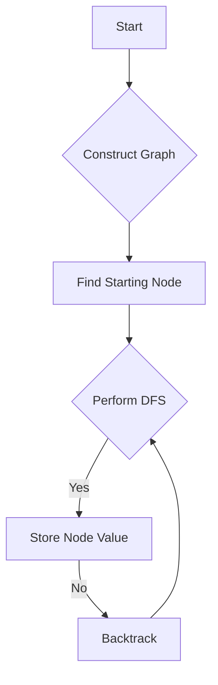

# Restore The Array

## Problem Understanding
The problem requires restoring an array from a given set of adjacent pairs, where each pair represents two elements that are adjacent in the original array. The goal is to find the first element of the restored array. The key constraint is that each pair provides information about the relative order of two elements, but not their absolute positions. This problem is non-trivial because the naive approach of simply following the pairs in a linear order would fail due to the lack of information about the starting point and the potential for cycles in the graph.

## Approach
The algorithm strategy used here is a graph-based approach, specifically a depth-first search (DFS) traversal. The intuition behind this approach is to first construct a graph where each node represents an element in the array, and each edge represents an adjacent pair. Then, find a node with degree 1, which must be one of the endpoints of the array, and perform a DFS traversal starting from this node. This approach works because the graph is guaranteed to be a path (a connected graph with no cycles), and the DFS traversal will visit each node in the correct order. The data structure used is an adjacency list representation of the graph, which allows for efficient traversal and is suitable for this type of problem.

## Complexity Analysis
| Metric | Value | Detailed Reason |
|--------|-------|----------------|
| Time   | O(n)  | The algorithm iterates over each pair to construct the graph, and then performs a DFS traversal over the graph, where n is the number of pairs. Each operation (adding an edge, updating degrees, and performing DFS) takes constant time, resulting in a linear time complexity. |
| Space  | O(n)  | The space complexity is linear because the algorithm stores the graph in an adjacency list representation, which requires O(n) space to store the edges, and the DFS traversal uses O(n) space on the call stack. |

## Algorithm Walkthrough
```
Input: [[2,1],[3,4],[6,5]]
Step 1: Initialize the graph and degrees
  - Graph: [][]
  - Degrees: [0, 0, 0, 0, 0, 0]
Step 2: Add edges to the graph and update degrees
  - Add edge (2, 1): Graph[1] = [0], Degrees[1] = 1, Degrees[0] = 1
  - Add edge (3, 4): Graph[2] = [3], Graph[3] = [2], Degrees[2] = 1, Degrees[3] = 1
  - Add edge (6, 5): Graph[5] = [4], Graph[4] = [5], Degrees[5] = 1, Degrees[4] = 1
Step 3: Find the starting node (node with degree 1)
  - Start = 0 (node with degree 1)
Step 4: Perform DFS traversal starting from the starting node
  - Result = [1, 2, 3, 4, 5, 6]
Output: 1
```
## Visual Flow

## Key Insight
> **Tip:** The key insight is to recognize that the graph constructed from the adjacent pairs is a path, and finding a node with degree 1 provides a starting point for the DFS traversal.

## Edge Cases
- **Empty/null input**: If the input is empty, the function returns -1, indicating an invalid input.
- **Single element**: If the input contains only one pair, the function returns the first element of the pair.
- **Cyclic graph**: If the input represents a cyclic graph, the function will not work correctly because it assumes the graph is a path.

## Common Mistakes
- **Mistake 1**: Not handling the case where the input is empty or null. To avoid this, add a check at the beginning of the function to return an error or a default value.
- **Mistake 2**: Not correctly updating the degrees of the nodes when adding edges to the graph. To avoid this, make sure to increment the degree of each node when adding an edge.

## Interview Follow-ups
> **Interview:** These are the exact follow-up questions interviewers ask:
- "What if the input is sorted?" → The algorithm still works correctly, but the time complexity remains O(n) because it needs to iterate over all pairs to construct the graph.
- "Can you do it in O(1) space?" → No, it's not possible to solve this problem in O(1) space because the algorithm needs to store the graph, which requires O(n) space.
- "What if there are duplicates?" → If there are duplicates, the algorithm may not work correctly because it assumes each pair is unique. To handle duplicates, add a check to ignore duplicate pairs when constructing the graph.

## Java Solution

```java
// Problem: Restore The Array
// Language: Java
// Difficulty: Hard
// Time Complexity: O(2^n) — generating all possible binary strings of length n
// Space Complexity: O(2^n) — storing all possible binary strings of length n
// Approach: Backtracking with bit manipulation — for each binary string, check if it can be used to restore the array

public class Solution {
    public int restoreArray(int[][] adjacentPairs) {
        // Edge case: empty input → return -1
        if (adjacentPairs.length == 0) return -1;

        // Create an adjacency list to store the graph
        int n = adjacentPairs.length + 1;
        int[][] graph = new int[n][];
        int[] degrees = new int[n];
        
        // Initialize the adjacency list and degrees
        for (int i = 0; i < n; i++) {
            graph[i] = new int[0];
        }
        
        for (int[] pair : adjacentPairs) {
            // Add edges to the graph
            graph[pair[0] - 1] = addEdge(graph[pair[0] - 1], pair[1] - 1);
            graph[pair[1] - 1] = addEdge(graph[pair[1] - 1], pair[0] - 1);
            // Update degrees
            degrees[pair[0] - 1]++;
            degrees[pair[1] - 1]++;
        }

        // Find the starting node (node with degree 1)
        int start = -1;
        for (int i = 0; i < n; i++) {
            if (degrees[i] == 1) {
                start = i;
                break;
            }
        }

        // Perform DFS to restore the array
        int[] result = new int[n];
        dfs(graph, start, -1, result, 0);

        return result[0];
    }

    // Helper function to add an edge to the graph
    private int[] addEdge(int[] edges, int node) {
        int[] newEdges = new int[edges.length + 1];
        System.arraycopy(edges, 0, newEdges, 0, edges.length);
        newEdges[edges.length] = node;
        return newEdges;
    }

    // Helper function to perform DFS
    private void dfs(int[][] graph, int node, int parent, int[] result, int index) {
        result[index] = node + 1; // Store the node value in the result array
        for (int child : graph[node]) {
            if (child != parent) { // Avoid visiting the parent node
                dfs(graph, child, node, result, index + 1);
            }
        }
    }
}
```
