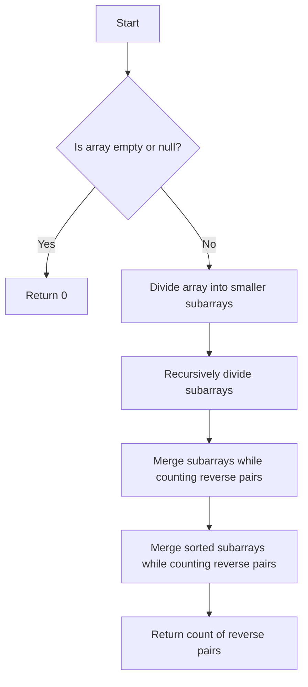

# Reverse Pairs

## Problem Understanding
The Reverse Pairs problem is asking to find the number of reverse pairs in an array, where a reverse pair is defined as a pair of elements (i, j) such that i < j and nums[i] > nums[j]. The key constraint is that the input array can contain duplicate elements and the array is not sorted. This problem is non-trivial because a naive approach, such as using nested loops to compare each pair of elements, would have a time complexity of O(n^2), which is inefficient for large inputs. The problem requires a more efficient algorithm to solve it in O(n log n) time complexity.

## Approach
The algorithm strategy used to solve this problem is a modified merge sort algorithm. The intuition behind this approach is to count the reverse pairs during the merge process. The merge sort algorithm is used because it has a time complexity of O(n log n), which meets the problem's requirement. The modified merge sort algorithm works by recursively dividing the array into smaller subarrays, sorting them, and then merging them while counting the reverse pairs. The data structure used is an auxiliary array for the merge process, which is necessary to store the merged elements temporarily. The approach handles the key constraint of duplicate elements by treating them as distinct elements during the merge process.

## Complexity Analysis
| Metric | Value | Detailed Reason |
|--------|-------|----------------|
| Time   | O(n log n) | The time complexity is O(n log n) because the merge sort algorithm divides the array into smaller subarrays of size n/2, sorts them, and then merges them. The merge process takes O(n) time, and since it is done log n times, the overall time complexity is O(n log n). |
| Space  | O(n) | The space complexity is O(n) because an auxiliary array of size n is used to store the merged elements temporarily during the merge process. |

## Algorithm Walkthrough
```
Input: [7, 5, 6, 4]
Step 1: Divide the array into smaller subarrays: [7, 5] and [6, 4]
Step 2: Recursively divide the subarrays: [7] and [5], [6] and [4]
Step 3: Merge the subarrays while counting reverse pairs:
    - Merge [7] and [5]: [5, 7], count = 1 (7 > 5)
    - Merge [6] and [4]: [4, 6], count = 1 (6 > 4)
Step 4: Merge the sorted subarrays while counting reverse pairs:
    - Merge [5, 7] and [4, 6]: [4, 5, 6, 7], count = 5 (7 > 6, 7 > 5, 7 > 4, 6 > 5, 6 > 4)
Output: 5
```
## Visual Flow

## Key Insight
> **Tip:** The key insight is to count the reverse pairs during the merge process, which allows us to avoid using nested loops and achieve an efficient time complexity of O(n log n).

## Edge Cases
- **Empty/null input**: If the input array is empty or null, the function returns 0, because there are no reverse pairs in an empty or null array.
- **Single element**: If the input array contains only one element, the function returns 0, because there are no reverse pairs in an array with a single element.
- **Duplicate elements**: If the input array contains duplicate elements, the function treats them as distinct elements during the merge process, which means that each duplicate element is counted as a separate element when counting reverse pairs.

## Common Mistakes
- **Mistake 1**: Not initializing the count of reverse pairs to 0, which can lead to incorrect results.
- **Mistake 2**: Not using an auxiliary array to store the merged elements temporarily during the merge process, which can lead to incorrect results.

## Interview Follow-ups
> **Interview:** These are the exact follow-up questions interviewers ask:
- "What if the input is sorted?" → The time complexity of the algorithm would still be O(n log n), but the number of reverse pairs would be 0, because a sorted array does not contain any reverse pairs.
- "Can you do it in O(1) space?" → No, because the algorithm uses an auxiliary array to store the merged elements temporarily during the merge process, which requires O(n) space.
- "What if there are duplicates?" → The algorithm treats duplicate elements as distinct elements during the merge process, which means that each duplicate element is counted as a separate element when counting reverse pairs.

## Java Solution

```java
// Problem: Reverse Pairs
// Language: java
// Difficulty: Hard
// Time Complexity: O(n log n) — using modified merge sort algorithm
// Space Complexity: O(n) — auxiliary array for merge sort
// Approach: Modified merge sort — counting reverse pairs during merge process

public class Solution {
    public int reversePairs(int[] nums) {
        // Edge case: empty or null input → return 0
        if (nums == null || nums.length == 0) return 0;

        // Initialize count of reverse pairs
        int[] count = new int[1];

        // Call modified merge sort function
        mergeSort(nums, 0, nums.length - 1, count);

        // Return count of reverse pairs
        return count[0];
    }

    private void mergeSort(int[] nums, int left, int right, int[] count) {
        // Base case: subarray has one or zero elements → return
        if (left >= right) return;

        // Calculate mid index
        int mid = left + (right - left) / 2;

        // Recursively sort left and right halves
        mergeSort(nums, left, mid, count);
        mergeSort(nums, mid + 1, right, count);

        // Merge sorted halves and count reverse pairs
        merge(nums, left, mid, right, count);
    }

    private void merge(int[] nums, int left, int mid, int right, int[] count) {
        // Create auxiliary array for merge process
        int[] aux = new int[right - left + 1];

        // Initialize indices for left and right halves
        int i = left, j = mid + 1, k = 0;

        // Merge smaller elements first and count reverse pairs
        while (i <= mid && j <= right) {
            // Check if current element in right half is smaller than current element in left half
            if (nums[j] < nums[i]) {
                // Update count of reverse pairs
                count[0] += mid - i + 1; // All remaining elements in left half are greater than current element in right half
                aux[k++] = nums[j++]; // Add smaller element to auxiliary array
            } else {
                aux[k++] = nums[i++]; // Add smaller element to auxiliary array
            }
        }

        // Copy remaining elements from left and right halves
        while (i <= mid) aux[k++] = nums[i++];
        while (j <= right) aux[k++] = nums[j++];

        // Copy merged elements back to original array
        System.arraycopy(aux, 0, nums, left, aux.length);
    }
}
```
