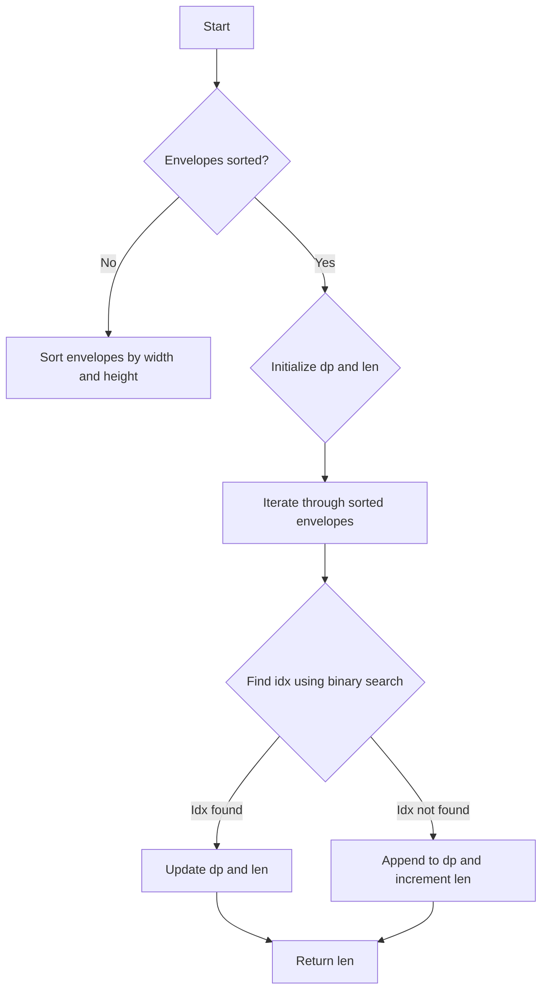

# Russian Doll Envelopes

## Problem Understanding
The Russian Doll Envelopes problem is asking to find the maximum number of envelopes that can be nested inside each other, given a set of envelopes with different widths and heights. The key constraint is that an envelope can be nested inside another envelope only if its width and height are both smaller than the other envelope. What makes this problem non-trivial is that the envelopes are not guaranteed to be sorted in any particular order, and a naive approach of trying all possible combinations of envelopes would result in an exponential time complexity. The problem requires a more efficient algorithm to find the longest sequence of increasing envelope sizes.

## Approach
The algorithm strategy used to solve this problem is a modified version of the Longest Increasing Subsequence (LIS) algorithm. The intuition behind it is to sort the envelopes based on their widths and then use a dynamic programming approach to find the longest sequence of increasing envelope sizes. The envelopes are sorted in ascending order of width and then in descending order of height for envelopes with the same width. This ensures that if two envelopes have the same width, the one with the smaller height comes first. The dynamic programming array `dp` is used to store the lengths of the longest increasing subsequences, and binary search is used to find the index of the smallest element in `dp` that is greater than or equal to the current height.

## Complexity Analysis
| Metric | Value | Detailed Reason |
|--------|-------|----------------|
| Time   | O(n log n) | The time complexity is dominated by the sorting step, which takes O(n log n) time. The binary search operation takes O(log n) time, and since it is performed n times, the total time complexity remains O(n log n). |
| Space  | O(n) | The space complexity is O(n) because the dynamic programming array `dp` has a size of n, where n is the number of envelopes. |

## Algorithm Walkthrough
```
Input: [[5, 4], [6, 4], [6, 7], [2, 3]]
Step 1: Sort the envelopes based on width and then height in reverse order:
         [[2, 3], [5, 4], [6, 7], [6, 4]]
Step 2: Initialize the dynamic programming array `dp` and the length `len` to 0:
         dp = [0, 0, 0, 0], len = 0
Step 3: Iterate through the sorted envelopes and update `dp` and `len`:
         For envelope [2, 3], idx = binarySearch(dp, 0, 0, 3) = 0, dp = [3, 0, 0, 0], len = 1
         For envelope [5, 4], idx = binarySearch(dp, 0, 1, 4) = 1, dp = [3, 4, 0, 0], len = 2
         For envelope [6, 7], idx = binarySearch(dp, 0, 2, 7) = 2, dp = [3, 4, 7, 0], len = 3
         For envelope [6, 4], idx = binarySearch(dp, 0, 3, 4) = 1, dp remains the same, len remains the same
Output: len = 3
```
## Visual Flow

## Key Insight
> **Tip:** The key to solving this problem is to sort the envelopes in a way that allows us to use a dynamic programming approach to find the longest increasing subsequence.

## Edge Cases
- **Empty/null input**: If the input is empty or null, the function returns 0, as there are no envelopes to nest.
- **Single element**: If the input contains only one envelope, the function returns 1, as a single envelope can be nested inside itself.
- **Envelopes with same width and height**: If two envelopes have the same width and height, they are considered to be the same envelope and can only be nested once.

## Common Mistakes
- **Mistake 1**: Not sorting the envelopes correctly, leading to incorrect results. → To avoid this, make sure to sort the envelopes based on width and then height in reverse order.
- **Mistake 2**: Not using binary search to find the index of the smallest element in `dp` that is greater than or equal to the current height. → To avoid this, use binary search to find the index, as it is more efficient than a linear search.

## Interview Follow-ups
> **Interview:** These are the exact follow-up questions interviewers ask:
- "What if the input is sorted?" → The algorithm still works, but the sorting step can be skipped, reducing the time complexity to O(n).
- "Can you do it in O(1) space?" → No, the algorithm requires O(n) space to store the dynamic programming array `dp`.
- "What if there are duplicates?" → The algorithm can handle duplicates, as it uses a dynamic programming approach to find the longest increasing subsequence.

## Java Solution

```java
// Problem: Russian Doll Envelopes
// Language: Java
// Difficulty: Hard
// Time Complexity: O(n log n) — sorting and binary search
// Space Complexity: O(n) — dynamic programming array
// Approach: Modified Longest Increasing Subsequence (LIS) — find the longest sequence of increasing envelope sizes

import java.util.Arrays;

public class Solution {
    public int maxEnvelopes(int[][] envelopes) {
        // Edge case: empty input → return 0
        if (envelopes.length == 0) return 0;

        // Sort envelopes based on width and then height in reverse order
        Arrays.sort(envelopes, (a, b) -> a[0] == b[0] ? b[1] - a[1] : a[0] - b[0]); // descending height for same width

        int[] dp = new int[envelopes.length]; // dynamic programming array to store LIS
        int len = 0; // length of the LIS

        for (int[] envelope : envelopes) {
            // Find the index of the smallest element in dp that is greater than or equal to the current height
            int idx = binarySearch(dp, 0, len, envelope[1]); // use binary search for efficiency

            // Update dp at the found index or append to dp if not found
            dp[idx] = envelope[1];
            if (idx == len) len++; // increase the length of the LIS if a new element is appended
        }

        return len; // return the length of the LIS
    }

    // Binary search to find the index of the smallest element in dp that is greater than or equal to the target
    private int binarySearch(int[] dp, int left, int right, int target) {
        while (left < right) {
            int mid = left + (right - left) / 2; // calculate the middle index
            if (dp[mid] < target) left = mid + 1; // move to the right half if dp[mid] is less than the target
            else right = mid; // move to the left half if dp[mid] is greater than or equal to the target
        }
        return left; // return the index of the smallest element that is greater than or equal to the target
    }

    public static void main(String[] args) {
        Solution solution = new Solution();
        int[][] envelopes = {{5, 4}, {6, 4}, {6, 7}, {2, 3}};
        System.out.println(solution.maxEnvelopes(envelopes)); // Output: 3
    }
}
```
