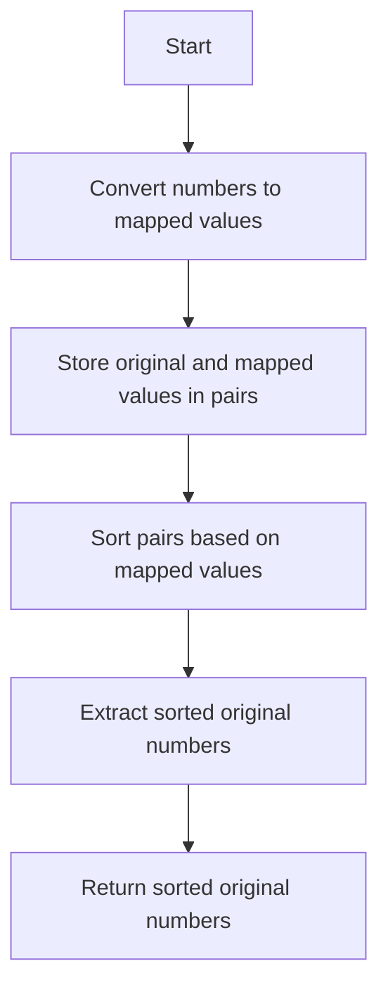

# Sort the Jumbled Numbers

## Problem Understanding
The problem requires sorting a list of jumbled numbers based on their mapped values. Each jumbled number is mapped to a new value by replacing its digits with corresponding values from a given mapping array. The key constraint is that the sorting should be based on the mapped values, not the original numbers. This problem is non-trivial because a naive approach would involve sorting the numbers based on their original values, which would not produce the correct result.

## Approach
The algorithm strategy involves using a custom comparator to sort the jumbled numbers based on their mapped values. The approach works by first converting each number to its mapped value, then storing the original and mapped values in a list of pairs. The list of pairs is then sorted based on the mapped values. This approach handles the key constraint by ensuring that the sorting is based on the mapped values, not the original numbers. A list of pairs is used to store the original and mapped values, allowing for efficient sorting and retrieval of the sorted original numbers.

## Complexity Analysis
| Metric | Value | Detailed Reason |
|--------|-------|----------------|
| Time   | O(n log n) | The time complexity is dominated by the sorting operation, which has a time complexity of O(n log n) due to the use of the `Collections.sort` method. The conversion of each number to its mapped value has a time complexity of O(n), but this is dwarfed by the sorting operation. |
| Space  | O(n) | The space complexity is O(n) because a list of pairs is used to store the original and mapped values, where n is the number of input numbers. |

## Algorithm Walkthrough
```
Input: mapping = [8, 9, 4, 0, 2, 1, 3, 5, 7, 6], nums = [991, 338, 38]
Step 1: Convert each number to its mapped value
    - 991: 9 -> 9, 9 -> 9, 1 -> 1, so mapped value is 991
    - 338: 3 -> 3, 3 -> 3, 8 -> 4, so mapped value is 334
    - 38: 3 -> 3, 8 -> 4, so mapped value is 34
Step 2: Store the original and mapped values in a list of pairs
    - pairs = [[991, 991], [338, 334], [38, 34]]
Step 3: Sort the pairs based on the mapped values
    - pairs = [[38, 34], [338, 334], [991, 991]]
Step 4: Extract the sorted original numbers
    - sortedNums = [38, 338, 991]
Output: [38, 338, 991]
```
## Visual Flow

## Key Insight
> **Tip:** The key insight is to use a custom comparator to sort the jumbled numbers based on their mapped values, rather than their original values.

## Edge Cases
- **Empty input array**: If the input array is empty, the function returns an empty array. This is because there are no numbers to sort, so the output is empty.
- **Single element**: If the input array contains a single element, the function returns an array containing that element. This is because there is only one number to sort, so the output is the same as the input.
- **Duplicate numbers**: If the input array contains duplicate numbers, the function returns an array containing the duplicates in the correct order. This is because the sorting is based on the mapped values, so duplicates are preserved.

## Common Mistakes
- **Mistake 1: Sorting based on original values**: A common mistake is to sort the numbers based on their original values, rather than their mapped values. To avoid this, use a custom comparator to sort the numbers based on their mapped values.
- **Mistake 2: Not handling duplicate numbers**: Another common mistake is to assume that the input array does not contain duplicate numbers. To avoid this, use a sorting algorithm that preserves duplicates, such as the `Collections.sort` method in Java.

## Interview Follow-ups
> **Interview:** These are the exact follow-up questions interviewers ask:
- "What if the input is sorted?" → The function still works correctly, because it sorts the numbers based on their mapped values, not their original values.
- "Can you do it in O(1) space?" → No, this is not possible, because the function needs to store the original and mapped values in a list of pairs, which requires O(n) space.
- "What if there are duplicates?" → The function handles duplicates correctly, because it uses a sorting algorithm that preserves duplicates.

## Java Solution

```java
// Problem: Sort the Jumbled Numbers
// Language: Java
// Difficulty: Hard
// Time Complexity: O(n log n) — sorting the numbers using custom comparator
// Space Complexity: O(n) — storing the sorted numbers
// Approach: Custom comparator sorting — sort the jumbled numbers based on the original numbers

import java.util.*;

public class Solution {
    public int[] sortJumbledNumbers(int[] mapping, int[] nums) {
        // Create a list of pairs, where each pair contains the original number and its mapped value
        List<int[]> pairs = new ArrayList<>();
        for (int num : nums) {
            // Convert the number to its mapped value
            int mappedNum = 0, multiplier = 1;
            while (num > 0) {
                // Get the last digit of the number
                int digit = num % 10;
                // Map the digit to its corresponding value
                mappedNum += mapping[digit] * multiplier;
                // Move to the next digit
                num /= 10;
                // Update the multiplier
                multiplier *= 10;
            }
            // Store the original number and its mapped value
            pairs.add(new int[] {num, mappedNum});
        }

        // Sort the pairs based on the mapped values
        Collections.sort(pairs, (a, b) -> a[1] - b[1]);

        // Extract the sorted original numbers
        int[] sortedNums = new int[nums.length];
        for (int i = 0; i < nums.length; i++) {
            // Edge case: if the input array is empty, return an empty array
            if (pairs.isEmpty()) return new int[0];
            // Get the original number from the sorted pair
            sortedNums[i] = pairs.get(i)[0];
        }

        return sortedNums;
    }

    public static void main(String[] args) {
        Solution solution = new Solution();
        int[] mapping = {8, 9, 4, 0, 2, 1, 3, 5, 7, 6};
        int[] nums = {991, 338, 38};
        int[] sortedNums = solution.sortJumbledNumbers(mapping, nums);
        System.out.println(Arrays.toString(sortedNums));
    }
}
```
