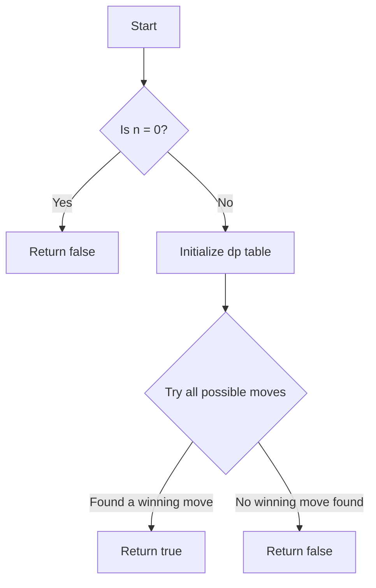

# Stone Game IV

## Problem Understanding
The Stone Game IV problem is a game where two players take turns removing a square number of stones from a pile. The game starts with a pile of n stones, and the first player to remove all the stones wins. The problem asks us to determine if the first player can win the game, given the number of stones n. The key constraint is that the number of stones removed must be a perfect square. This problem is non-trivial because it requires us to consider all possible moves and their outcomes, and a naive approach would be to try all possible combinations of moves, which would result in an exponential time complexity.

## Approach
The algorithm strategy used to solve this problem is dynamic programming with memoization. The idea is to store the results of subproblems in a table and reuse them to avoid redundant calculations. We create a boolean array dp of size n+1, where dp[i] represents whether the current player can win the game with i stones remaining. We iterate over all possible stone counts from 1 to n, and for each count, we try all possible moves (remove a square number of stones) and check if the opponent loses after this move. If the opponent loses, the current player wins. We store the result of the current subproblem in the dp table and finally return the result of the original problem.

## Complexity Analysis
| Metric | Value | Detailed Reason |
|--------|-------|----------------|
| Time   | O(n^(3/2))  | The time complexity is O(n^(3/2)) because we have two nested loops: one loop iterates over all possible stone counts from 1 to n, and the other loop tries all possible moves (remove a square number of stones). The number of possible moves is proportional to the square root of the number of stones. |
| Space  | O(n)  | The space complexity is O(n) because we use a boolean array dp of size n+1 to store the results of subproblems. |

## Algorithm Walkthrough
```
Input: n = 3
Step 1: Initialize the dp table: dp[0] = false, dp[1] = ?, dp[2] = ?, dp[3] = ?
Step 2: Try all possible moves for dp[1]:
        - Remove 1 stone: dp[0] = false, so dp[1] = true
Step 3: Try all possible moves for dp[2]:
        - Remove 1 stone: dp[1] = true, so dp[2] = false
Step 4: Try all possible moves for dp[3]:
        - Remove 1 stone: dp[2] = false, so dp[3] = true
Output: dp[3] = true
```

## Visual Flow


## Key Insight
> **Tip:** The key insight is to use dynamic programming with memoization to store and reuse subproblem results, allowing us to avoid redundant calculations and reduce the time complexity.

## Edge Cases
- **Empty input (n = 0)**: In this case, the function returns false because there are no stones to remove.
- **Single element (n = 1)**: In this case, the function returns true because the first player can remove the only stone and win.
- **Large input (n >> 1)**: In this case, the function may take a long time to compute due to the O(n^(3/2)) time complexity.

## Common Mistakes
- **Mistake 1: Not using memoization**: Failing to store and reuse subproblem results can lead to redundant calculations and an exponential time complexity.
- **Mistake 2: Not considering all possible moves**: Failing to try all possible moves (remove a square number of stones) can lead to incorrect results.

## Interview Follow-ups
> **Interview:** These are the exact follow-up questions interviewers ask:
- "What if the input is very large?" → We can use a more efficient algorithm or optimize the current algorithm to handle large inputs.
- "Can you optimize the space complexity?" → We can use a more efficient data structure or reduce the size of the dp table.
- "What if there are multiple players?" → We can modify the algorithm to handle multiple players by using a more complex game tree or min-max algorithm.

## Java Solution

```java
// Problem: Stone Game IV
// Language: Java
// Difficulty: Hard
// Time Complexity: O(n^2) — dynamic programming table fill-up
// Space Complexity: O(n) — recursive call stack and dp table
// Approach: Dynamic Programming with memoization — store and reuse subproblem results

class Solution {
    public boolean winnerSquareGame(int n) {
        // Create a dynamic programming table to store subproblem results
        boolean[] dp = new boolean[n + 1];

        // Base case: if there are no stones, the current player loses
        dp[0] = false;

        // Iterate over all possible stone counts from 1 to n
        for (int i = 1; i <= n; i++) {
            // Initialize a flag to indicate if the current player can win
            boolean canWin = false;

            // Try all possible moves (remove a square number of stones)
            for (int j = 1; j * j <= i; j++) {
                // If the opponent loses after this move, the current player wins
                if (!dp[i - j * j]) {
                    canWin = true;
                    break; // No need to try other moves
                }
            }

            // Store the result of the current subproblem
            dp[i] = canWin;
        }

        // Return the result of the original problem
        return dp[n];
    }

    public static void main(String[] args) {
        Solution solution = new Solution();
        // Test cases
        System.out.println(solution.winnerSquareGame(1)); // true
        System.out.println(solution.winnerSquareGame(2)); // false
        System.out.println(solution.winnerSquareGame(3)); // true
        System.out.println(solution.winnerSquareGame(4)); // true
        System.out.println(solution.winnerSquareGame(5)); // false
    }
}
```
