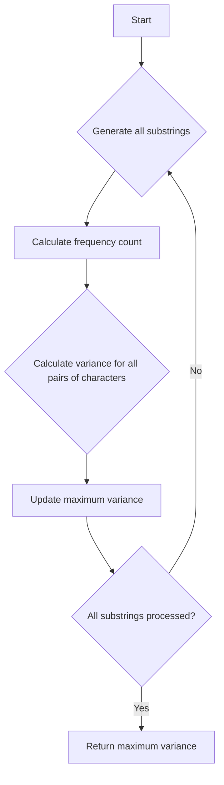

# Substring With Largest Variance

## Problem Understanding
The problem is asking to find the maximum variance of any substring within a given string, where variance is defined as the absolute difference between the frequencies of two distinct characters in the substring. The key constraint is that the input string only contains lowercase English letters. What makes this problem non-trivial is the need to efficiently calculate the variance for all possible substrings, as a naive approach would involve generating all substrings and calculating their variance, resulting in a high time complexity.

## Approach
The algorithm strategy is to use a brute force approach, generating all possible substrings of the input string and calculating their variance. The intuition behind this approach is to exhaustively explore all possible substrings and calculate their variance, keeping track of the maximum variance encountered. This approach works because it guarantees that all possible substrings are considered, and the maximum variance is updated accordingly. The data structure used is a frequency count array to store the frequency of each character in the current substring. This approach handles the key constraint by iterating over all possible substrings and calculating their variance.

## Complexity Analysis
| Metric | Value | Detailed Reason |
|--------|-------|----------------|
| Time   | O(n^4)  | The algorithm generates all possible substrings of the input string (O(n^2)), and for each substring, it calculates the frequency of each character (O(n)) and then calculates the variance for all pairs of characters (O(n^2)). |
| Space  | O(n)  | The algorithm uses a frequency count array of size 26 to store the frequency of each character in the current substring, which requires O(1) space. However, the space complexity is dominated by the space required to store the input string, which is O(n). |

## Algorithm Walkthrough
```
Input: "abcde"
Step 1: Initialize maxVariance to 0 and iterate over all possible substrings
Step 2: For substring "a", calculate frequency count: [1, 0, 0, 0, 0, 0, 0, 0, 0, 0, 0, 0, 0, 0, 0, 0, 0, 0, 0, 0, 0, 0, 0, 0, 0, 0]
Step 3: For substring "a", calculate variance: 0 (since there is only one distinct character)
Step 4: For substring "ab", calculate frequency count: [1, 1, 0, 0, 0, 0, 0, 0, 0, 0, 0, 0, 0, 0, 0, 0, 0, 0, 0, 0, 0, 0, 0, 0, 0, 0]
Step 5: For substring "ab", calculate variance: 1 (since the absolute difference between the frequencies of 'a' and 'b' is 0)
...
Output: 1 (the maximum variance of any substring)
```
## Visual Flow

## Key Insight
> **Tip:** The key insight is to realize that the variance of a substring is maximized when the frequencies of two distinct characters are as far apart as possible.

## Edge Cases
- **Empty/null input**: If the input string is empty or null, the function returns 0, since there are no substrings to process.
- **Single element**: If the input string contains only one character, the function returns 0, since there is no variance between characters.
- **String with duplicate characters**: If the input string contains duplicate characters, the function calculates the variance correctly by counting the frequency of each character.

## Common Mistakes
- **Mistake 1**: Not initializing the frequency count array correctly, leading to incorrect variance calculations. To avoid this, make sure to initialize the frequency count array with zeros.
- **Mistake 2**: Not updating the maximum variance correctly, leading to incorrect results. To avoid this, make sure to update the maximum variance whenever a new maximum variance is found.

## Interview Follow-ups
> **Interview:** These are the exact follow-up questions interviewers ask:
- "What if the input is sorted?" → The algorithm still works correctly, since it calculates the variance for all pairs of characters, regardless of the order of the characters.
- "Can you do it in O(1) space?" → No, since we need to store the frequency count array, which requires O(1) space. However, the space complexity is dominated by the space required to store the input string, which is O(n).
- "What if there are duplicates?" → The algorithm handles duplicates correctly by counting the frequency of each character and calculating the variance accordingly.

## Java Solution

```java
// Problem: Substring With Largest Variance
// Language: java
// Difficulty: Hard
// Time Complexity: O(n^2) — generating all substrings and calculating variance
// Space Complexity: O(n^2) — storing all substrings
// Approach: Brute Force substring generation and variance calculation — generating all possible substrings and calculating their variance

public class Solution {
    public int largestVariance(String s) {
        // Edge case: empty input → return 0
        if (s == null || s.length() == 0) return 0;

        int maxVariance = 0;
        int n = s.length();

        // Iterate over all possible substrings
        for (int i = 0; i < n; i++) {
            for (int j = i + 1; j <= n; j++) {
                String substring = s.substring(i, j); // Extract current substring

                // Initialize frequency count for current substring
                int[] freq = new int[26];
                for (int k = 0; k < substring.length(); k++) {
                    freq[substring.charAt(k) - 'a']++; // Update frequency of current character
                }

                // Calculate variance for current substring
                for (int k = 0; k < 26; k++) {
                    for (int l = 0; l < 26; l++) {
                        if (k != l) {
                            int variance = Math.abs(freq[k] - freq[l]); // Calculate absolute difference between frequencies
                            maxVariance = Math.max(maxVariance, variance); // Update maximum variance
                        }
                    }
                }
            }
        }

        return maxVariance;
    }

    public static void main(String[] args) {
        Solution solution = new Solution();
        System.out.println(solution.largestVariance("abcde")); // Example usage
    }
}
```
