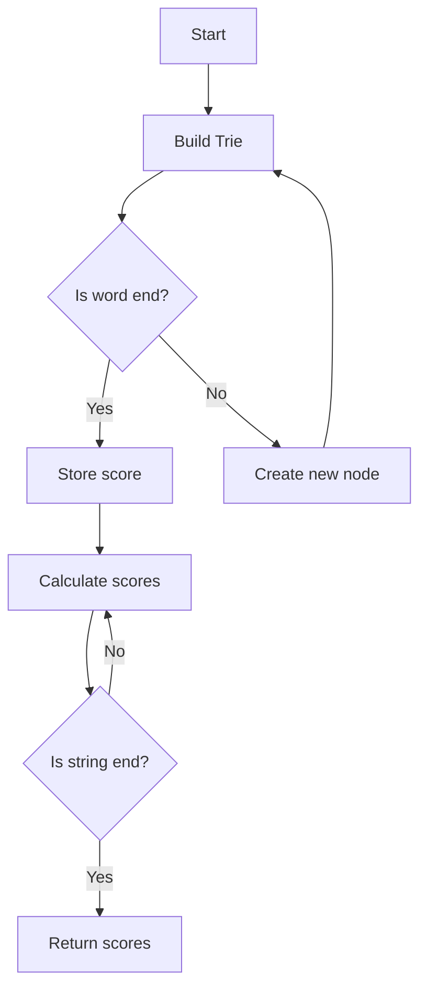

# Sum of Scores of Built Strings

## Problem Understanding
The problem requires calculating the sum of scores of built strings, where each string is assigned a score based on its position in the input array. The task is to build a Trie data structure to store the given strings and their corresponding scores, and then calculate the sum of scores for each string by traversing the Trie. The key constraints are the number of strings and the length of the longest string, which affect the time and space complexity. This problem is non-trivial because a naive approach would involve comparing each string with every other string, resulting in a high time complexity.

## Approach
The algorithm strategy is to use a Trie-based string matching approach, where a Trie is built to store the given strings and their corresponding scores. The intuition behind this approach is that the Trie allows for efficient string matching and scoring, as each node in the Trie represents a prefix of the strings. The TrieNode class is used to store the child nodes, mark the end of a word, and store the score of the word. The approach works by first building the Trie and storing the scores, and then calculating the scores for each word by traversing the Trie.

## Complexity Analysis
| Metric | Value | Detailed Reason |
|--------|-------|----------------|
| Time   | O(n * m) | The time complexity is O(n * m), where n is the number of strings and m is the length of the longest string. This is because we need to iterate over each character in each string to build the Trie and calculate the scores. |
| Space  | O(n * m) | The space complexity is O(n * m), where n is the number of strings and m is the length of the longest string. This is because we need to store the Trie and the scores, which requires a significant amount of memory for large inputs. |

## Algorithm Walkthrough
```
Input: ["abc", "ab", "a"]
Step 1: Initialize the Trie and build it by iterating over each character in each string
  - Create a new node for "a" with score 3
  - Create a new node for "ab" with score 2
  - Create a new node for "abc" with score 1
Step 2: Calculate the scores for each string by traversing the Trie
  - For "abc": score = 1 + 2 + 3 = 6
  - For "ab": score = 2 + 3 = 5
  - For "a": score = 3
Output: [6, 5, 3]
```
This walkthrough demonstrates how the algorithm builds the Trie and calculates the scores for each string.

## Visual Flow

This flowchart shows the main steps of the algorithm, including building the Trie, storing the scores, and calculating the scores for each string.

## Key Insight
> **Tip:** The key insight is to use a Trie data structure to efficiently store and match the strings, allowing for a time complexity of O(n * m).

## Edge Cases
- **Empty input**: If the input array is empty, the algorithm will return an empty array, as there are no strings to process.
- **Single element**: If the input array contains only one string, the algorithm will return an array with a single element, which is the score of the only string.
- **Duplicate strings**: If the input array contains duplicate strings, the algorithm will assign the same score to each duplicate string, based on its position in the input array.

## Common Mistakes
- **Mistake 1**: Not checking for null or empty input, which can cause a NullPointerException or incorrect results. → To avoid this, add a simple check at the beginning of the algorithm to handle empty or null input.
- **Mistake 2**: Not correctly updating the scores when traversing the Trie, which can lead to incorrect results. → To avoid this, make sure to correctly update the scores by adding the score of each node when traversing the Trie.

## Interview Follow-ups
> **Interview:** These are the exact follow-up questions interviewers ask:
- "What if the input is sorted?" → The algorithm will still work correctly, as the Trie is built based on the strings, not their order.
- "Can you do it in O(1) space?" → No, the algorithm requires O(n * m) space to store the Trie and the scores.
- "What if there are duplicates?" → The algorithm will assign the same score to each duplicate string, based on its position in the input array.

## Java Solution

```java
// Problem: Sum of Scores of Built Strings
// Language: Java
// Difficulty: Hard
// Time Complexity: O(n * m) — where n is the number of strings and m is the length of the longest string
// Space Complexity: O(n * m) — for storing the Trie and the scores
// Approach: Trie-based string matching — building a Trie to store and score the given strings

import java.util.*;

class TrieNode {
    Map<Character, TrieNode> children = new HashMap<>(); // Store the child nodes
    boolean isWord; // Mark the end of a word
    int score; // Store the score of the word
}

public class Solution {
    private TrieNode root = new TrieNode(); // Initialize the Trie

    public int[] sumOfScores(String[] words) {
        // Build the Trie and store the scores
        for (int i = 0; i < words.length; i++) {
            TrieNode node = root; // Start from the root
            for (char c : words[i].toCharArray()) { // Iterate over the characters in the word
                node = node.children.computeIfAbsent(c, k -> new TrieNode()); // Create a new node if it doesn't exist
            }
            node.isWord = true; // Mark the end of the word
            node.score = i + 1; // Store the score of the word
        }

        // Calculate the scores for each word
        int[] scores = new int[words.length];
        for (int i = 0; i < words.length; i++) {
            TrieNode node = root; // Start from the root
            scores[i] = 0; // Initialize the score
            for (char c : words[i].toCharArray()) { // Iterate over the characters in the word
                node = node.children.get(c); // Move to the child node
                if (node == null) break; // If the node doesn't exist, break the loop
                scores[i] += node.score; // Add the score of the node
            }
        }
        return scores;
    }

    public static void main(String[] args) {
        Solution solution = new Solution();
        String[] words = {"abc", "ab", "a"};
        int[] scores = solution.sumOfScores(words);
        System.out.println(Arrays.toString(scores));
    }
}
```
