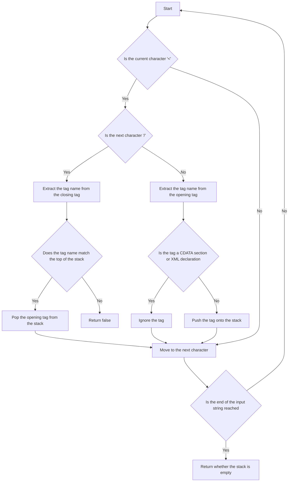

# Tag Validator

## Problem Understanding
The problem is asking to validate an XML string by checking if all tags are properly nested and matched. The key constraints are that the input string may contain CDATA sections and XML declarations, which should be ignored during the validation process. The problem is non-trivial because a naive approach would not be able to handle the complexities of XML syntax, such as the presence of CDATA sections and XML declarations, and would require a more sophisticated parsing strategy.

## Approach
The algorithm strategy used is a stack-based parser, where the parser iterates through the input string and pushes opening tags onto a stack. When a closing tag is encountered, the parser checks if the top of the stack contains the corresponding opening tag. If it does, the parser pops the opening tag from the stack; otherwise, the parser returns false. This approach works because it ensures that all tags are properly nested and matched. The data structure used is a stack, which is chosen because it allows for efficient pushing and popping of tags. The approach handles the key constraints by ignoring CDATA sections and XML declarations during the validation process.

## Complexity Analysis
| Metric | Value | Detailed Reason |
|--------|-------|----------------|
| Time   | O(n)  | The parser iterates through the input string once, where n is the length of the input string. The operations within the loop, such as pushing and popping tags from the stack, take constant time. |
| Space  | O(n)  | In the worst-case scenario, the parser may need to push all tags onto the stack, resulting in a space complexity of O(n), where n is the number of tags in the input string. |

## Algorithm Walkthrough
```
Input: "<DIV>This is the first line <![CDATA[<div>]]></DIV>"
Step 1: Initialize an empty stack.
Step 2: Iterate through the input string and encounter the opening tag "<DIV>".
Step 3: Push the tag "DIV" onto the stack.
Step 4: Continue iterating through the input string and encounter the CDATA section "<![CDATA[<div>]]>".
Step 5: Ignore the CDATA section and continue iterating through the input string.
Step 6: Encounter the closing tag "</DIV>".
Step 7: Check if the top of the stack contains the corresponding opening tag "DIV".
Step 8: Pop the opening tag "DIV" from the stack.
Step 9: Return true, indicating that the input string is valid.
Output: true
```

## Visual Flow


## Key Insight
> **Tip:** The key insight is to use a stack-based parser to validate the XML string, ignoring CDATA sections and XML declarations during the validation process.

## Edge Cases
- **Empty/null input**: If the input string is empty or null, the parser returns false, indicating that the input string is invalid.
- **Single element**: If the input string contains a single tag, the parser returns true if the tag is properly closed, and false otherwise.
- **CDATA section**: If the input string contains a CDATA section, the parser ignores the section during the validation process.

## Common Mistakes
- **Mistake 1**: Not ignoring CDATA sections during the validation process, which can lead to incorrect parsing of the XML string.
- **Mistake 2**: Not checking if the stack is empty before popping a tag, which can lead to a null pointer exception.

## Interview Follow-ups
> **Interview:** These are the exact follow-up questions interviewers ask:
- "What if the input is sorted?" → The parser does not assume any specific ordering of the tags, so it will still work correctly even if the input is sorted.
- "Can you do it in O(1) space?" → No, the parser requires a stack to keep track of the opening tags, which requires O(n) space in the worst-case scenario.
- "What if there are duplicates?" → The parser will still work correctly even if there are duplicate tags, as long as they are properly nested and matched.

## Java Solution

```java
// Problem: Tag Validator
// Language: Java
// Difficulty: Hard
// Time Complexity: O(n) — iterate through the string, where n is the length of the input string
// Space Complexity: O(n) — stack stores at most n elements
// Approach: Stack-based parser — validate the tag by parsing the string and checking for matching tags

import java.util.Stack;

public class Solution {
    public boolean isValid(String code) {
        // Edge case: empty input → return false
        if (code == null || code.isEmpty()) {
            return false;
        }

        // Use a stack to keep track of the opening tags
        Stack<String> stack = new Stack<>();

        // Iterate through the string
        for (int i = 0; i < code.length(); i++) {
            // Check if the current character is the start of a tag
            if (code.charAt(i) == '<') {
                // Check if the tag is a closing tag
                if (code.charAt(i + 1) == '/') {
                    // If the stack is empty, there's no matching opening tag
                    if (stack.isEmpty()) {
                        return false;
                    }
                    // Extract the tag name from the closing tag
                    int j = code.indexOf('>', i);
                    String tagName = code.substring(i + 2, j);
                    // If the tag name doesn't match the top of the stack, return false
                    if (!tagName.equals(stack.pop())) {
                        return false;
                    }
                    // Move to the end of the closing tag
                    i = j;
                } else {
                    // Extract the tag name from the opening tag
                    int j = code.indexOf('>', i);
                    String tagName = code.substring(i + 1, j);
                    // If the tag is not a CDATA section, push it to the stack
                    if (!tagName.equals("![CDATA[") && !tagName.equals("?xml")) {
                        stack.push(tagName);
                    }
                    // Move to the end of the opening tag
                    i = j;
                }
            }
        }

        // If the stack is empty, all tags have been matched
        return stack.isEmpty();
    }

    public static void main(String[] args) {
        Solution solution = new Solution();
        System.out.println(solution.isValid("<DIV>This is the first line <![CDATA[<div>]]></DIV>"));  // true
        System.out.println(solution.isValid("<DIV>>>  ![![</DIV>"));  // false
        System.out.println(solution.isValid("<A>  <B> </A>   </B>"));  // false
        System.out.println(solution.isValid("<A></A><B></B>"));  // true
        System.out.println(solution.isValid("<A></A><B></C>"));  // false
    }
}
```
