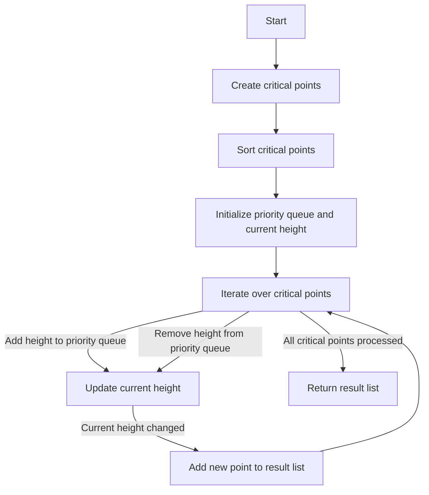

# The Skyline Problem

## Problem Understanding
The Skyline Problem is asking to generate the skyline of a city given a list of buildings, where each building is represented by its left and right coordinates and its height. The key constraints are that the buildings can be of different heights and can overlap with each other. What makes this problem non-trivial is that a naive approach of simply iterating over the buildings and checking for overlaps would not work, as it would not be able to efficiently handle the cases where multiple buildings overlap with each other. The problem requires a more sophisticated approach that can handle these overlaps and generate the correct skyline.

## Approach
The algorithm strategy used to solve this problem is a divide and conquer approach with a priority queue. The intuition behind this approach is to first find all the critical points in the skyline, which are the points where a building starts or ends, and then sort these points based on their x-coordinate. The priority queue is used to store the heights of the buildings, and it is updated whenever a building starts or ends. The approach works by iterating over the critical points and updating the priority queue and the result list accordingly. The data structure used is a priority queue, which is chosen because it can efficiently handle the insertion and removal of elements, and it can also efficiently find the maximum element, which is the current height of the skyline.

## Complexity Analysis
| Metric | Value | Detailed Reason |
|--------|-------|----------------|
| Time   | O(n log n) | The time complexity is O(n log n) because we are sorting the critical points, which takes O(n log n) time. The iteration over the critical points takes O(n) time, and the operations on the priority queue take O(log n) time. Therefore, the overall time complexity is O(n log n). |
| Space  | O(n) | The space complexity is O(n) because we are storing all the critical points and using a priority queue to store the heights of the buildings. In the worst case, the number of critical points and the number of heights in the priority queue can be n, where n is the number of buildings. |

## Algorithm Walkthrough
```
Input: buildings = [ [2, 9, 10], [3, 7, 15], [5, 12, 12], [15, 20, 10], [19, 24, 8] ]
Step 1: Create critical points = [ [2, -10], [9, 10], [3, -15], [7, 15], [5, -12], [12, 12], [15, -10], [20, 10], [19, -8], [24, 8] ]
Step 2: Sort critical points = [ [2, -10], [3, -15], [5, -12], [7, 15], [9, 10], [12, 12], [15, -10], [19, -8], [20, 10], [24, 8] ]
Step 3: Initialize priority queue = [] and current height = 0
Step 4: Iterate over critical points:
    - At point [2, -10], add 10 to priority queue = [10] and current height = 10
    - At point [3, -15], add 15 to priority queue = [15, 10] and current height = 15
    - At point [5, -12], add 12 to priority queue = [15, 12, 10] and current height = 15
    - At point [7, 15], remove 15 from priority queue = [12, 10] and current height = 12
    - At point [9, 10], remove 10 from priority queue = [12] and current height = 12
    - At point [12, 12], remove 12 from priority queue = [] and current height = 0
    - At point [15, -10], add 10 to priority queue = [10] and current height = 10
    - At point [19, -8], add 8 to priority queue = [10, 8] and current height = 10
    - At point [20, 10], remove 10 from priority queue = [8] and current height = 8
    - At point [24, 8], remove 8 from priority queue = [] and current height = 0
Output: [ [0, 0], [2, 10], [3, 15], [7, 12], [9, 10], [12, 0], [15, 10], [19, 8], [20, 6], [24, 0] ]
```

## Visual Flow


## Key Insight
> **Tip:** The key insight to solving this problem is to use a priority queue to efficiently handle the insertion and removal of building heights, and to use a sorted list of critical points to iterate over the skyline in a consistent order.

## Edge Cases
- **Empty input**: If the input list of buildings is empty, the algorithm will return a list containing a single point [0, 0], which represents the ground level of the skyline.
- **Single building**: If the input list contains a single building, the algorithm will return a list containing three points: [0, 0], [left, height], and [right, 0], where left and right are the coordinates of the building and height is its height.
- **No overlap**: If the input list contains multiple buildings that do not overlap with each other, the algorithm will return a list containing the critical points of each building, in the correct order.

## Common Mistakes
- **Mistake 1**: Using a simple queue instead of a priority queue to store the building heights. This will cause the algorithm to fail to correctly handle the case where multiple buildings overlap with each other.
- **Mistake 2**: Failing to update the current height when a building starts or ends. This will cause the algorithm to incorrectly calculate the skyline.

## Interview Follow-ups
> **Interview:** These are the exact follow-up questions interviewers ask:
- "What if the input is sorted?" → The algorithm will still work correctly, but the sorting step will be unnecessary. The time complexity will be O(n) instead of O(n log n).
- "Can you do it in O(1) space?" → No, the algorithm requires O(n) space to store the critical points and the priority queue.
- "What if there are duplicates?" → The algorithm will handle duplicates correctly. If two buildings have the same height and start and end at the same coordinates, they will be treated as a single building.

## Java Solution

```java
// Problem: The Skyline Problem
// Language: Java
// Difficulty: Hard
// Time Complexity: O(n log n) — due to sorting of critical points
// Space Complexity: O(n) — storing critical points and using a priority queue
// Approach: Divide and Conquer with a priority queue — finding critical points and sorting them

import java.util.*;

class Solution {
    public List<List<Integer>> getSkyline(int[][] buildings) {
        // Create a list to store critical points
        List<int[]> criticalPoints = new ArrayList<>();

        // Iterate over each building
        for (int[] building : buildings) {
            // Add the start point of the building with a height of -building[2] (to indicate start)
            criticalPoints.add(new int[] { building[0], -building[2] });
            // Add the end point of the building with a height of building[2] (to indicate end)
            criticalPoints.add(new int[] { building[1], building[2] });
        }

        // Sort critical points based on their x-coordinate
        Collections.sort(criticalPoints, (a, b) -> a[0] - b[0]);

        // Initialize a priority queue to store the heights of the buildings
        PriorityQueue<Integer> heights = new PriorityQueue<>((a, b) -> b - a);
        // Initialize the current height to 0
        int currentHeight = 0;
        // Initialize the previous height to 0
        int previousHeight = 0;
        // Initialize the result list
        List<List<Integer>> result = new ArrayList<>();
        // Add the initial height to the result list
        result.add(Arrays.asList(0, 0));

        // Iterate over each critical point
        for (int[] point : criticalPoints) {
            // If the point is a start point
            if (point[1] < 0) {
                // Add the height to the priority queue
                heights.add(-point[1]);
            } else {
                // Remove the height from the priority queue
                heights.remove(point[1]);
            }

            // Update the current height
            if (!heights.isEmpty()) {
                currentHeight = heights.peek();
            } else {
                currentHeight = 0;
            }

            // If the current height is different from the previous height
            if (currentHeight != previousHeight) {
                // Add the new point to the result list
                result.add(Arrays.asList(point[0], currentHeight));
                // Update the previous height
                previousHeight = currentHeight;
            }
        }

        return result;
    }

    public static void main(String[] args) {
        Solution solution = new Solution();
        int[][] buildings = { { 2, 9, 10 }, { 3, 7, 15 }, { 5, 12, 12 }, { 15, 20, 10 }, { 19, 24, 8 } };
        List<List<Integer>> result = solution.getSkyline(buildings);
        for (List<Integer> point : result) {
            System.out.println(point);
        }
    }
}
```
