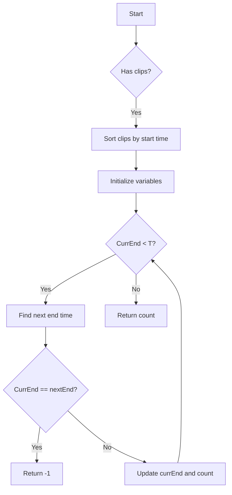

# Video Stitching

## Problem Understanding
The problem of video stitching involves stitching together video clips to cover a certain time range, [0, T]. The goal is to use the minimum number of clips to cover this range. The key constraint is that each clip has a start and end time, and a clip can only be used if its start time is less than or equal to the current end time of the stitched video. This problem is non-trivial because a naive approach of simply using the first available clip would not guarantee the minimum number of clips, as it may lead to gaps in the coverage of the time range.

## Approach
The algorithm strategy used to solve this problem is a greedy algorithm with sorting. The clips are first sorted by their start times, and then iterated over to find the minimum number of clips that cover the time range [0, T]. The intuition behind this approach is that by sorting the clips, we can ensure that we are always considering the clip that starts at the earliest time and ends at the latest time, which maximizes the coverage of the time range. The algorithm uses three variables to keep track of the current end time, the next end time, and the count of clips used. The algorithm iterates over the clips, updating the next end time and incrementing the count as necessary, until the current end time reaches T.

## Complexity Analysis
| Metric | Value | Detailed Reason |
|--------|-------|----------------|
| Time   | O(n log n) | The algorithm first sorts the clips, which takes O(n log n) time. Then, it iterates over the clips, which takes O(n) time. Therefore, the overall time complexity is O(n log n) due to the sorting step. |
| Space  | O(1) | The algorithm only uses a constant amount of space to store the variables, so the space complexity is O(1). Note that the sorting is done in-place, so it does not require any additional space. |

## Algorithm Walkthrough
```
Input: clips = [[0, 2], [4, 6], [8, 10], [1, 9], [1, 5], [5, 9]], T = 10
Step 1: Sort the clips by start time: [[0, 2], [1, 9], [1, 5], [4, 6], [5, 9], [8, 10]]
Step 2: Initialize variables: count = 0, currEnd = 0, nextEnd = 0, i = 0
Step 3: Iterate over the clips to find the minimum number of clips:
  - While currEnd < T:
    - While i < clips.length and clips[i][0] <= currEnd:
      - nextEnd = max(nextEnd, clips[i][1])
      - i++
    - If currEnd == nextEnd: return -1
    - currEnd = nextEnd
    - count++
Step 4: Return count = 3
Output: 3
```

## Visual Flow


## Key Insight
> **Tip:** The key insight is to sort the clips by start time and then iterate over them to find the minimum number of clips, using a greedy approach to maximize the coverage of the time range.

## Edge Cases
- **Empty/null input**: If the input is empty or null, the algorithm returns -1, indicating that it is not possible to cover the time range.
- **Single element**: If there is only one clip, the algorithm returns 1 if the clip covers the time range, or -1 if it does not.
- **Clips with same start time**: If there are multiple clips with the same start time, the algorithm uses the clip with the latest end time, which maximizes the coverage of the time range.

## Common Mistakes
- **Mistake 1**: Not sorting the clips by start time, which can lead to incorrect results. → To avoid this, make sure to sort the clips before iterating over them.
- **Mistake 2**: Not updating the next end time correctly, which can lead to incorrect results. → To avoid this, make sure to update the next end time with the maximum end time of the clips that start at or before the current end time.

## Interview Follow-ups
> **Interview:** These are the exact follow-up questions interviewers ask:
- "What if the input is sorted?" → The algorithm still works correctly, but the sorting step can be omitted, reducing the time complexity to O(n).
- "Can you do it in O(1) space?" → The algorithm already uses O(1) space, so this is not a concern.
- "What if there are duplicates?" → The algorithm can handle duplicates correctly, as it uses the maximum end time of the clips that start at or before the current end time.

## Java Solution

```java
// Problem: Video Stitching
// Language: Java
// Difficulty: Hard
// Time Complexity: O(n log n) — sorting the clips and then iterating over them to find the minimum number of clips
// Space Complexity: O(n) — sorting the clips in place
// Approach: Greedy algorithm with sorting — sort the clips by start time and then iterate over them to find the minimum number of clips

public class Solution {
    public int videoStitching(int[][] clips, int T) {
        // Edge case: empty input → return -1
        if (clips.length == 0) return -1;
        
        // Sort the clips by start time
        java.util.Arrays.sort(clips, (a, b) -> a[0] - b[0]); // Sort the clips in ascending order of start time
        
        int count = 0; // Count of the number of clips used
        int currEnd = 0; // Current end time of the stitched video
        int nextEnd = 0; // Next end time of the stitched video
        int i = 0; // Index of the current clip
        
        // Iterate over the clips to find the minimum number of clips
        while (currEnd < T) {
            // Find the next end time of the stitched video
            while (i < clips.length && clips[i][0] <= currEnd) {
                nextEnd = Math.max(nextEnd, clips[i][1]); // Update the next end time
                i++; // Move to the next clip
            }
            
            // If the next end time is not updated, return -1
            if (currEnd == nextEnd) return -1;
            
            // Update the current end time and increment the count
            currEnd = nextEnd;
            count++;
        }
        
        return count;
    }

    public static void main(String[] args) {
        Solution solution = new Solution();
        int[][] clips = {{0, 2}, {4, 6}, {8, 10}, {1, 9}, {1, 5}, {5, 9}};
        int T = 10;
        System.out.println(solution.videoStitching(clips, T)); // Output: 3
    }
}
```
