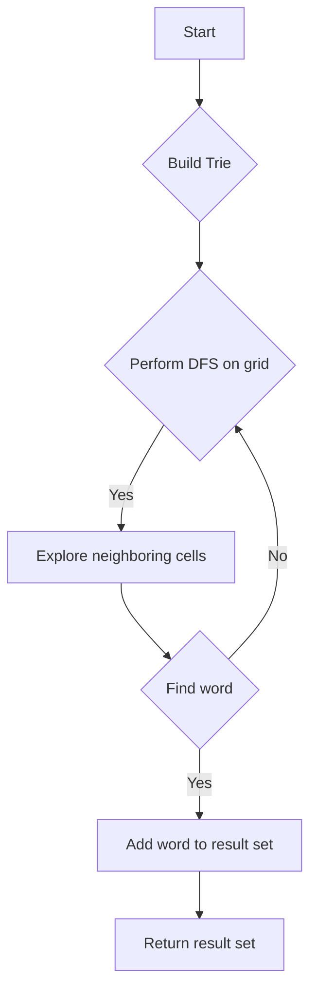

# Word Search II

## Problem Understanding
The Word Search II problem involves finding all words in a given word list that can be formed by traversing a 2D grid of characters. The key constraints are that each cell in the grid can only be used once in a word, and words can be constructed in any direction (up, down, left, right, or diagonally). This problem is non-trivial because a naive approach would involve checking all possible paths in the grid, resulting in exponential time complexity.

## Approach
The algorithm strategy used here is a Trie-based depth-first search. A Trie data structure is built from the given word list, and then a depth-first search is performed on the grid to find words. The intuition behind this approach is that the Trie allows for efficient lookup of words and their prefixes, and the depth-first search ensures that all possible paths in the grid are explored. The Trie is used to store the words and their prefixes, and the depth-first search is used to explore the grid and find words.

## Complexity Analysis
| Metric | Value | Detailed Reason |
|--------|-------|----------------|
| Time   | O(n*m*4^len(word)) | The time complexity is O(n*m*4^len(word)) because in the worst-case scenario, we are performing a depth-first search on the grid, exploring all four directions (up, down, left, right) from each cell, and the average length of a word in the word list is len(word). The n*m term comes from the fact that we are iterating over each cell in the grid. |
| Space  | O(n*m + N) | The space complexity is O(n*m + N) because we are storing the Trie, which requires O(N) space, where N is the number of words in the word list, and we are also using a set to store the result, which requires O(n*m) space in the worst-case scenario. |

## Algorithm Walkthrough
```
Input: 
board = [
    ['o', 'a', 'a', 'n'],
    ['e', 't', 'a', 'e'],
    ['i', 'h', 'k', 'r'],
    ['i', 'f', 'l', 'v']
]
words = ["oath", "pea", "eat", "rain"]

Step 1: Build a Trie from the word list
- Create a TrieNode for each word in the word list
- Store the words and their prefixes in the Trie

Step 2: Perform DFS on the grid to find words
- Iterate over each cell in the grid
- For each cell, perform a depth-first search to find words
- If a word is found, add it to the result set

Step 3: Return the result set as a list
- Convert the result set to a list and return it

Output: ["oath", "eat"]
```

## Visual Flow


## Key Insight
> **Tip:** The key insight is to use a Trie data structure to store the words and their prefixes, allowing for efficient lookup and exploration of the grid during the depth-first search.

## Edge Cases
- **Empty/null input**: If the input grid or word list is empty or null, the algorithm returns an empty list.
- **Single element**: If the word list contains only one word, the algorithm still performs a depth-first search to find the word in the grid.
- **Duplicate words**: If the word list contains duplicate words, the algorithm only adds each word to the result set once, thanks to the use of a set to store the result.

## Common Mistakes
- **Mistake 1**: Not using a Trie data structure to store the words and their prefixes, resulting in inefficient lookup and exploration of the grid.
- **Mistake 2**: Not using a set to store the result, resulting in duplicate words in the output.

## Interview Follow-ups
> **Interview:** 
- "What if the input is sorted?" → The algorithm would still work correctly, as the Trie is built based on the word list, regardless of its order.
- "Can you do it in O(1) space?" → No, because we need to store the Trie and the result set, which requires additional space.
- "What if there are duplicates in the word list?" → The algorithm would still work correctly, as it uses a set to store the result, which automatically removes duplicates.

## Java Solution

```java
// Problem: Word Search II
// Language: Java
// Difficulty: Hard
// Time Complexity: O(n*m*4^len(word)) — where n and m are the dimensions of the board and len(word) is the average length of a word in the word list
// Space Complexity: O(n*m + N) — where n*m is the space required for the Trie and N is the number of words in the word list
// Approach: Trie-based depth-first search — build a Trie from the word list and perform DFS on the board to find words

import java.util.*;

class TrieNode {
    // Map to store the children of a node
    Map<Character, TrieNode> children;
    // String to store the word at a node
    String word;

    public TrieNode() {
        children = new HashMap<>();
        word = null;
    }
}

class Solution {
    // Method to build a Trie from the given word list
    private void buildTrie(TrieNode root, String[] words) {
        for (String word : words) {
            TrieNode node = root;
            // Iterate over each character in the word
            for (char ch : word.toCharArray()) {
                // If the character is not in the children map, add it
                if (!node.children.containsKey(ch)) {
                    node.children.put(ch, new TrieNode());
                }
                // Move to the next node
                node = node.children.get(ch);
            }
            // Store the word at the last node
            node.word = word;
        }
    }

    // Method to perform DFS on the board to find words
    private void dfs(char[][] board, int i, int j, TrieNode node, Set<String> result) {
        // Edge case: out of bounds or the cell is not in the current node's children
        if (i < 0 || i >= board.length || j < 0 || j >= board[0].length || !node.children.containsKey(board[i][j])) {
            return;
        }
        // Get the next node
        TrieNode nextNode = node.children.get(board[i][j]);
        // If the next node has a word, add it to the result set
        if (nextNode.word != null) {
            result.add(nextNode.word);
            // Remove the word from the Trie to avoid duplicates
            nextNode.word = null;
        }
        // Mark the current cell as visited
        char temp = board[i][j];
        board[i][j] = '#';
        // Perform DFS on the neighboring cells
        dfs(board, i - 1, j, nextNode, result); // Up
        dfs(board, i + 1, j, nextNode, result); // Down
        dfs(board, i, j - 1, nextNode, result); // Left
        dfs(board, i, j + 1, nextNode, result); // Right
        // Unmark the current cell
        board[i][j] = temp;
    }

    public List<String> findWords(char[][] board, String[] words) {
        // Edge case: empty board or word list
        if (board == null || board.length == 0 || words == null || words.length == 0) {
            return new ArrayList<>();
        }
        // Build a Trie from the word list
        TrieNode root = new TrieNode();
        buildTrie(root, words);
        // Initialize the result set
        Set<String> result = new HashSet<>();
        // Perform DFS on the board
        for (int i = 0; i < board.length; i++) {
            for (int j = 0; j < board[0].length; j++) {
                dfs(board, i, j, root, result);
            }
        }
        // Return the result as a list
        return new ArrayList<>(result);
    }

    public static void main(String[] args) {
        Solution solution = new Solution();
        char[][] board = {
                {'o', 'a', 'a', 'n'},
                {'e', 't', 'a', 'e'},
                {'i', 'h', 'k', 'r'},
                {'i', 'f', 'l', 'v'}
        };
        String[] words = {"oath", "pea", "eat", "rain"};
        List<String> result = solution.findWords(board, words);
        System.out.println(result);
    }
}
```
