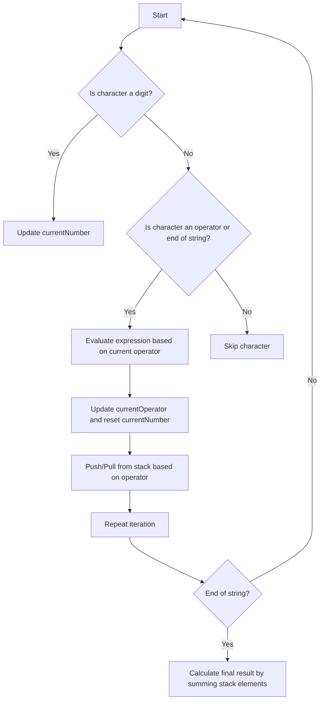

# Basic Calculator II

## Problem Understanding
The problem is asking to implement a basic calculator that can evaluate a string of mathematical expressions involving addition, subtraction, multiplication, and division. The key constraints are that the input string can contain spaces and the operators have different precedence levels. What makes this problem non-trivial is the need to handle the operator precedence correctly, as a naive approach would simply evaluate the expression from left to right, resulting in incorrect results for expressions like "3+2*2". The problem also requires handling cases where the input string is empty or contains only whitespace.

## Approach
The algorithm strategy is to use a stack-based evaluation approach, where intermediate results are stored in a stack and then evaluated based on the operator precedence. The intuition behind this approach is to separate the parsing of the input string from the evaluation of the mathematical expressions, allowing for a clear and efficient handling of operator precedence. The approach works by iterating through the input string, parsing the numbers and operators, and then evaluating the expressions based on the operator precedence. The data structure used is a stack, which is chosen because it allows for efficient pushing and popping of elements, making it ideal for handling the intermediate results.

## Complexity Analysis
| Metric | Value | Detailed Reason |
|--------|-------|----------------|
| Time   | O(n)  | The algorithm iterates through the input string once, where n is the length of the input string. The operations within the loop (pushing and popping from the stack) take constant time, resulting in a linear time complexity. |
| Space  | O(n)  | The space complexity is also linear because in the worst case, the stack can grow up to the size of the input string, which happens when the input string consists only of numbers and the '+' operator. |

## Algorithm Walkthrough
```
Input: "3+2*2"
Step 1: Initialize the stack, currentNumber = 0, and currentOperator = '+'
Step 2: Iterate through the input string, when the character is '3', update currentNumber to 3
Step 3: When the character is '+', evaluate the expression based on the current operator, push 3 onto the stack, update currentOperator to '+', and reset currentNumber to 0
Step 4: When the character is '2', update currentNumber to 2
Step 5: When the character is '*', evaluate the expression based on the current operator, push 2 onto the stack, update currentOperator to '*', and reset currentNumber to 0
Step 6: When the character is '2', update currentNumber to 2
Step 7: Since we've reached the end of the string, evaluate the expression based on the current operator, pop the top element from the stack (2), multiply it by the currentNumber (2), and push the result (4) onto the stack
Step 8: Evaluate the final result by summing all elements in the stack, pop the top element (4) and add it to the result, then pop the next element (3) and add it to the result
Output: 7
```

## Visual Flow


## Key Insight
> **Tip:** The single most important insight is to separate the parsing of the input string from the evaluation of the mathematical expressions, allowing for a clear and efficient handling of operator precedence by using a stack to store intermediate results.

## Edge Cases
- **Empty/null input**: The algorithm will throw an exception or return an error because it expects a non-empty string as input. To handle this, we can add a check at the beginning of the function to return 0 or throw a custom exception for empty or null input.
- **Single element**: If the input string contains a single number without any operators, the algorithm will correctly return that number as the result.
- **String with only whitespace**: The algorithm will correctly handle this by returning 0, as it will not encounter any numbers or operators during the iteration.

## Common Mistakes
- **Mistake 1**: Not handling operator precedence correctly, leading to incorrect results. To avoid this, ensure that the algorithm correctly evaluates expressions based on the operator precedence.
- **Mistake 2**: Not handling the case where the input string contains only whitespace. To avoid this, add a check at the beginning of the function to return 0 or throw a custom exception for such inputs.

## Interview Follow-ups
> **Interview:** 
- "What if the input is sorted?" → The algorithm does not assume any specific order of the input, so it will work correctly regardless of whether the input is sorted or not.
- "Can you do it in O(1) space?" → No, because we need to use a stack to store intermediate results, which requires O(n) space in the worst case.
- "What if there are duplicates?" → The algorithm does not assume that the input numbers are unique, so it will work correctly even if there are duplicates. However, the presence of duplicates does not affect the time or space complexity of the algorithm.

## Java Solution

```java
// Problem: Basic Calculator II
// Language: Java
// Difficulty: Medium
// Time Complexity: O(n) — single pass through the input string
// Space Complexity: O(n) — space for the stack
// Approach: Stack-based evaluation — using a stack to handle operator precedence

public class Solution {
    public int calculate(String s) {
        // Initialize the stack to store intermediate results
        java.util.Stack<Integer> stack = new java.util.Stack<>();
        
        // Initialize the current number and operator
        int currentNumber = 0;
        char currentOperator = '+';
        
        // Iterate through the input string
        for (int i = 0; i < s.length(); i++) {
            // If the current character is a digit, update the current number
            if (Character.isDigit(s.charAt(i))) {
                currentNumber = currentNumber * 10 + s.charAt(i) - '0'; // convert char to int
            }
            
            // If the current character is an operator or we've reached the end of the string
            if ((!Character.isDigit(s.charAt(i)) && !Character.isWhitespace(s.charAt(i))) || i == s.length() - 1) {
                // Evaluate the expression based on the current operator
                if (currentOperator == '+') {
                    stack.push(currentNumber); // push the current number onto the stack
                } else if (currentOperator == '-') {
                    stack.push(-currentNumber); // push the negation of the current number onto the stack
                } else if (currentOperator == '*') {
                    stack.push(stack.pop() * currentNumber); // pop the top element, multiply it by the current number, and push the result
                } else if (currentOperator == '/') {
                    stack.push(stack.pop() / currentNumber); // pop the top element, divide it by the current number, and push the result
                }
                
                // Update the current operator and reset the current number
                currentOperator = s.charAt(i);
                currentNumber = 0;
            }
        }
        
        // Calculate the final result by summing all elements in the stack
        int result = 0;
        while (!stack.isEmpty()) {
            result += stack.pop(); // add the top element to the result
        }
        
        return result;
    }

    public static void main(String[] args) {
        Solution solution = new Solution();
        System.out.println(solution.calculate("3+2*2")); // Output: 7
        System.out.println(solution.calculate(" 3/2 ")); // Output: 1
        System.out.println(solution.calculate(" 3+5 / 2 ")); // Output: 5
    }
}
```
