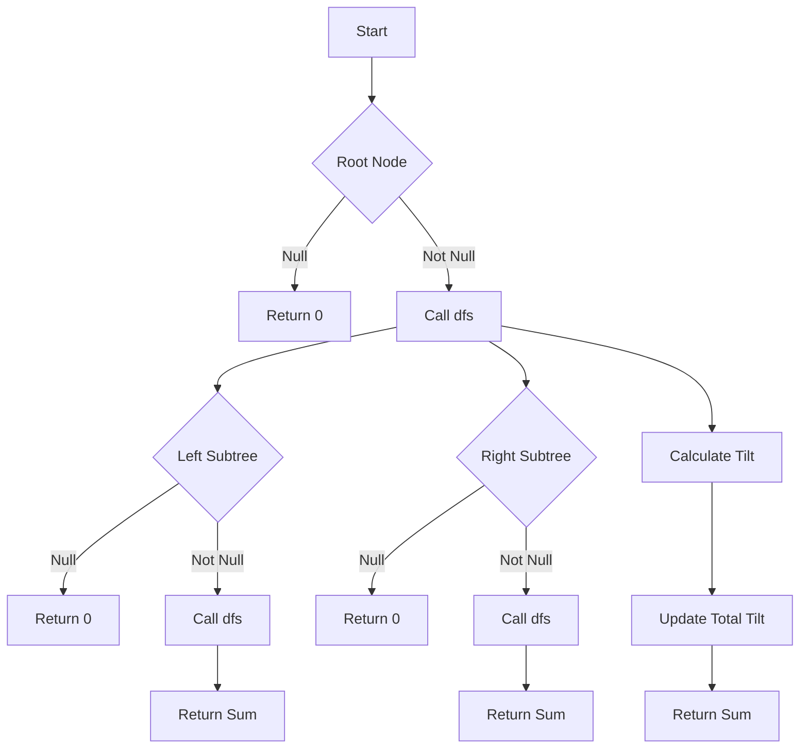

# Binary Tree Tilt

## Problem Understanding
The problem of Binary Tree Tilt involves calculating the total tilt of a binary tree, where the tilt of a node is defined as the absolute difference between the sum of its left subtree and the sum of its right subtree. The key constraint is that we need to calculate the tilt for each node in the tree and sum them up to get the total tilt. This problem is non-trivial because it requires a recursive approach to calculate the sum of each subtree, and a naive approach would result in redundant calculations and inefficient time complexity.

## Approach
The approach to solving this problem involves using Depth-First Search (DFS) to recursively calculate the tilt of each subtree. The intuition behind this approach is to calculate the sum of each subtree and then use these sums to calculate the tilt of each node. We use a helper function `dfs` to calculate the sum of each subtree and update the total tilt. The `dfs` function returns the sum of the subtree, which includes the node value, and updates the total tilt by adding the tilt of the current subtree. This approach works because it allows us to calculate the tilt of each node in a single pass through the tree, avoiding redundant calculations.

## Complexity Analysis
| Metric | Value | Detailed Reason |
|--------|-------|----------------|
| Time   | O(n)  | We visit each node in the tree once, where n is the number of nodes in the tree. The `dfs` function is called recursively for each node, but each node is visited only once. |
| Space  | O(h)  | The maximum recursion depth is equal to the height of the tree, which is h. In the worst case, the tree is skewed, and h = n. However, for a balanced tree, h = log(n). |

## Algorithm Walkthrough
```
Input: 
     1
   /   \
  2     3
 /
4
Step 1: Start with the root node (1)
  - Call dfs(1)
  - Calculate the sum of the left subtree: dfs(2)
  - Calculate the sum of the right subtree: dfs(3)
Step 2: Calculate the sum of the left subtree of node 2
  - Call dfs(4)
  - Return the sum of the subtree: 4
Step 3: Calculate the sum of the right subtree of node 2
  - Return the sum of the empty subtree: 0
Step 4: Calculate the tilt of node 2
  - tilt = |4 - 0| = 4
  - Update the total tilt: totalTilt += 4
  - Return the sum of the subtree: 4 + 2 = 6
Step 5: Calculate the sum of the left subtree of node 1
  - Return the sum of the subtree: 6
Step 6: Calculate the sum of the right subtree of node 1
  - Call dfs(3)
  - Return the sum of the subtree: 3
Step 7: Calculate the tilt of node 1
  - tilt = |6 - 3| = 3
  - Update the total tilt: totalTilt += 3
  - Return the sum of the subtree: 6 + 3 + 1 = 10
Output: totalTilt = 7
```
## Visual Flow

## Key Insight
> **Tip:** The key insight to solving this problem is to use a recursive approach to calculate the sum of each subtree and update the total tilt in a single pass through the tree.

## Edge Cases
- **Empty/null input**: If the input tree is empty, the function returns 0, as there are no nodes to calculate the tilt for.
- **Single element**: If the input tree has only one node, the function returns 0, as there are no subtrees to calculate the tilt for.
- **Unbalanced tree**: If the input tree is unbalanced, the function still works correctly, as it uses a recursive approach to calculate the sum of each subtree and update the total tilt.

## Common Mistakes
- **Mistake 1**: Not updating the total tilt correctly. To avoid this, make sure to update the total tilt inside the `dfs` function.
- **Mistake 2**: Not handling the base case correctly. To avoid this, make sure to return 0 when the input node is null.

## Interview Follow-ups
> **Interview:** These are the exact follow-up questions interviewers ask:
- "What if the input is sorted?" → The problem statement does not assume any specific ordering of the nodes, so the solution works regardless of the input ordering.
- "Can you do it in O(1) space?" → No, the solution requires O(h) space to store the recursion stack, where h is the height of the tree.
- "What if there are duplicates?" → The problem statement does not assume any specific values for the nodes, so the solution works regardless of duplicates.

## Java Solution

```java
// Problem: Binary Tree Tilt
// Language: Java
// Difficulty: Medium
// Time Complexity: O(n) — single pass through the tree using DFS
// Space Complexity: O(h) — maximum recursion depth, where h is the height of the tree
// Approach: Depth-First Search (DFS) tilt calculation — recursively calculate the tilt of each subtree

/**
 * Definition for a binary tree node.
 * public class TreeNode {
 *     int val;
 *     TreeNode left;
 *     TreeNode right;
 *     TreeNode() {}
 *     TreeNode(int val) { this.val = val; }
 *     TreeNode(int val, TreeNode left, TreeNode right) {
 *         this.val = val;
 *         this.left = left;
 *         this.right = right;
 *     }
 * }
 */

class Solution {
    private int totalTilt; // store the total tilt of the binary tree
    
    public int findTilt(TreeNode root) {
        // Edge case: empty tree → return 0
        if (root == null) return 0;
        
        // Perform DFS to calculate the tilt of each subtree
        dfs(root);
        
        // Return the total tilt of the binary tree
        return totalTilt;
    }
    
    // Helper function to calculate the tilt of a subtree and update the total tilt
    private int dfs(TreeNode node) {
        // Base case: empty subtree → return 0
        if (node == null) return 0;
        
        // Recursively calculate the sum of the left and right subtrees
        int leftSum = dfs(node.left); // calculate sum of left subtree
        int rightSum = dfs(node.right); // calculate sum of right subtree
        
        // Calculate the tilt of the current subtree
        int tilt = Math.abs(leftSum - rightSum); // absolute difference between left and right subtree sums
        
        // Update the total tilt
        totalTilt += tilt; // add the tilt of the current subtree to the total tilt
        
        // Return the sum of the current subtree (including the node value)
        return leftSum + rightSum + node.val; // return the sum of left and right subtrees plus the node value
    }
}
```
