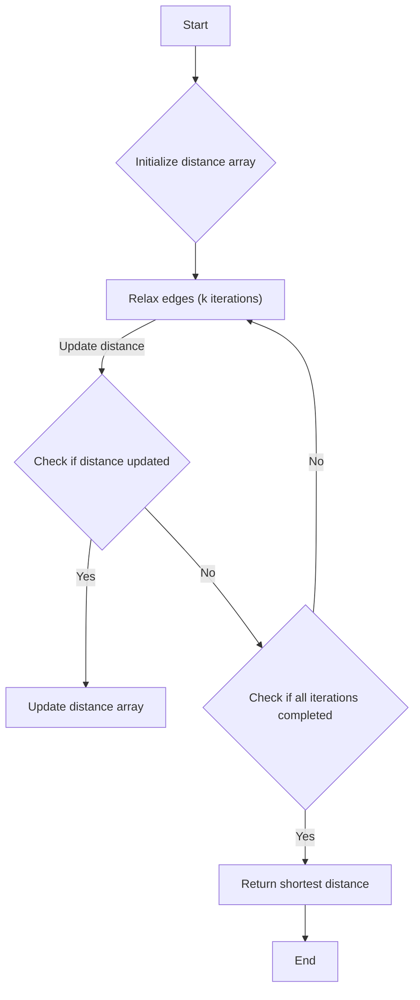

# Cheapest Flights Within K Stops

## Problem Understanding
The problem asks to find the cheapest flight price from a source city to a destination city within a certain number of stops (k). The key constraints are the number of stops (k) and the availability of flights between cities. This problem is non-trivial because it involves finding the shortest path in a graph with weighted edges, and the naive approach of trying all possible paths would be inefficient due to the large number of possible paths.

## Approach
The algorithm strategy used is the Bellman-Ford algorithm with dynamic programming. This approach works by repeatedly relaxing the edges of the graph, allowing the algorithm to find the shortest path from the source to all other nodes. The intuition behind this approach is that the shortest path from the source to a node can be found by considering all possible paths from the source to that node and choosing the one with the minimum cost. The algorithm uses a distance array to store the minimum cost to reach each node and updates this array iteratively.

## Complexity Analysis
| Metric | Value | Detailed Reason |
|--------|-------|----------------|
| Time   | O(n + m * k)  | The algorithm iterates over all edges (m) for each stop (k), and n is the number of nodes. The time complexity is dominated by the nested loop structure. |
| Space  | O(n)  | The algorithm uses a distance array of size n to store the minimum cost to reach each node. |

## Algorithm Walkthrough
```java
Input: n = 3, flights = [[0,1,100],[1,2,100],[0,2,500]], src = 0, dst = 2, k = 1
Step 1: Initialize distance array: [0, INF, INF]
Step 2: Relax edges (first iteration):
    - Consider flight [0,1,100]: Update distance to node 1: [0, 100, INF]
    - Consider flight [1,2,100]: Not applicable (node 1 not reachable yet)
    - Consider flight [0,2,500]: Update distance to node 2: [0, 100, 500]
Step 3: Relax edges (second iteration):
    - Consider flight [0,1,100]: No update (distance to node 1 already 100)
    - Consider flight [1,2,100]: Update distance to node 2: [0, 100, 200]
    - Consider flight [0,2,500]: No update (distance to node 2 already 200)
Output: 200
```

## Visual Flow


## Key Insight
> **Tip:** The key insight is to use the Bellman-Ford algorithm with dynamic programming to find the shortest path within a certain number of stops, allowing for efficient computation of the minimum cost to reach the destination.

## Edge Cases
- **Empty/null input**: If the input array `flights` is empty or null, the algorithm will return -1, indicating that there is no path from the source to the destination.
- **Single element**: If the input array `flights` contains only one element, the algorithm will return the cost of that flight if it is from the source to the destination, or -1 otherwise.
- **No path from source to destination**: If there is no path from the source to the destination within the given number of stops, the algorithm will return -1.

## Common Mistakes
- **Mistake 1**: Not initializing the distance array correctly, leading to incorrect results. → To avoid this, make sure to initialize the distance array with infinity for all nodes except the source, which should be initialized to 0.
- **Mistake 2**: Not considering the case where there is no path from the source to the destination. → To avoid this, make sure to return -1 if the distance to the destination remains infinity after the algorithm completes.

## Interview Follow-ups
> **Interview:** These are the exact follow-up questions interviewers ask:
- "What if the input is sorted?" → The algorithm does not rely on the input being sorted, so it will work correctly regardless of the order of the input.
- "Can you do it in O(1) space?" → No, the algorithm requires at least O(n) space to store the distance array.
- "What if there are duplicates?" → The algorithm will automatically handle duplicates by choosing the minimum cost path.

## Java Solution

```java
// Problem: Cheapest Flights Within K Stops
// Language: Java
// Difficulty: Medium
// Time Complexity: O(n + m) — Bellman-Ford algorithm with n nodes and m edges
// Space Complexity: O(n) — distance array stores n nodes
// Approach: Bellman-Ford algorithm with dynamic programming — find shortest path within k stops

import java.util.*;

public class Solution {
    public int findCheapestPrice(int n, int[][] flights, int src, int dst, int k) {
        // Initialize distance array with infinity for all nodes except source (0)
        int[] distance = new int[n]; 
        Arrays.fill(distance, Integer.MAX_VALUE); 
        distance[src] = 0; // Distance to source is 0
        
        // Relax edges repeatedly (|V| - 1 times)
        for (int i = 0; i <= k; i++) { // Allow up to k stops
            int[] temp = Arrays.copyOf(distance, n); // Store previous distance values
            for (int[] flight : flights) { // Iterate over all edges
                int u = flight[0], v = flight[1], w = flight[2]; // From, to, weight
                // If we can reach 'u' and the path through 'u' to 'v' is shorter, update distance
                if (temp[u] != Integer.MAX_VALUE && temp[u] + w < distance[v]) 
                    distance[v] = temp[u] + w; // Update shortest distance to 'v'
            }
        }
        
        // Edge case: no path from source to destination
        if (distance[dst] == Integer.MAX_VALUE) 
            return -1; // Return -1 if no path exists
        
        return distance[dst]; // Return shortest distance
    }

    public static void main(String[] args) {
        Solution solution = new Solution();
        int[][] flights = {{0,1,100},{1,2,100},{0,2,500}};
        System.out.println(solution.findCheapestPrice(3, flights, 0, 2, 1)); // Output: 200
    }
}
```
