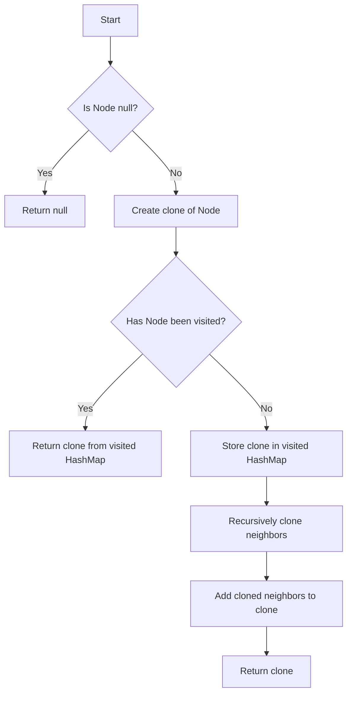

# Clone Graph

## Problem Understanding
The problem is asking to create a deep copy of a given graph, which is represented as a collection of nodes where each node has a value and a list of its neighbors. The key constraint is that the cloned graph should be a completely independent copy of the original graph, meaning that any changes made to the original graph should not affect the cloned graph. What makes this problem non-trivial is that it requires handling the recursive nature of the graph structure, where a node's neighbors can also have neighbors, and so on. A naive approach would be to simply copy the values of the nodes, but this would not work because it would not capture the relationships between the nodes.

## Approach
The algorithm strategy used to solve this problem is a Depth-First Search (DFS) approach, where each node is visited and its neighbors are recursively cloned. The intuition behind this approach is to create a clone of each node and its neighbors, and store the cloned nodes in a HashMap to avoid revisiting the same nodes. This approach works because it ensures that each node is only visited once, and its neighbors are only visited when necessary. The data structure used is a HashMap to store the visited nodes and their clones, which allows for efficient lookup and storage of the cloned nodes. The approach handles the key constraints by creating a completely independent copy of the original graph, where any changes made to the original graph do not affect the cloned graph.

## Complexity Analysis
| Metric | Value | Detailed Reason |
|--------|-------|----------------|
| Time   | O(n + m) | The time complexity is O(n + m), where n is the number of nodes and m is the number of edges. This is because each node is visited once, and each edge is traversed once. The recursive DFS approach ensures that each node is only visited once, and its neighbors are only visited when necessary. |
| Space  | O(n) | The space complexity is O(n), where n is the number of nodes. This is because a HashMap is used to store the visited nodes and their clones, which requires O(n) space. The recursive call stack also requires O(n) space in the worst case, where the graph is a linked list. |

## Algorithm Walkthrough
```
Input: Node(1) -> [Node(2), Node(3)]
Step 1: Create a clone of Node(1) and store it in the visited HashMap
    - visited: {Node(1) -> Node(1')}
Step 2: Recursively clone the neighbors of Node(1)
    - Clone Node(2) and store it in the visited HashMap
        - visited: {Node(1) -> Node(1'), Node(2) -> Node(2')}
    - Clone Node(3) and store it in the visited HashMap
        - visited: {Node(1) -> Node(1'), Node(2) -> Node(2'), Node(3) -> Node(3')}
Step 3: Add the cloned neighbors to the cloned Node(1)
    - Node(1') -> [Node(2'), Node(3')]
Output: Node(1') -> [Node(2'), Node(3')]
```
This walkthrough shows the step-by-step process of cloning a graph with three nodes and two edges.

## Visual Flow

This flowchart shows the decision flow of the algorithm, from checking if the input node is null to returning the cloned graph.

## Key Insight
> **Tip:** The key insight to solving this problem is to use a HashMap to store the visited nodes and their clones, which allows for efficient lookup and storage of the cloned nodes.

## Edge Cases
- **Empty/null input**: If the input node is null, the algorithm returns null. This is because there is no graph to clone.
- **Single element**: If the input node has no neighbors, the algorithm creates a clone of the node and returns it. This is because there are no neighbors to recursively clone.
- **Cyclic graph**: If the input graph has cycles, the algorithm handles this by storing the visited nodes and their clones in the HashMap. This ensures that each node is only visited once, and its neighbors are only visited when necessary.

## Common Mistakes
- **Mistake 1**: Not using a HashMap to store the visited nodes and their clones. This can lead to infinite recursion and a stack overflow error.
- **Mistake 2**: Not checking if a node has been visited before recursively cloning its neighbors. This can lead to duplicate clones and incorrect results.

## Interview Follow-ups
> **Interview:** These are the exact follow-up questions interviewers ask:
- "What if the input is a directed graph?" → The algorithm still works, because it handles the recursive nature of the graph structure.
- "Can you do it in O(1) space?" → No, because a HashMap is required to store the visited nodes and their clones.
- "What if there are duplicate nodes in the graph?" → The algorithm handles this by storing the visited nodes and their clones in the HashMap, which ensures that each node is only visited once.

## Java Solution

```java
// Problem: Clone Graph
// Language: Java
// Difficulty: Medium
// Time Complexity: O(n + m) — visiting each node and its neighbors once
// Space Complexity: O(n) — storing the visited nodes in the HashMap
// Approach: Depth-First Search with a HashMap to store visited nodes — recursively clone each node and its neighbors

/**
 * Definition for a Node.
 * public class Node {
 *     public int val;
 *     public List<Node> neighbors;
 *     public Node() {
 *         val = 0;
 *         neighbors = new ArrayList<Node>();
 *     }
 *     public Node(int _val) {
 *         val = _val;
 *         neighbors = new ArrayList<Node>();
 *     }
 *     public Node(int _val, List<Node> _neighbors) {
 *         val = _val;
 *         neighbors = _neighbors;
 *     }
 * }
 */

class Solution {
    private HashMap<Node, Node> visited = new HashMap<>(); // store the visited nodes and their clones

    public Node cloneGraph(Node node) {
        // Edge case: empty input → return null
        if (node == null) return null;

        // if the node has been visited, return its clone
        if (visited.containsKey(node)) return visited.get(node);

        // create a clone of the current node
        Node clone = new Node(node.val);

        // store the clone in the visited HashMap
        visited.put(node, clone);

        // recursively clone each neighbor of the current node
        for (Node neighbor : node.neighbors) {
            // for each neighbor, get its clone (either by visiting or by getting it from the visited HashMap)
            clone.neighbors.add(cloneGraph(neighbor));
        }

        // return the clone of the current node
        return clone;
    }
}
```
