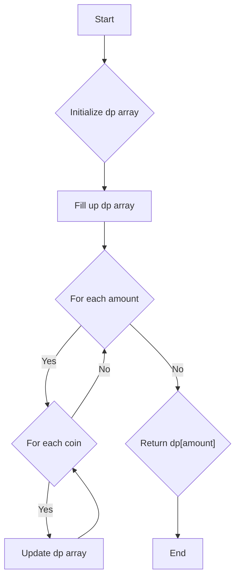

# Coin Change

## Problem Understanding
The Coin Change problem is asking for the minimum number of coins required to make a certain amount, given a set of coin denominations. The key constraint is that we can use each coin denomination any number of times. What makes this problem non-trivial is that a naive approach, such as trying all possible combinations of coins, would be inefficient due to the large number of possible combinations. The problem requires a more efficient algorithm that can find the optimal solution without trying all possible combinations.

## Approach
The algorithm strategy used to solve this problem is dynamic programming, specifically a bottom-up approach. The intuition behind this approach is to build up a table of minimum number of coins required to make up each amount from 0 to the target amount. We use a 1D array `dp` to store the minimum number of coins for each amount, where `dp[i]` represents the minimum number of coins needed to make up the amount `i`. We fill up the table by iterating over each amount and checking if using each coin can reduce the number of coins needed. This approach works because it ensures that we consider all possible combinations of coins and choose the one that requires the minimum number of coins.

## Complexity Analysis
| Metric | Value | Detailed Reason |
|--------|-------|----------------|
| Time   | O(amount * coins.length) | We have two nested loops, one iterating over each amount from 1 to the target amount, and the other iterating over each coin denomination. The time complexity is proportional to the product of the number of amounts and the number of coin denominations. |
| Space  | O(amount) | We use a 1D array `dp` to store the minimum number of coins for each amount, which requires space proportional to the target amount. |

## Algorithm Walkthrough
```
Input: coins = [1, 2, 5], amount = 11
Step 1: Initialize dp array with large values: dp = [0, 12, 12, 12, 12, 12, 12, 12, 12, 12, 12, 12]
Step 2: Fill up dp array:
  - For amount 1: dp[1] = min(dp[1], dp[1-1] + 1) = min(12, 0 + 1) = 1
  - For amount 2: dp[2] = min(dp[2], dp[2-1] + 1) = min(12, 1 + 1) = 2
  - For amount 3: dp[3] = min(dp[3], dp[3-1] + 1) = min(12, 2 + 1) = 3
  - For amount 4: dp[4] = min(dp[4], dp[4-2] + 1) = min(12, 2 + 1) = 2
  - For amount 5: dp[5] = min(dp[5], dp[5-5] + 1) = min(12, 0 + 1) = 1
  - For amount 6: dp[6] = min(dp[6], dp[6-1] + 1) = min(12, 2 + 1) = 3
  - For amount 7: dp[7] = min(dp[7], dp[7-2] + 1) = min(12, 3 + 1) = 3
  - For amount 8: dp[8] = min(dp[8], dp[8-5] + 1) = min(12, 2 + 1) = 2
  - For amount 9: dp[9] = min(dp[9], dp[9-4] + 1) = min(12, 3 + 1) = 3
  - For amount 10: dp[10] = min(dp[10], dp[10-5] + 1) = min(12, 2 + 1) = 2
  - For amount 11: dp[11] = min(dp[11], dp[11-1] + 1) = min(12, 2 + 1) = 3
Output: dp[11] = 3
```
## Visual Flow

## Key Insight
> **Tip:** The key insight to solving this problem is to use dynamic programming to build up a table of minimum number of coins required to make up each amount, and to use the previously computed values to avoid redundant computations.

## Edge Cases
- **Empty/null input**: If the input array is empty or null, the function should return -1, as it's impossible to make up the amount with no coins.
- **Single element**: If the input array contains only one coin denomination, the function should return the amount divided by the coin denomination, rounded up to the nearest integer, as we can use the coin as many times as needed.
- **Amount is 0**: If the amount is 0, the function should return 0, as we don't need any coins to make up the amount 0.

## Common Mistakes
- **Mistake 1**: Not initializing the dp array with large values, which can cause the function to return incorrect results.
- **Mistake 2**: Not checking if the coin is not larger than the current amount, which can cause the function to return incorrect results.

## Interview Follow-ups
> **Interview:** These are the exact follow-up questions interviewers ask:
- "What if the input is sorted?" → The sorting of the input array does not affect the time complexity of the algorithm, as we are using a dynamic programming approach that fills up a table with minimum number of coins for each amount.
- "Can you do it in O(1) space?" → No, we cannot solve this problem in O(1) space, as we need to store the minimum number of coins for each amount in the dp array.
- "What if there are duplicates?" → If there are duplicates in the input array, we can simply remove them before filling up the dp array, as using a coin multiple times does not affect the minimum number of coins required to make up the amount.

## Java Solution

```java
// Problem: Coin Change
// Language: Java
// Difficulty: Medium
// Time Complexity: O(amount * coins.length) — dynamic programming fills up a 2D table
// Space Complexity: O(amount) — 1D array stores minimum number of coins for each amount
// Approach: Dynamic Programming bottom-up — fill up a table with minimum number of coins for each amount

public class Solution {
    public int coinChange(int[] coins, int amount) {
        // Edge case: amount is 0 → return 0
        if (amount == 0) return 0;

        // Create a dynamic programming table to store minimum number of coins for each amount
        int[] dp = new int[amount + 1];
        
        // Initialize the dynamic programming table with a large value (more than the maximum possible number of coins)
        for (int i = 0; i <= amount; i++) {
            // Assume it's impossible to make up the amount initially
            dp[i] = amount + 1;
        }
        
        // Base case: it takes 0 coins to make up the amount 0
        dp[0] = 0;

        // Fill up the dynamic programming table
        for (int i = 1; i <= amount; i++) {
            // For each coin, check if using it can reduce the number of coins needed
            for (int coin : coins) {
                // Check if the coin is not larger than the current amount
                if (coin <= i) {
                    // Update the minimum number of coins if using the current coin reduces the number of coins needed
                    dp[i] = Math.min(dp[i], dp[i - coin] + 1);
                }
            }
        }

        // Edge case: it's impossible to make up the amount → return -1
        if (dp[amount] > amount) return -1;

        // Return the minimum number of coins needed to make up the amount
        return dp[amount];
    }
}
```
