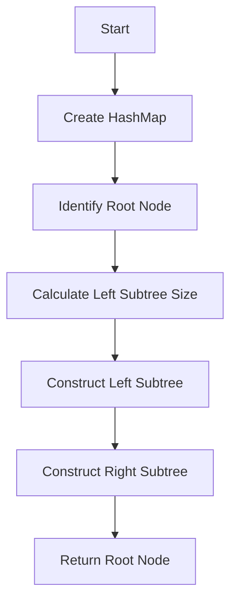

# Construct Binary Tree from Preorder and Inorder Traversal

## Problem Understanding
The problem asks to construct a binary tree from given preorder and inorder traversal sequences. The key constraint is that the input sequences are valid traversals of a binary tree. The problem is non-trivial because it requires understanding the relationship between preorder and inorder traversals and using this relationship to reconstruct the tree. A naive approach would fail because it would not correctly identify the root node and the boundaries of the left and right subtrees.

## Approach
The algorithm strategy is to use a recursive approach to construct the binary tree. The intuition behind this approach is to identify the root node from the preorder traversal and then use the inorder traversal to split the left and right subtrees. A HashMap is used to store the indices of the inorder traversal for fast lookup. This approach works because the preorder traversal gives the root node, and the inorder traversal gives the order of the nodes in the left and right subtrees. The recursive function constructs the left subtree, then the right subtree, using the preorder and inorder traversals.

## Complexity Analysis
| Metric | Value | Detailed Reason |
|--------|-------|----------------|
| Time   | O(n)  | The algorithm makes a single pass through both the preorder and inorder arrays, where n is the number of nodes in the tree. The recursive function calls are made n times, and each call performs a constant amount of work. The HashMap operations (put and get) take constant time. |
| Space  | O(n)  | The HashMap stores at most n elements, where n is the number of nodes in the tree. The recursive call stack also uses O(n) space in the worst case, when the tree is skewed to one side. |

## Algorithm Walkthrough
```
Input: 
preorder = [3, 9, 20, 15, 7]
inorder = [9, 3, 15, 20, 7]

Step 1: Create a HashMap for fast Inorder index lookup
inorderIndexMap = {9: 0, 3: 1, 15: 2, 20: 3, 7: 4}

Step 2: Identify the root node from Preorder
rootVal = 3
rootIndexInInorder = 1

Step 3: Calculate the size of the left subtree
leftSubtreeSize = 1

Step 4: Recursively construct the left subtree
preorder = [9]
inorder = [9]
root.left = TreeNode(9)

Step 5: Recursively construct the right subtree
preorder = [20, 15, 7]
inorder = [15, 20, 7]
root.right = TreeNode(20)
  root.right.left = TreeNode(15)
  root.right.right = TreeNode(7)

Output: 
       3
      / \
     9  20
       /  \
      15   7
```
## Visual Flow

## Key Insight
> **Tip:** The key insight is to use the preorder traversal to identify the root node and the inorder traversal to split the left and right subtrees, and to use a HashMap for fast lookup of inorder indices.

## Edge Cases
- **Empty/null input**: If the input arrays are empty or null, the function returns null, as there is no tree to construct.
- **Single element**: If the input arrays have only one element, the function returns a tree with a single node, as there are no left or right subtrees to construct.
- **Duplicate elements**: If the input arrays have duplicate elements, the function may not work correctly, as the HashMap will only store the index of the last occurrence of each element.

## Common Mistakes
- **Mistake 1**: Not checking for empty or null input arrays before attempting to construct the tree.
- **Mistake 2**: Not using a HashMap for fast lookup of inorder indices, resulting in inefficient tree construction.

## Interview Follow-ups
> **Interview:** 
- "What if the input is sorted?" → The algorithm will still work correctly, but the tree may be skewed to one side.
- "Can you do it in O(1) space?" → No, because we need to use a HashMap to store the inorder indices, which requires O(n) space.
- "What if there are duplicates?" → The algorithm may not work correctly, as the HashMap will only store the index of the last occurrence of each element.

## Java Solution

```java
// Problem: Construct Binary Tree from Preorder and Inorder Traversal
// Language: Java
// Difficulty: Medium
// Time Complexity: O(n) — single pass through both arrays using HashMap for Inorder index lookup
// Space Complexity: O(n) — HashMap stores at most n elements, recursive call stack
// Approach: Recursive tree construction — using Preorder for root and Inorder for left/right subtree identification

/**
 * Definition for a binary tree node.
 * public class TreeNode {
 *     int val;
 *     TreeNode left;
 *     TreeNode right;
 *     TreeNode() {}
 *     TreeNode(int val) { this.val = val; }
 *     TreeNode(int val, TreeNode left, TreeNode right) {
 *         this.val = val;
 *         this.left = left;
 *         this.right = right;
 *     }
 * }
 */
class Solution {
    public TreeNode buildTree(int[] preorder, int[] inorder) {
        // Edge case: empty input → return null
        if (preorder == null || preorder.length == 0 || inorder == null || inorder.length == 0) {
            return null;
        }
        
        // Create a HashMap for fast Inorder index lookup
        Map<Integer, Integer> inorderIndexMap = new HashMap<>();
        for (int i = 0; i < inorder.length; i++) {
            inorderIndexMap.put(inorder[i], i); // store val and its index in Inorder
        }
        
        return buildTreeRecursive(preorder, 0, preorder.length - 1, inorder, 0, inorder.length - 1, inorderIndexMap);
    }
    
    private TreeNode buildTreeRecursive(int[] preorder, int preorderStart, int preorderEnd, int[] inorder, int inorderStart, int inorderEnd, Map<Integer, Integer> inorderIndexMap) {
        // Base case: if start > end, subtree is empty
        if (preorderStart > preorderEnd) {
            return null;
        }
        
        // Identify the root node from Preorder
        int rootVal = preorder[preorderStart]; // first element in Preorder is the root
        TreeNode root = new TreeNode(rootVal);
        
        // Find the root's index in Inorder to split left and right subtrees
        int rootIndexInInorder = inorderIndexMap.get(rootVal);
        
        // Calculate the size of the left subtree
        int leftSubtreeSize = rootIndexInInorder - inorderStart;
        
        // Recursively construct the left subtree
        root.left = buildTreeRecursive(preorder, preorderStart + 1, preorderStart + leftSubtreeSize, inorder, inorderStart, rootIndexInInorder - 1, inorderIndexMap);
        
        // Recursively construct the right subtree
        root.right = buildTreeRecursive(preorder, preorderStart + leftSubtreeSize + 1, preorderEnd, inorder, rootIndexInInorder + 1, inorderEnd, inorderIndexMap);
        
        return root;
    }
}
```
