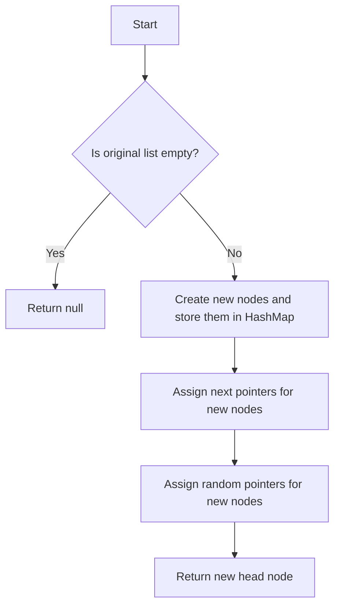

# Copy List with Random Pointer

## Problem Understanding
The problem requires creating a deep copy of a linked list where each node has a random pointer to another node in the list. The key constraint is that the copied list should have the same structure and random pointer connections as the original list. What makes this problem non-trivial is the presence of random pointers, which means a simple iterative or recursive approach to copy the list would not be sufficient, as it would not correctly handle the random pointers. The naive approach of copying each node and then trying to reconnect the random pointers would fail because it would not be able to efficiently find the corresponding node in the new list to assign as the random pointer.

## Approach
The algorithm strategy is to use a HashMap to store the mapping between the original nodes and their corresponding new nodes. This approach works because it allows for efficient lookup of the new node corresponding to any original node, which is necessary for correctly assigning the random pointers. The intuition behind this approach is to first create all the new nodes and store them in the HashMap, and then use the HashMap to assign the random pointers. The data structure used is a HashMap, which is chosen because it provides constant-time lookup, insertion, and deletion operations. This approach handles the key constraint of correctly assigning the random pointers by using the HashMap to efficiently find the corresponding new node for each original node's random pointer.

## Complexity Analysis
| Metric | Value | Detailed Reason |
|--------|-------|----------------|
| Time   | O(n)  | The algorithm makes two passes through the list: one to create the new nodes and store them in the HashMap, and another to assign the random pointers. Each pass takes O(n) time, where n is the number of nodes in the list. Therefore, the total time complexity is O(n) + O(n) = O(2n), which simplifies to O(n). |
| Space  | O(n)  | The algorithm uses a HashMap to store the mapping between the original nodes and their corresponding new nodes. In the worst case, the HashMap will store n nodes, where n is the number of nodes in the list. Therefore, the space complexity is O(n). |

## Algorithm Walkthrough
```java
Input: 
// Create a sample linked list with random pointers
Node head = new Node(1);
head.next = new Node(2);
head.next.next = new Node(3);
head.random = head.next.next; // Node 1's random pointer points to Node 3
head.next.random = head; // Node 2's random pointer points to Node 1
head.next.next.random = head.next; // Node 3's random pointer points to Node 2

Step 1: Create a new node for each original node and store them in the HashMap
// nodeMap = {head: new Node(1), head.next: new Node(2), head.next.next: new Node(3)}

Step 2: Assign the next pointers for the new nodes
// newHead = new Node(1), newHead.next = new Node(2), newHead.next.next = new Node(3)

Step 3: Assign the random pointers for the new nodes
// newHead.random = new Node(3), newHead.next.random = newHead, newHead.next.next.random = newHead.next

Output: 
// The new head node of the copied linked list
```
This walkthrough demonstrates the algorithm's ability to correctly copy the linked list with random pointers.

## Visual Flow

This flowchart illustrates the decision flow of the algorithm.

## Key Insight
> **Tip:** The key insight is to use a HashMap to store the mapping between the original nodes and their corresponding new nodes, which enables efficient lookup and assignment of the random pointers.

## Edge Cases
- **Empty/null input**: If the input list is empty or null, the algorithm returns null, as there are no nodes to copy.
- **Single element**: If the input list contains only one node, the algorithm creates a new node with the same value and returns it as the new head node. The random pointer of the new node is assigned based on the original node's random pointer.
- **Cycle in the list**: If the input list contains a cycle (i.e., a node's next pointer points to a previous node), the algorithm will still work correctly, as it uses the HashMap to keep track of the new nodes and their corresponding original nodes.

## Common Mistakes
- **Mistake 1**: Not using a HashMap to store the mapping between the original nodes and their corresponding new nodes, which would lead to inefficient lookup and assignment of the random pointers.
- **Mistake 2**: Not handling the case where a node's random pointer points to itself, which would cause an infinite loop if not handled correctly.

## Interview Follow-ups
> **Interview:** These are the exact follow-up questions interviewers ask:
- "What if the input is sorted?" → The algorithm still works correctly, as it does not rely on the input being sorted. The time complexity remains O(n).
- "Can you do it in O(1) space?" → No, the algorithm requires O(n) space to store the HashMap, which is necessary for efficient lookup and assignment of the random pointers.
- "What if there are duplicates?" → The algorithm still works correctly, as it uses the HashMap to keep track of the new nodes and their corresponding original nodes. The presence of duplicates does not affect the correctness of the algorithm.

## Java Solution

```java
// Problem: Copy List with Random Pointer
// Language: Java
// Difficulty: Medium
// Time Complexity: O(n) — two passes through the list to create nodes and assign random pointers
// Space Complexity: O(n) — HashMap stores at most n nodes
// Approach: HashMap-based node cloning — store new nodes in a HashMap for efficient lookup

import java.util.HashMap;
import java.util.Map;

class Node {
    int val;
    Node next;
    Node random;

    public Node(int val) {
        this.val = val;
        this.next = null;
        this.random = null;
    }
}

public class Solution {
    public Node copyRandomList(Node head) {
        // Edge case: empty list → return null
        if (head == null) return null;

        // Create a HashMap to store new nodes for efficient lookup
        Map<Node, Node> nodeMap = new HashMap<>();

        // First pass: create new nodes and store them in the HashMap
        Node originalCurrent = head;
        Node newCurrent = null;
        Node newHead = null;
        while (originalCurrent != null) {
            // Create a new node with the same value
            Node newNode = new Node(originalCurrent.val);
            
            // Store the new node in the HashMap
            nodeMap.put(originalCurrent, newNode);

            // If this is the first node, set it as the new head
            if (newHead == null) newHead = newNode;

            // If the previous new node exists, link it to the current new node
            if (newCurrent != null) newCurrent.next = newNode;

            // Move to the next original node and update the new current node
            originalCurrent = originalCurrent.next;
            newCurrent = newNode;
        }

        // Second pass: assign random pointers to the new nodes
        originalCurrent = head;
        newCurrent = newHead;
        while (originalCurrent != null) {
            // If the original node has a random pointer, assign it to the new node
            if (originalCurrent.random != null) {
                // Get the new node corresponding to the original random node from the HashMap
                newCurrent.random = nodeMap.get(originalCurrent.random);
            }

            // Move to the next original node and update the new current node
            originalCurrent = originalCurrent.next;
            newCurrent = newCurrent.next;
        }

        // Return the new head node
        return newHead;
    }
}
```
