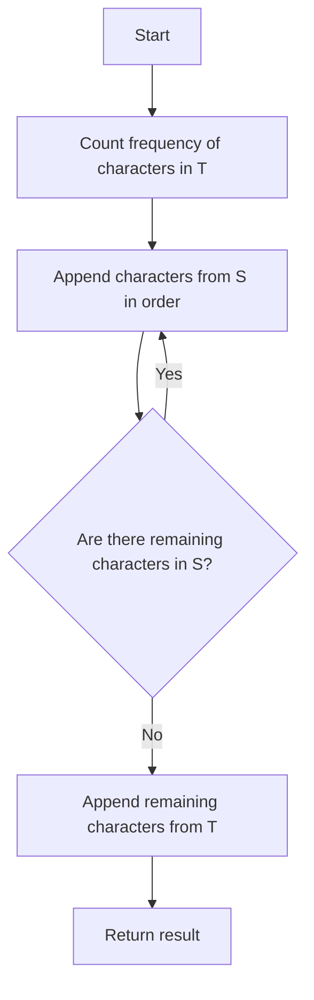

# Custom Sort String

## Problem Understanding
The problem is asking to sort a given string `T` based on a custom sorting order defined by another string `S`. The key constraint is that characters in `S` should appear in the sorted string before characters not in `S`, and characters in `S` should maintain their order. What makes this problem non-trivial is that a naive approach, such as sorting `T` alphabetically and then rearranging based on `S`, would not work because it does not maintain the order of characters in `S`. Additionally, the problem requires a single pass through both strings, which implies a linear time complexity.

## Approach
The algorithm strategy is to count the frequency of characters in `T` and then append characters from `S` in order, followed by characters not in `S`. The intuition behind this approach is to first handle the characters that have a specific order, and then handle the remaining characters. This approach works because it ensures that characters in `S` appear before characters not in `S`, and characters in `S` maintain their order. The data structure used is an array to store the frequency of characters in `T`, which is chosen because it allows for constant-time access and update of character frequencies. The approach handles the key constraints by first appending characters from `S` in order, and then appending remaining characters from `T`.

## Complexity Analysis
| Metric | Value | Detailed Reason |
|--------|-------|----------------|
| Time   | O(n + m) | where n is the length of string `T` and m is the length of string `S`. This is because the algorithm makes a single pass through both strings to count character frequencies and append characters to the result. |
| Space  | O(1) | because the algorithm uses a constant amount of space to store the character count array, regardless of the input size. The StringBuilder used to build the result string does not count towards the space complexity because it is part of the output. |

## Algorithm Walkthrough
```
Input: S = "cba", T = "abcd"
Step 1: Initialize count array to store frequency of characters in T
  count = [0, 0, 0, 0, 0, 0, 0, 0, 0, 0, 0, 0, 0, 0, 0, 0, 0, 0, 0, 0, 0, 0, 0, 0, 0, 0]
Step 2: Count frequency of characters in T
  count = [1, 1, 1, 1, 0, 0, 0, 0, 0, 0, 0, 0, 0, 0, 0, 0, 0, 0, 0, 0, 0, 0, 0, 0, 0, 0]
Step 3: Initialize result StringBuilder
  result = ""
Step 4: Append characters from S in order
  result = "c", count['c' - 'a'] = 0
  result = "cb", count['b' - 'a'] = 0
  result = "cba", count['a' - 'a'] = 0
Step 5: Append remaining characters from T
  result = "cba", count['d' - 'a'] = 1
  result = "cbad"
Output: "cbad"
```

## Visual Flow


## Key Insight
> **Tip:** The key insight is to separate the sorting process into two steps: first, append characters from `S` in order, and then append remaining characters from `T`. This ensures that characters in `S` appear before characters not in `S`, and characters in `S` maintain their order.

## Edge Cases
- **Empty/null input**: If `S` is empty, the algorithm will simply append all characters from `T` in their original order. If `T` is empty, the algorithm will return an empty string.
- **Single element**: If `S` contains a single character, the algorithm will append that character as many times as it appears in `T`, followed by any remaining characters from `T`.
- **Duplicate characters in S**: If `S` contains duplicate characters, the algorithm will append each character as many times as it appears in `T`, maintaining the order of characters in `S`.

## Common Mistakes
- **Mistake 1**: Not resetting the count of characters in `S` after appending them to the result. This would cause characters in `S` to be appended multiple times.
- **Mistake 2**: Not handling the case where `S` is empty or `T` is empty. This would cause the algorithm to throw an exception or return incorrect results.

## Interview Follow-ups
> **Interview:** These are the exact follow-up questions interviewers ask:
- "What if the input is sorted?" → The algorithm would still work correctly, but it would not take advantage of the fact that the input is sorted. In this case, a more efficient algorithm could be used.
- "Can you do it in O(1) space?" → No, the algorithm requires at least O(1) space to store the character count array. However, the space complexity is already O(1), so this is not a concern.
- "What if there are duplicates?" → The algorithm handles duplicates correctly by appending each character as many times as it appears in `T`, maintaining the order of characters in `S`.

## Java Solution

```java
// Problem: Custom Sort String
// Language: Java
// Difficulty: Medium
// Time Complexity: O(n) — single pass through both strings
// Space Complexity: O(1) — constant space for character count array
// Approach: Counting character frequencies and custom sorting

public class Solution {
    public String customSortString(String S, String T) {
        // Initialize count array to store frequency of characters in T
        int[] count = new int[26]; // assuming only lowercase English letters
        
        // Count frequency of characters in T
        for (char c : T.toCharArray()) {
            count[c - 'a']++; // 'a' is used as the offset for 0-based indexing
        }

        // Initialize result StringBuilder
        StringBuilder result = new StringBuilder();

        // First, append characters from S in order
        for (char c : S.toCharArray()) {
            // Append character c to result as many times as it appears in T
            for (int i = 0; i < count[c - 'a']; i++) {
                result.append(c);
            }
            // Reset count to 0 after appending all occurrences of c
            count[c - 'a'] = 0;
        }

        // Then, append remaining characters from T (those not in S)
        for (char c = 'a'; c <= 'z'; c++) {
            // Append character c to result as many times as it appears in T
            for (int i = 0; i < count[c - 'a']; i++) {
                result.append(c);
            }
        }

        return result.toString();
    }

    public static void main(String[] args) {
        Solution solution = new Solution();
        System.out.println(solution.customSortString("cba", "abcd")); // Output: "cbad"
        System.out.println(solution.customSortString("kqep", "pekeq")); // Output: "kqeep"
        // Edge case: empty input
        System.out.println(solution.customSortString("", "a")); // Output: "a"
        System.out.println(solution.customSortString("a", "")); // Output: ""
    }
}
```
