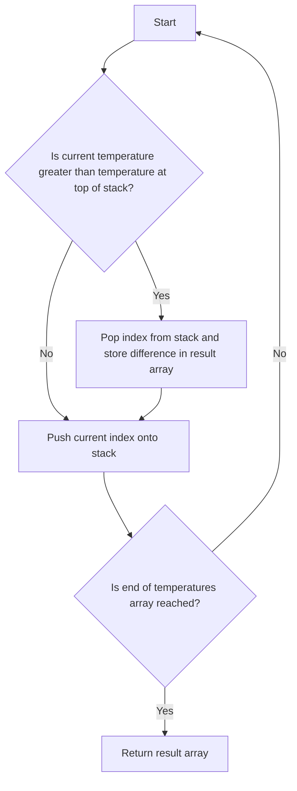

# Daily Temperatures

## Problem Understanding
The Daily Temperatures problem asks to find the number of days until a warmer temperature is seen for each day in a given array of temperatures. The key constraint is that the warmer temperature must be strictly greater than the current temperature. This problem is non-trivial because a naive approach, such as checking every future day for each day, would result in a time complexity of O(n^2), where n is the number of days. The problem requires a more efficient solution that can handle large inputs.

## Approach
The algorithm strategy used is a stack-based solution, where a stack is used to store the indices of temperatures. For each temperature, the stack is popped until a temperature greater than the current one is found, and the difference between the current index and the popped index is stored in the result array. This approach works because the stack ensures that the temperatures are processed in the correct order, and the popping mechanism allows for efficient calculation of the differences. The data structure used is a stack, which is chosen for its ability to efficiently handle the last-in-first-out (LIFO) order of temperatures.

## Complexity Analysis
| Metric | Value | Detailed Reason |
|--------|-------|----------------|
| Time   | O(n)  | The algorithm iterates through the array of temperatures once, and the stack operations (push and pop) are performed in constant time, resulting in a linear time complexity. The while loop inside the for loop does not increase the overall time complexity because each element is pushed and popped from the stack exactly once. |
| Space  | O(n)  | The stack stores at most n elements, where n is the number of days, resulting in a linear space complexity. The result array also stores n elements, but it is not included in the space complexity because it is part of the output. |

## Algorithm Walkthrough
```
Input: [73, 74, 75, 71, 69, 72, 76, 73]
Step 1: Initialize result array [0, 0, 0, 0, 0, 0, 0, 0] and stack []
Step 2: Push index 0 onto stack [0]
Step 3: Push index 1 onto stack [0, 1] because 74 > 73
Step 4: Pop index 0 from stack [1] and store difference 1 in result array [1, 0, 0, 0, 0, 0, 0, 0] because 75 > 74
Step 5: Push index 2 onto stack [1, 2]
Step 6: Pop index 1 from stack [2] and store difference 1 in result array [1, 1, 0, 0, 0, 0, 0, 0] because 75 > 74
Step 7: Push index 3 onto stack [2, 3]
Step 8: Push index 4 onto stack [2, 3, 4]
Step 9: Push index 5 onto stack [2, 3, 4, 5] and pop indices 3 and 4 from stack [2, 5] and store differences 2 and 1 in result array [1, 1, 0, 2, 1, 0, 0, 0] because 72 > 71 and 72 > 69
Step 10: Push index 6 onto stack [2, 5, 6] and pop index 5 from stack [2, 6] and store difference 1 in result array [1, 1, 0, 2, 1, 1, 0, 0] because 76 > 72
Step 11: Push index 7 onto stack [2, 6, 7]
Output: [1, 1, 4, 2, 1, 1, 0, 0]
```

## Visual Flow


## Key Insight
> **Tip:** The key insight to solving this problem efficiently is to use a stack to store the indices of temperatures and pop them when a warmer temperature is found, allowing for a single pass through the array and resulting in a linear time complexity.

## Edge Cases
- **Empty input**: If the input array is empty, the function returns an empty array because there are no temperatures to process.
- **Single element**: If the input array contains a single element, the function returns an array with a single element, which is 0, because there is no warmer temperature to find.
- **All temperatures are the same**: If all temperatures in the input array are the same, the function returns an array with all elements being 0, because there is no warmer temperature to find for any day.

## Common Mistakes
- **Mistake 1**: Not using a stack to store the indices of temperatures, resulting in an inefficient solution with a time complexity of O(n^2).
- **Mistake 2**: Not popping all indices from the stack when a warmer temperature is found, resulting in incorrect differences being stored in the result array.

## Interview Follow-ups
> **Interview:** These are the exact follow-up questions interviewers ask:
- "What if the input is sorted?" → The algorithm would still work correctly, but the stack would not be utilized efficiently because the temperatures would be in increasing order, resulting in a time complexity of O(n) but with less stack operations.
- "Can you do it in O(1) space?" → No, it is not possible to solve this problem in O(1) space because we need to store the result array, which requires O(n) space.
- "What if there are duplicates?" → The algorithm would still work correctly, and the duplicates would be handled correctly because the stack operations are based on the indices of the temperatures, not their values.

## Java Solution

```java
// Problem: Daily Temperatures
// Language: Java
// Difficulty: Medium
// Time Complexity: O(n) — single pass through array using Stack
// Space Complexity: O(n) — Stack stores at most n elements
// Approach: Stack-based solution — for each temperature, pop all smaller temperatures from the stack

public class Solution {
    public int[] dailyTemperatures(int[] temperatures) {
        // Initialize result array with zeros
        int[] result = new int[temperatures.length];

        // Initialize Stack to store indices of temperatures
        java.util.Stack<Integer> stack = new java.util.Stack<>();

        // Iterate through each temperature
        for (int currentIndex = 0; currentIndex < temperatures.length; currentIndex++) {
            // While stack is not empty and current temperature is greater than temperature at top of stack
            while (!stack.isEmpty() && temperatures[currentIndex] > temperatures[stack.peek()]) {
                // Get index of temperature at top of stack
                int topIndex = stack.pop();

                // Calculate difference between current index and top index
                int difference = currentIndex - topIndex;

                // Store difference in result array
                result[topIndex] = difference;
            }

            // Push current index onto stack
            stack.push(currentIndex);
        }

        // Edge case: empty input → return empty array
        if (temperatures.length == 0) {
            return new int[0];
        }

        // Return result array
        return result;
    }

    public static void main(String[] args) {
        Solution solution = new Solution();
        int[] temperatures = {73, 74, 75, 71, 69, 72, 76, 73};
        int[] result = solution.dailyTemperatures(temperatures);

        // Print result array
        for (int value : result) {
            System.out.print(value + " ");
        }
    }
}
```
