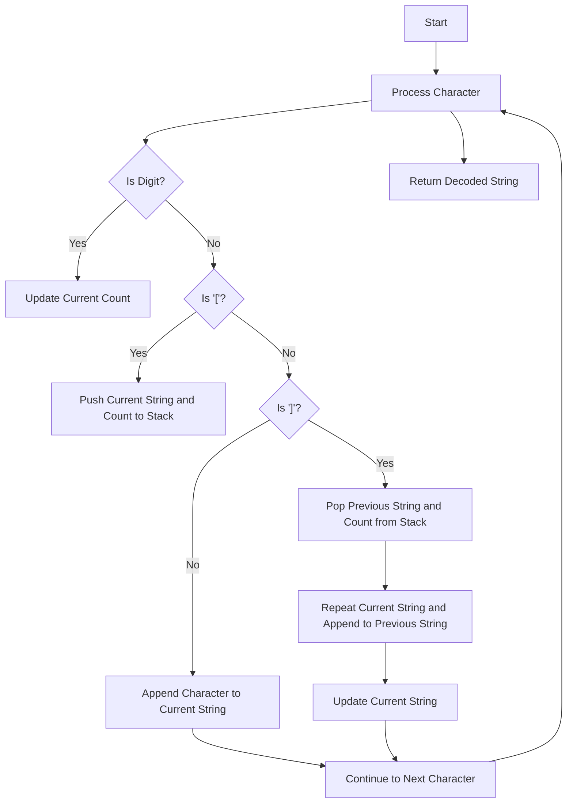

# Decode String

## Problem Understanding
The problem is asking to decode a given string where certain parts of the string are repeated a specified number of times. The string contains digits, letters, and brackets, where the digits represent the repetition count and the brackets represent the start and end of the repeating section. The key constraint is that the string can have nested brackets, which means that a repeating section can itself contain another repeating section. This problem is non-trivial because a naive approach of simply iterating through the string and repeating the characters would not work due to the nested brackets, requiring a more sophisticated approach to handle the repetition and nesting correctly.

## Approach
The algorithm strategy is to use a stack-based approach to decode the string. The intuition behind this approach is to use two stacks, one to store the characters and another to store the counts, to keep track of the repeating sections and their corresponding counts. When a digit is encountered, it is used to update the current count. When a '[', the current string and count are pushed to the stack, and when a ']', the previous string and count are popped from the stack, and the current string is repeated the specified number of times and appended to the previous string. This approach works because it correctly handles the nesting of brackets and the repetition of the strings. The data structures used are two stacks, one for characters and another for counts, which are chosen because they allow for efficient pushing and popping of elements, making it easy to handle the nesting and repetition.

## Complexity Analysis
| Metric | Value | Detailed Reason |
|--------|-------|----------------|
| Time   | O(n)  | The algorithm iterates through the string once, where n is the length of the string. Each character is processed once, and the operations performed (pushing and popping from the stack, appending to the string) take constant time. |
| Space  | O(n)  | The algorithm uses two stacks to store the characters and counts. In the worst case, the stacks can grow up to the length of the string, which happens when the string consists of alternating '[' and ']' characters. |

## Algorithm Walkthrough
```
Input: "3[a]2[bc]"
Step 1: Initialize empty stacks and current string
  - Character stack: []
  - Count stack: []
  - Current string: ""
Step 2: Process character '3'
  - Current count: 3
Step 3: Process character 'a'
  - Current string: "a"
Step 4: Process character '['
  - Push current string "a" to character stack
  - Push current count 3 to count stack
  - Reset current string: ""
Step 5: Process character '2'
  - Current count: 2
Step 6: Process character 'b'
  - Current string: "b"
Step 7: Process character 'c'
  - Current string: "bc"
Step 8: Process character ']'
  - Pop previous string "a" from character stack
  - Pop previous count 3 from count stack
  - Repeat current string "bc" 2 times and append to previous string "a"
  - Update current string: "aaabcbc"
Step 9: Return decoded string
  - Output: "aaabcbc"
```

## Visual Flow


## Key Insight
> **Tip:** The key insight to solving this problem is to use a stack-based approach to handle the nesting of brackets and the repetition of strings, allowing for efficient processing of the input string.

## Edge Cases
- **Empty/null input**: If the input string is empty or null, the algorithm returns an empty string, as there are no characters to process.
- **Single element**: If the input string consists of a single character, the algorithm returns the same character, as there are no brackets or digits to process.
- **No brackets**: If the input string does not contain any brackets, the algorithm simply returns the original string, as there are no repeating sections to process.

## Common Mistakes
- **Mistake 1**: Not handling the case where the input string contains nested brackets. To avoid this, use a stack-based approach to keep track of the repeating sections and their corresponding counts.
- **Mistake 2**: Not updating the current count correctly when encountering a digit. To avoid this, use a separate variable to store the current count and update it accordingly when encountering a digit.

## Interview Follow-ups
> **Interview:** These are the exact follow-up questions interviewers ask:
- "What if the input is sorted?" → The algorithm still works correctly, as it does not rely on the input being sorted.
- "Can you do it in O(1) space?" → No, it is not possible to solve this problem in O(1) space, as we need to store the characters and counts in the stack to handle the nesting and repetition.
- "What if there are duplicates?" → The algorithm still works correctly, as it handles duplicates by repeating the current string the specified number of times and appending it to the previous string.

## Java Solution

```java
// Problem: Decode String
// Language: Java
// Difficulty: Medium
// Time Complexity: O(n) — single pass through string
// Space Complexity: O(n) — stack stores at most n characters
// Approach: Stack-based string decoding — for each character, check if it's a digit or a letter

public class Solution {
    public String decodeString(String s) {
        // Initialize an empty stack to store characters and counts
        java.util.Stack<String> stack = new java.util.Stack<>();
        java.util.Stack<Integer> countStack = new java.util.Stack<>();
        
        // Initialize an empty string to build the result
        StringBuilder currentString = new StringBuilder();
        
        // Initialize the current count to 0
        int currentCount = 0;
        
        // Iterate through each character in the string
        for (char c : s.toCharArray()) {
            // If the character is a digit, update the current count
            if (Character.isDigit(c)) {
                // Update the current count by shifting the current count to the left and adding the new digit
                currentCount = currentCount * 10 + (c - '0');
            } 
            // If the character is a '[', push the current string and count to the stack
            else if (c == '[') {
                // Push the current string to the stack
                stack.push(currentString.toString());
                // Push the current count to the stack
                countStack.push(currentCount);
                // Reset the current string and count
                currentString = new StringBuilder();
                currentCount = 0;
            } 
            // If the character is a ']', pop the string and count from the stack and append the current string
            else if (c == ']') {
                // Get the previous string and count from the stack
                StringBuilder previousString = new StringBuilder(stack.pop());
                int previousCount = countStack.pop();
                // Append the current string to the previous string 'previousCount' times
                for (int i = 0; i < previousCount; i++) {
                    previousString.append(currentString);
                }
                // Update the current string
                currentString = previousString;
            } 
            // If the character is a letter, append it to the current string
            else {
                // Append the character to the current string
                currentString.append(c);
            }
        }
        
        // Return the decoded string
        return currentString.toString();
    }

    public static void main(String[] args) {
        Solution solution = new Solution();
        // Test case 1: "3[a]2[bc]"
        System.out.println(solution.decodeString("3[a]2[bc]"));  // Output: "aaabcbc"
        // Test case 2: "3[a2[c]]"
        System.out.println(solution.decodeString("3[a2[c]]"));  // Output: "accaccacc"
        // Test case 3: "2[abc]3[cd]ef"
        System.out.println(solution.decodeString("2[abc]3[cd]ef"));  // Output: "abcabccdcdcdef"
        // Edge case: empty input → return empty string
        System.out.println(solution.decodeString(""));  // Output: ""
    }
}
```
