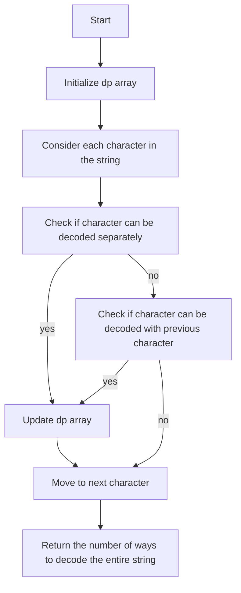

# Decode Ways

## Problem Understanding
The "Decode Ways" problem asks to find the number of ways to decode a given string, where each number in the string can be decoded into a letter. The key constraint is that each number in the string can be either a single digit (representing a letter from '1' to '9') or a two-digit number (representing a letter from '10' to '26'). The problem becomes non-trivial because the naive approach of trying all possible decodings would result in exponential time complexity due to overlapping subproblems. The problem requires finding an efficient way to count the number of valid decodings.

## Approach
The algorithm strategy used is dynamic programming, which involves building up the solution by considering each character and its possible decodings. The intuition behind this approach is to store the number of ways to decode the string up to each position in a dynamic programming (dp) array. The dp array is initialized with a base case where there is one way to decode an empty string. Then, for each character in the string, the algorithm checks if it can be decoded separately or together with the previous character, and updates the dp array accordingly. The approach handles the key constraints by ensuring that only valid decodings are considered.

## Complexity Analysis
| Metric | Value | Detailed Reason |
|--------|-------|----------------|
| Time   | O(n)  | The algorithm iterates through the input string once, where n is the length of the string. Each iteration involves a constant amount of work, resulting in a linear time complexity. |
| Space  | O(n)  | The algorithm uses a dynamic programming array of size n+1 to store the number of ways to decode the string up to each position. This results in a linear space complexity. |

## Algorithm Walkthrough
```
Input: "12"
Step 1: Initialize dp array [1, 0, 0] (base case: one way to decode an empty string)
Step 2: Consider the first character '1', which is not zero, so dp[1] = 1
Step 3: Consider the second character '2', which is not zero, so dp[2] += dp[1] = 1
Step 4: Consider the last two characters '12', which form a valid decoding, so dp[2] += dp[0] = 1 + 1 = 2
Output: 2 (there are two ways to decode "12": "1" -> "A", "2" -> "B" or "12" -> "L")
```
This example illustrates how the algorithm iterates through the input string and updates the dp array to count the number of valid decodings.

## Visual Flow

This flowchart illustrates the decision flow of the algorithm, which involves initializing the dp array, considering each character in the string, and updating the dp array based on whether the character can be decoded separately or together with the previous character.

## Key Insight
> **Tip:** The key to solving this problem is to recognize that the number of ways to decode a string up to a certain position only depends on the number of ways to decode the string up to the previous positions, allowing for a dynamic programming approach.

## Edge Cases
- **Empty/null input**: If the input string is empty or null, the algorithm returns 0, as there is no way to decode an empty string.
- **Single element**: If the input string has only one character, the algorithm returns 1 if the character is not zero, and 0 otherwise, as there is only one way to decode a single non-zero character.
- **String with only zeros**: If the input string contains only zeros, the algorithm returns 0, as there is no way to decode a string with only zeros.

## Common Mistakes
- **Mistake 1**: Not initializing the dp array correctly, leading to incorrect results. To avoid this, ensure that the dp array is initialized with a base case where there is one way to decode an empty string.
- **Mistake 2**: Not considering the case where a character can be decoded together with the previous character, leading to incorrect results. To avoid this, ensure that the algorithm checks for valid two-digit decodings.

## Interview Follow-ups
> **Interview:** These are the exact follow-up questions interviewers ask:
- "What if the input is sorted?" → The algorithm would still work correctly, as the sorting of the input does not affect the number of ways to decode the string.
- "Can you do it in O(1) space?" → No, the algorithm requires a dynamic programming array to store the number of ways to decode the string up to each position, resulting in a space complexity of O(n).
- "What if there are duplicates?" → The algorithm would still work correctly, as duplicates in the input string do not affect the number of ways to decode the string.

## Java Solution

```java
// Problem: Decode Ways
// Language: Java
// Difficulty: Medium
// Time Complexity: O(n) — dynamic programming with a single pass through the input string
// Space Complexity: O(n) — dp array stores the number of ways to decode up to each position
// Approach: Dynamic Programming — build up the solution by considering each character and its possible decodings

public class Solution {
    public int numDecodings(String s) {
        // Edge case: empty input → return 0
        if (s == null || s.length() == 0) {
            return 0;
        }
        
        int n = s.length();
        // Initialize dp array to store the number of ways to decode up to each position
        int[] dp = new int[n + 1];
        dp[0] = 1; // Base case: there is one way to decode an empty string (i.e., do nothing)

        // If the first character is not zero, there is one way to decode it
        if (s.charAt(0) != '0') {
            dp[1] = 1;
        }

        // Iterate through the input string
        for (int i = 2; i <= n; i++) {
            // If the current character is not zero, consider it as a separate decoding
            if (s.charAt(i - 1) != '0') {
                dp[i] += dp[i - 1]; // Add the number of ways to decode up to the previous position
            }
            
            // If the last two characters form a valid decoding (10-26), consider them together
            if (s.charAt(i - 2) == '1' || (s.charAt(i - 2) == '2' && s.charAt(i - 1) <= '6')) {
                dp[i] += dp[i - 2]; // Add the number of ways to decode up to the position two steps back
            }
        }

        // The number of ways to decode the entire string is stored in the last position of the dp array
        return dp[n];
    }
}
```
