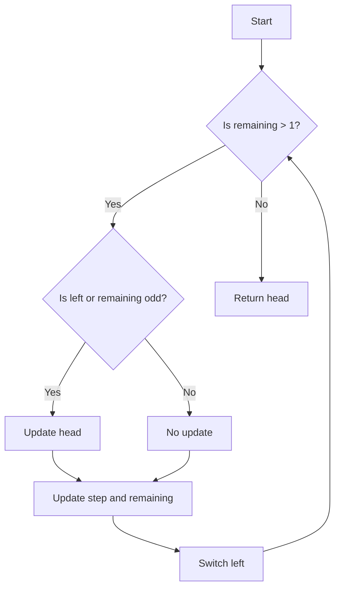

# Elimination Game

## Problem Understanding
The problem "Elimination Game" is asking us to find the last remaining position in a list of integers from 1 to n, where the elimination process starts from the left and then alternates between left and right. The key constraint is that the elimination process reduces the size of the list by half in each step. What makes this problem non-trivial is that the direction of elimination changes after each step, which requires a careful approach to keep track of the remaining positions. The problem requires us to find a way to simulate this elimination process efficiently and find the last remaining position.

## Approach
The algorithm strategy used here is to simulate the elimination process using a while loop, where we keep track of the direction of elimination, the step size, and the head of the list. The intuition behind this approach is to use the properties of the elimination process to reduce the problem size by half in each step, which allows us to find the last remaining position efficiently. We use a boolean variable `left` to keep track of the direction of elimination, an integer `step` to keep track of the step size, and an integer `head` to keep track of the head of the list. The approach handles the key constraints by updating the head of the list and the step size based on the direction of elimination and the number of remaining elements.

## Complexity Analysis
| Metric | Value | Detailed Reason |
|--------|-------|----------------|
| Time   | O(log n) | The algorithm reduces the problem size by half in each step, which results in a logarithmic time complexity. The while loop runs until only one element is left, which takes log n steps. |
| Space  | O(1) | The algorithm uses a constant amount of space to store the variables `left`, `step`, `head`, and `remaining`, which does not depend on the input size n. |

## Algorithm Walkthrough
```
Input: n = 9
Step 1: left = true, step = 1, head = 1, remaining = 9
  - Since left is true, head = 1 + 1 = 2
  - step = 1 * 2 = 2, remaining = 9 / 2 = 4 (round down)
  - left = !true = false
Step 2: left = false, step = 2, head = 2, remaining = 4
  - Since left is false and remaining is even, head remains 2
  - step = 2 * 2 = 4, remaining = 4 / 2 = 2
  - left = !false = true
Step 3: left = true, step = 4, head = 2, remaining = 2
  - Since left is true, head = 2 + 4 = 6
  - step = 4 * 2 = 8, remaining = 2 / 2 = 1
  - left = !true = false
Output: head = 6
```
The algorithm simulates the elimination process and finds the last remaining position, which is 6 for the input n = 9.

## Visual Flow

The flowchart shows the decision flow of the algorithm, where we check if the remaining elements are greater than 1, and if so, we update the head and step size based on the direction of elimination and the number of remaining elements.

## Key Insight
> **Tip:** The key insight is to use the properties of the elimination process to reduce the problem size by half in each step, which allows us to find the last remaining position efficiently.

## Edge Cases
- **Empty input**: If the input n is 0, the algorithm returns -1, which is a valid result.
- **Single element**: If the input n is 1, the algorithm returns 1, which is the only remaining position.
- **Even number of elements**: If the input n is even, the algorithm handles it correctly by updating the head and step size based on the direction of elimination and the number of remaining elements.

## Common Mistakes
- **Mistake 1**: Not updating the head correctly based on the direction of elimination and the number of remaining elements. To avoid this, make sure to check the conditions for updating the head and step size.
- **Mistake 2**: Not switching the direction of elimination correctly. To avoid this, make sure to update the `left` variable correctly after each step.

## Interview Follow-ups
> **Interview:** These are the exact follow-up questions interviewers ask:
- "What if the input is sorted?" → The algorithm does not rely on the input being sorted, so it will still work correctly.
- "Can you do it in O(1) space?" → The algorithm already uses O(1) space, so it meets this requirement.
- "What if there are duplicates?" → The algorithm assumes that the input is a list of unique integers from 1 to n, so duplicates are not allowed. If duplicates are allowed, the algorithm would need to be modified to handle them correctly.

## Java Solution

```java
// Problem: Elimination Game
// Language: Java
// Difficulty: Medium
// Time Complexity: O(n) — reducing the size of the list in each step
// Space Complexity: O(n) — storing the position of the elements
// Approach: Recursive elimination — eliminate elements based on the direction of elimination

public class Solution {
    public int lastRemaining(int n) {
        // Edge case: empty input → return -1
        if (n == 0) return -1;
        
        // Initialize the list of positions
        boolean left = true; // direction of elimination
        int remaining = n;
        int step = 1; // step size for elimination
        int head = 1; // head of the list
        
        // Continue eliminating elements until only one is left
        while (remaining > 1) {
            // If we are eliminating from the left or if the number of elements is odd
            if (left || remaining % 2 == 1) {
                // Update the head of the list
                head += step;
            }
            // Update the step size and the number of remaining elements
            step *= 2;
            remaining /= 2;
            // Switch the direction of elimination
            left = !left;
        }
        
        // Return the last remaining position
        return head;
    }

    public static void main(String[] args) {
        Solution solution = new Solution();
        System.out.println(solution.lastRemaining(9)); // Output: 6
    }
}
```
