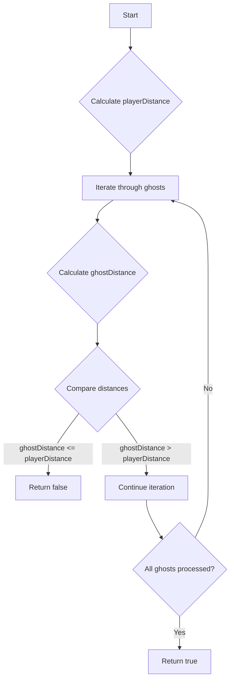

# Escape The Ghosts

## Problem Understanding
The problem "Escape The Ghosts" is asking whether a player can escape from a group of ghosts and reach a target location. The key constraint is that the player and ghosts can only move in a grid, and their distances are calculated using the Manhattan distance metric. This problem is non-trivial because a naive approach might involve simulating all possible movements of the player and ghosts, which would be computationally expensive. However, the problem can be simplified by comparing the Manhattan distances between the player, ghosts, and the target location.

## Approach
The algorithm strategy used here is a Manhattan distance comparison, where the distance between the player and the target is compared with the distance between each ghost and the target. The intuition behind this approach is that if any ghost is closer to the target than the player, the ghost can catch the player. This approach works because the Manhattan distance metric is used, which allows for a simple and efficient comparison of distances. The algorithm uses a constant amount of space to store variables, making it space-efficient. The key constraint of the grid movement is handled by using the Manhattan distance formula to calculate distances.

## Complexity Analysis
| Metric | Value | Detailed Reason |
|--------|-------|----------------|
| Time   | O(n)  | The algorithm iterates through the ghosts array once, where n is the number of ghosts. The calculation of Manhattan distances takes constant time, so the overall time complexity is linear. |
| Space  | O(1)  | The algorithm uses a constant amount of space to store variables such as playerDistance and ghostDistance, regardless of the input size. |

## Algorithm Walkthrough
```
Input: ghosts = [[1, 0], [0, 3]], target = [0, 1]
Step 1: Calculate playerDistance = Math.abs(target[0]) + Math.abs(target[1]) = 1
Step 2: Iterate through each ghost:
  - Ghost [1, 0]: ghostDistance = Math.abs(1 - 0) + Math.abs(0 - 1) = 2
  - Ghost [0, 3]: ghostDistance = Math.abs(0 - 0) + Math.abs(3 - 1) = 2
Step 3: Compare distances:
  - Ghost [1, 0] distance (2) > playerDistance (1)
  - Ghost [0, 3] distance (2) > playerDistance (1)
Output: true (player can escape all ghosts)
```
This walkthrough demonstrates the algorithm's logic with a small example.

## Visual Flow

This flowchart illustrates the algorithm's decision flow and data transformation.

## Key Insight
> **Tip:** The key insight is that the player can escape all ghosts if and only if the player's Manhattan distance to the target is less than the Manhattan distance of any ghost to the target.

## Edge Cases
- **Empty ghosts array**: If the ghosts array is empty, the player can always escape, so the function returns true.
- **Single element in ghosts array**: If there is only one ghost, the function compares the player's distance to the target with the ghost's distance to the target and returns true if the player is closer, and false otherwise.
- **Target at origin**: If the target is at the origin (0, 0), the player's distance to the target is 0, so the function returns true if and only if all ghosts are at a distance greater than 0 from the origin.

## Common Mistakes
- **Mistake 1: Incorrect distance calculation**: Using the Euclidean distance formula instead of the Manhattan distance formula can lead to incorrect results. To avoid this, ensure that the distance calculation uses the correct formula: `Math.abs(x2 - x1) + Math.abs(y2 - y1)`.
- **Mistake 2: Not handling edge cases**: Failing to consider edge cases, such as an empty ghosts array or a single ghost, can lead to incorrect results. To avoid this, explicitly handle these cases in the code.

## Interview Follow-ups
> **Interview:** 
- "What if the input is sorted?" → The algorithm does not rely on the input being sorted, so the time complexity remains O(n).
- "Can you do it in O(1) space?" → The algorithm already uses O(1) space, so this is not a concern.
- "What if there are duplicates in the ghosts array?" → The algorithm will still work correctly, but it may perform unnecessary comparisons. To optimize, consider removing duplicates from the ghosts array before processing.

## Java Solution

```java
// Problem: Escape The Ghosts
// Language: Java
// Difficulty: Medium
// Time Complexity: O(n) — iterate through ghosts array to calculate Manhattan distance
// Space Complexity: O(1) — use a constant amount of space to store variables
// Approach: Manhattan distance comparison — compare distance between target and player with distance between target and each ghost

public class Solution {
    public boolean escapeGhosts(int[][] ghosts, int[] target) {
        // Calculate Manhattan distance between player and target
        int playerDistance = Math.abs(target[0]) + Math.abs(target[1]); // distance from origin to target

        // Iterate through each ghost
        for (int[] ghost : ghosts) {
            // Calculate Manhattan distance between ghost and target
            int ghostDistance = Math.abs(ghost[0] - target[0]) + Math.abs(ghost[1] - target[1]); // distance between ghost and target

            // If any ghost is closer to target than player, return false
            if (ghostDistance <= playerDistance) { // compare distances
                return false; // ghost can catch player
            }
        }

        // Edge case: empty ghosts array → player can always escape
        // If no ghosts are closer to target than player, return true
        return true; // player can escape all ghosts
    }
}
```
