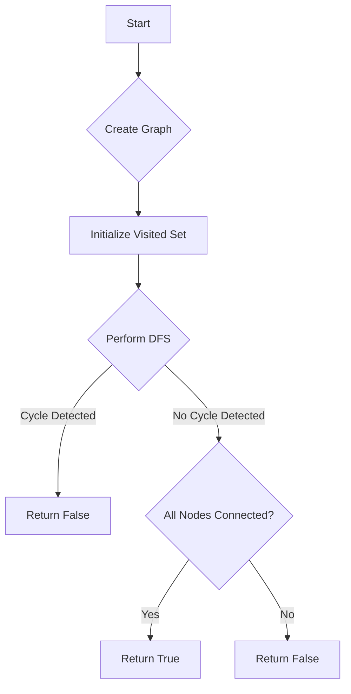

# Graph Valid Tree

## Problem Understanding
The Graph Valid Tree problem asks us to determine whether a given undirected graph is a valid tree. A valid tree is a graph that is connected and has no cycles. The problem provides the number of nodes (`n`) and the edges in the graph (`edges`), and we need to return `true` if the graph is a valid tree and `false` otherwise. The key constraints are that the graph must be connected and have no cycles, which implies that the graph must have `n-1` edges. If the graph has more or fewer edges, it cannot be a valid tree.

## Approach
The algorithm strategy used to solve this problem is Depth-First Search (DFS) with cycle detection. We create an adjacency list representation of the graph and then perform DFS from node 0 to detect cycles and check connectivity. We use a `visited` set to track visited nodes and a recursive DFS helper function (`hasCycle`) to detect cycles. This approach works because DFS is well-suited for detecting cycles and checking connectivity in a graph. The mathematical/logical reasoning behind this approach is that a graph is a valid tree if and only if it is connected and has no cycles.

## Complexity Analysis
| Metric | Value | Detailed Reason |
|--------|-------|----------------|
| Time   | O(n + m) | The time complexity is O(n + m) because we visit each node and edge once using DFS. The `hasCycle` function visits each node and edge once, resulting in a time complexity of O(n + m). |
| Space  | O(n) | The space complexity is O(n) because in the worst case, the recursive call stack and the `visited` set can grow up to a size of `n`. |

## Algorithm Walkthrough
```
Input: n = 5, edges = [[0, 1], [0, 2], [0, 3], [1, 4]]
Step 1: Create adjacency list representation of the graph
  - graph[0] = [1, 2, 3]
  - graph[1] = [0, 4]
  - graph[2] = [0]
  - graph[3] = [0]
  - graph[4] = [1]
Step 2: Initialize visited set
  - visited = {}
Step 3: Perform DFS from node 0
  - visited = {0}
  - hasCycle(graph, 1, 0, visited) = false
  - visited = {0, 1}
  - hasCycle(graph, 4, 1, visited) = false
  - visited = {0, 1, 4}
  - hasCycle(graph, 2, 0, visited) = false
  - visited = {0, 1, 2, 4}
  - hasCycle(graph, 3, 0, visited) = false
  - visited = {0, 1, 2, 3, 4}
Step 4: Check if all nodes are connected
  - visited.size() = n = 5
Output: true
```
## Visual Flow

## Key Insight
> **Tip:** A graph is a valid tree if and only if it is connected and has no cycles.

## Edge Cases
- **Empty/null input**: If the input graph is empty or null, the function returns `false` because an empty graph is not a valid tree.
- **Single element**: If the input graph has only one node and no edges, the function returns `true` because a single node with no edges is a valid tree.
- **Disjoint graph**: If the input graph is disjoint (i.e., it has multiple connected components), the function returns `false` because a disjoint graph is not a valid tree.

## Common Mistakes
- **Mistake 1**: Not checking for cycles in the graph. To avoid this, use a `visited` set to track visited nodes and detect cycles.
- **Mistake 2**: Not checking if all nodes are connected. To avoid this, use a `visited` set to track visited nodes and check if all nodes are connected after performing DFS.

## Interview Follow-ups
> **Interview:** These are the exact follow-up questions interviewers ask:
- "What if the input is sorted?" → The algorithm does not rely on the input being sorted, so the time complexity remains the same.
- "Can you do it in O(1) space?" → No, because we need to use a `visited` set to track visited nodes, which requires O(n) space in the worst case.
- "What if there are duplicates?" → The algorithm ignores duplicate edges because it uses a `visited` set to track visited nodes.

## Java Solution

```java
// Problem: Graph Valid Tree
// Language: java
// Difficulty: Medium
// Time Complexity: O(n + m) — visiting each node and edge once using DFS
// Space Complexity: O(n) — recursive call stack and visited set in worst case
// Approach: Depth-First Search (DFS) with cycle detection — ensuring all nodes are connected and no cycles exist

import java.util.*;

public class Solution {
    /**
     * Determines if a given graph is a valid tree.
     * 
     * @param n       the number of nodes in the graph
     * @param edges   the edges in the graph
     * @return true if the graph is a valid tree, false otherwise
     */
    public boolean validTree(int n, int[][] edges) {
        // Edge case: empty graph → return false
        if (n == 0) return false;

        // Create adjacency list representation of the graph
        List<List<Integer>> graph = new ArrayList<>();
        for (int i = 0; i < n; i++) {
            graph.add(new ArrayList<>());
        }
        for (int[] edge : edges) {
            // Add edge to both nodes' adjacency lists
            graph.get(edge[0]).add(edge[1]);
            graph.get(edge[1]).add(edge[0]);
        }

        // Initialize visited set to track visited nodes
        Set<Integer> visited = new HashSet<>();

        // Perform DFS from node 0 to detect cycles and check connectivity
        if (hasCycle(graph, 0, -1, visited)) {
            return false; // Cycle detected, not a tree
        }

        // Check if all nodes are connected (i.e., all nodes visited)
        if (visited.size() != n) {
            return false; // Not all nodes connected, not a tree
        }

        return true; // Graph is a valid tree
    }

    /**
     * Recursive DFS helper function to detect cycles and mark visited nodes.
     * 
     * @param graph   the graph represented as an adjacency list
     * @param node    the current node being visited
     * @param parent  the parent node of the current node
     * @param visited the set of visited nodes
     * @return true if a cycle is detected, false otherwise
     */
    private boolean hasCycle(List<List<Integer>> graph, int node, int parent, Set<Integer> visited) {
        // Mark current node as visited
        visited.add(node);

        // Iterate over all neighbors of the current node
        for (int neighbor : graph.get(node)) {
            // Skip parent node to avoid false cycle detection
            if (neighbor == parent) continue;

            // If neighbor is already visited and not the parent, cycle detected
            if (visited.contains(neighbor)) {
                return true; // Cycle detected
            }

            // Recursively visit neighbor and check for cycles
            if (hasCycle(graph, neighbor, node, visited)) {
                return true; // Cycle detected in recursive call
            }
        }

        return false; // No cycle detected
    }

    public static void main(String[] args) {
        Solution solution = new Solution();
        int n = 5;
        int[][] edges = { { 0, 1 }, { 0, 2 }, { 0, 3 }, { 1, 4 } };
        System.out.println(solution.validTree(n, edges)); // Output: true

        n = 5;
        edges = new int[][] { { 0, 1 }, { 1, 2 }, { 2, 3 }, { 1, 3 }, { 1, 4 } };
        System.out.println(solution.validTree(n, edges)); // Output: false
    }
}
```
