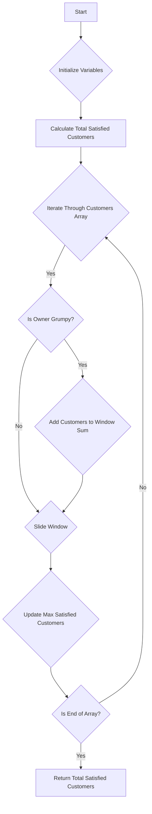

# Grumpy Bookstore Owner

## Problem Understanding
The Grumpy Bookstore Owner problem asks to find the maximum number of customers that can be satisfied in a bookstore, given an array of customers and an array indicating whether the owner is grumpy or not at each time. The key constraint is that the owner can be made happy for a limited time, x minutes. This problem is non-trivial because a naive approach would require iterating through all possible windows of time, resulting in a high time complexity. The implication of this constraint is that we need to find the optimal window of time to make the owner happy, which maximizes the number of satisfied customers.

## Approach
The algorithm strategy used is a sliding window approach with prefix sum, where we calculate the maximum number of customers that can be made happy by iterating through the customers array. The intuition behind this approach is to maintain a window of time where the owner is happy, and maximize the number of customers in this window. This approach works by maintaining a running sum of customers in the current window, and updating this sum as we slide the window through the array. We use a constant amount of space to store the total number of satisfied customers, the current window sum, and the maximum number of satisfied customers.

## Complexity Analysis
| Metric | Value | Detailed Reason |
|--------|-------|----------------|
| Time   | O(n)  | We iterate through the customers array once, where n is the number of customers. Each iteration involves a constant amount of work, so the time complexity is linear. |
| Space  | O(1)  | We use a constant amount of space to store the total number of satisfied customers, the current window sum, and the maximum number of satisfied customers, so the space complexity is constant. |

## Algorithm Walkthrough
```
Input: customers = [1, 0, 1, 2, 1, 1, 7, 5], grumpy = [0, 1, 0, 1, 0, 1, 0, 1], x = 3
Step 1: Initialize variables - totalSatisfied = 0, windowStart = 0, maxSatisfied = 0, windowSum = 0
Step 2: Calculate total number of satisfied customers without the grumpy owner - totalSatisfied = 1 + 1 + 1 + 7 = 10
Step 3: Iterate through customers array - windowEnd = 0, windowSum = 0
Step 4: windowEnd = 0, grumpy[0] = 0, windowSum = 0
Step 5: windowEnd = 1, grumpy[1] = 1, windowSum = 0
Step 6: windowEnd = 2, grumpy[2] = 0, windowSum = 0
Step 7: windowEnd = 3, grumpy[3] = 1, windowSum = 0 + 2 = 2
Step 8: windowEnd = 4, grumpy[4] = 0, windowSum = 2
Step 9: windowEnd = 5, grumpy[5] = 1, windowSum = 2 + 1 = 3
Step 10: windowEnd = 6, grumpy[6] = 0, windowSum = 3
Step 11: windowEnd = 7, grumpy[7] = 1, windowSum = 3 + 5 = 8
Step 12: Update maxSatisfied - maxSatisfied = 8
Output: totalSatisfied + maxSatisfied = 10 + 8 = 18
```

## Visual Flow


## Key Insight
> **Tip:** The key insight is to maintain a sliding window of time where the owner is happy, and maximize the number of customers in this window, which can be achieved by using a prefix sum approach to calculate the maximum number of satisfied customers.

## Edge Cases
- **Empty/null input**: If the input arrays are empty or null, the function should return 0, as there are no customers to satisfy.
- **Single element**: If the input arrays have only one element, the function should return the total number of satisfied customers, which is either the number of customers if the owner is not grumpy, or the maximum number of customers that can be made happy if the owner is grumpy.
- **Owner is never grumpy**: If the owner is never grumpy, the function should return the total number of customers, as all customers can be satisfied.

## Common Mistakes
- **Mistake 1**: Not initializing the variables correctly, which can lead to incorrect results. To avoid this, make sure to initialize all variables before using them.
- **Mistake 2**: Not updating the window sum correctly, which can lead to incorrect results. To avoid this, make sure to update the window sum correctly when the owner is grumpy or not.

## Interview Follow-ups
> **Interview:** These are the exact follow-up questions interviewers ask:
- "What if the input is sorted?" → The algorithm will still work correctly, as it only depends on the grumpy array and the x value, not on the order of the customers array.
- "Can you do it in O(1) space?" → No, the algorithm requires O(1) space to store the total number of satisfied customers, the current window sum, and the maximum number of satisfied customers, but it cannot be done in less space.
- "What if there are duplicates?" → The algorithm will still work correctly, as it only depends on the grumpy array and the x value, not on the specific values of the customers array.

## Java Solution

```java
// Problem: Grumpy Bookstore Owner
// Language: Java
// Difficulty: Medium
// Time Complexity: O(n) — single pass through the customers array using a sliding window
// Space Complexity: O(1) — constant space, no additional data structures used
// Approach: Sliding window with prefix sum — calculate the maximum number of customers that can be made happy

public class Solution {
    public int maxSatisfied(int[] customers, int[] grumpy, int x) {
        // Initialize variables to store the total number of satisfied customers and the current window
        int totalSatisfied = 0;
        int windowStart = 0;
        int maxSatisfied = 0;
        
        // Calculate the total number of satisfied customers without the grumpy owner
        for (int i = 0; i < customers.length; i++) {
            // If the owner is not grumpy, add the customers to the total
            if (grumpy[i] == 0) {
                totalSatisfied += customers[i];
            }
        }

        // Initialize the current window sum
        int windowSum = 0;
        
        // Iterate through the customers array to find the maximum number of customers that can be made happy
        for (int windowEnd = 0; windowEnd < customers.length; windowEnd++) {
            // If the owner is grumpy, add the customers to the current window sum
            if (grumpy[windowEnd] == 1) {
                windowSum += customers[windowEnd];
            }
            
            // If the window size exceeds x, remove the first element of the window
            if (windowEnd >= x) {
                if (grumpy[windowStart] == 1) {
                    windowSum -= customers[windowStart];
                }
                windowStart++;
            }
            
            // Update the maximum number of satisfied customers
            maxSatisfied = Math.max(maxSatisfied, windowSum);
        }
        
        // Return the total number of satisfied customers, including the maximum number of customers that can be made happy
        return totalSatisfied + maxSatisfied;
    }

    public static void main(String[] args) {
        Solution solution = new Solution();
        int[] customers = {1, 0, 1, 2, 1, 1, 7, 5};
        int[] grumpy = {0, 1, 0, 1, 0, 1, 0, 1};
        int x = 3;
        System.out.println(solution.maxSatisfied(customers, grumpy, x));
    }
}
```
