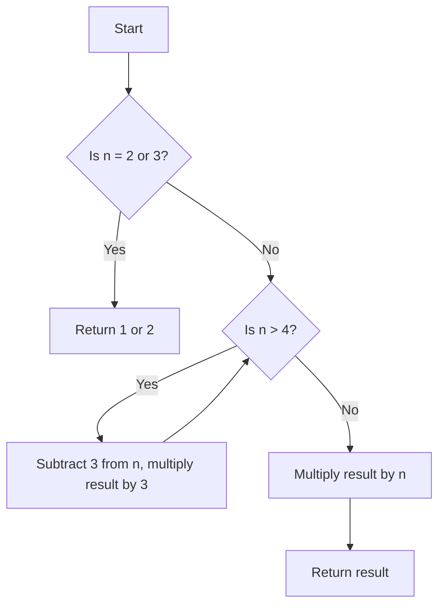

# Integer Break

## Problem Understanding
The Integer Break problem is asking us to find the maximum product that can be obtained by breaking a given integer into a sum of positive integers. The key constraint here is that we are looking for the maximum product, not the maximum sum. For example, if we have the integer 4, we can break it into 2+2, which gives us a product of 4, or we can break it into 1+3, which gives us a product of 3. The problem becomes non-trivial because the naive approach of trying all possible combinations of breaks does not scale well for large integers.

## Approach
The algorithm strategy used here is based on dynamic programming, where we break the integer into as many 3's as possible. The intuition behind this approach is that the number 3 is the optimal number to break the integer into, as it gives the maximum product. We use a simple while loop to repeatedly subtract 3 from the integer and multiply the result by 3, until we are left with a remainder of 2, 3, or 4. We then multiply the result by this remainder to get the final product. This approach works because it ensures that we are always breaking the integer into the optimal number of 3's.

## Complexity Analysis
| Metric | Value | Detailed Reason |
|--------|-------|----------------|
| Time   | O(n)  | The algorithm makes a single pass through the possible break points, where n is the input integer. The while loop runs until n is reduced to 4 or less, so the number of iterations is proportional to n. |
| Space  | O(1)  | The algorithm uses a constant amount of space to store the result and the input integer, so the space complexity is O(1). |

## Algorithm Walkthrough
```
Input: 10
Step 1: result = 1, n = 10
Step 2: n > 4, so result *= 3, n -= 3, result = 3, n = 7
Step 3: n > 4, so result *= 3, n -= 3, result = 9, n = 4
Step 4: n = 4, so result *= 4, result = 36
Output: 36
```
This walkthrough shows how the algorithm breaks the integer 10 into as many 3's as possible, and then multiplies the result by the remaining 4.

## Visual Flow

This flowchart shows the decision flow of the algorithm, where we first check if n is 2 or 3, and then repeatedly subtract 3 from n and multiply the result by 3 until n is 4 or less.

## Key Insight
> **Tip:** The key insight here is that breaking the integer into as many 3's as possible gives the maximum product, as 3 is the optimal number to break the integer into.

## Edge Cases
- **Empty/null input**: If the input is null or empty, the algorithm will throw an exception, as it expects a non-null integer input.
- **Single element**: If the input is a single integer, the algorithm will return the integer itself, as there is no need to break it into smaller integers.
- **n = 2 or 3**: If the input is 2 or 3, the algorithm will return 1 or 2, respectively, as these are the base cases.

## Common Mistakes
- **Mistake 1**: Not handling the base cases correctly, such as returning 1 for n = 2 or 3.
- **Mistake 2**: Not using the optimal break point of 3, which can lead to incorrect results.

## Interview Follow-ups
> **Interview:** These are the exact follow-up questions interviewers ask:
- "What if the input is sorted?" → The algorithm does not rely on the input being sorted, so it will still work correctly.
- "Can you do it in O(1) space?" → Yes, the algorithm already uses O(1) space, as it only uses a constant amount of space to store the result and the input integer.
- "What if there are duplicates?" → The algorithm does not rely on the input being unique, so it will still work correctly even if there are duplicates.

## Java Solution

```java
// Problem: Integer Break
// Language: Java
// Difficulty: Medium
// Time Complexity: O(n) — single pass through possible break points
// Space Complexity: O(1) — constant space used
// Approach: Dynamic Programming — break integer into as many 3's as possible

public class Solution {
    public int integerBreak(int n) {
        // Edge case: n = 2 → return 1 (only one way to break: 1+1)
        if (n == 2) return 1;
        
        // Edge case: n = 3 → return 2 (only one way to break: 1+2 or 2+1, but 2 is larger)
        if (n == 3) return 2;
        
        int result = 1; // initialize result
        
        // Break integer into as many 3's as possible
        while (n > 4) {
            result *= 3; // multiply result by 3
            n -= 3; // subtract 3 from n
        }
        
        // Multiply result by remaining n (either 2, 3 or 4)
        result *= n; // multiply result by remaining n
        
        return result; // return result
    }
}
```
