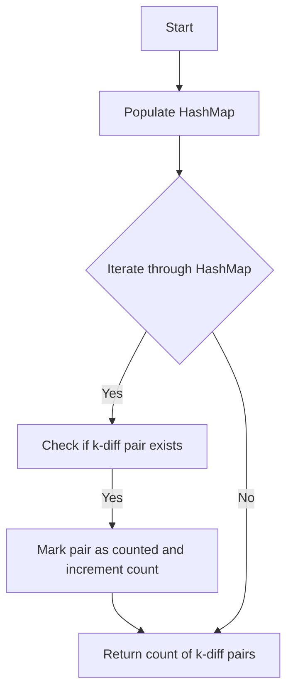

# K-diff Pairs in an Array

## Problem Understanding
The problem requires finding the number of k-diff pairs in an array, where a k-diff pair is defined as two numbers in the array that have a difference of k. The key constraint is that the input array can be empty, and we need to handle this edge case. The problem is non-trivial because a naive approach would involve iterating through the array for each element to find its k-diff pair, resulting in a time complexity of O(n^2). However, we can improve this by using a HashMap to store the frequency of each number, allowing us to find k-diff pairs in a single pass.

## Approach
The algorithm strategy is to use a HashMap to store the frequency of each number in the array. We then iterate through the HashMap to find k-diff pairs by checking if the number plus k exists in the HashMap. This approach works because we can look up numbers in the HashMap in constant time, allowing us to find k-diff pairs efficiently. We use a HashMap to store the frequency of each number because it allows us to count the occurrences of each number and handle duplicate pairs. Additionally, we use a set to store unique pairs to avoid counting duplicate pairs.

## Complexity Analysis
| Metric | Value | Detailed Reason |
|--------|-------|----------------|
| Time   | O(n)  | We make a single pass through the array to populate the HashMap, and then we iterate through the HashMap to find k-diff pairs. The total number of operations is proportional to the number of elements in the array, resulting in a time complexity of O(n). |
| Space  | O(n)  | We use a HashMap to store the frequency of each number, which can store at most n elements. We also use a set to store unique pairs, which can store at most n elements. Therefore, the total space complexity is O(n). |

## Algorithm Walkthrough
```
Input: nums = [3, 1, 4, 1, 5], k = 2
Step 1: Populate the HashMap with the frequency of each number
    - numFrequency = {3: 1, 1: 2, 4: 1, 5: 1}
Step 2: Iterate through the HashMap to find k-diff pairs
    - For num = 3, check if num + k = 5 exists in the HashMap
        - 5 exists, so mark the pair as counted and increment the count of k-diff pairs
    - For num = 1, check if num + k = 3 exists in the HashMap
        - 3 exists, so mark the pair as counted and increment the count of k-diff pairs
    - For num = 4, check if num + k = 6 exists in the HashMap
        - 6 does not exist, so do not increment the count of k-diff pairs
Step 3: Return the count of k-diff pairs
    - kDiffPairsCount = 2
Output: 2
```
## Visual Flow

## Key Insight
> **Tip:** The key insight is to use a HashMap to store the frequency of each number, allowing us to find k-diff pairs in a single pass and avoid counting duplicate pairs.

## Edge Cases
- **Empty/null input**: If the input array is empty or null, the function returns 0 because there are no k-diff pairs to count.
- **Single element**: If the input array has only one element, the function returns 0 because there are no k-diff pairs to count.
- **k = 0**: If k is 0, the function only counts pairs where the frequency of the number is greater than 1, to avoid counting the same number as a pair with itself.

## Common Mistakes
- **Mistake 1**: Not using a set to store unique pairs, resulting in counting duplicate pairs.
- **Mistake 2**: Not checking if the input array is empty or null, resulting in a NullPointerException.

## Interview Follow-ups
> **Interview:** These are the exact follow-up questions interviewers ask:
- "What if the input is sorted?" → The algorithm would still work correctly, but the time complexity would remain O(n) because we need to iterate through the array to populate the HashMap.
- "Can you do it in O(1) space?" → No, because we need to use a HashMap to store the frequency of each number, which requires O(n) space.
- "What if there are duplicates?" → The algorithm would count duplicate pairs correctly, because we use a set to store unique pairs and only increment the count of k-diff pairs if the pair is not already counted.

## Java Solution

```java
// Problem: K-diff Pairs in an Array
// Language: java
// Difficulty: Medium
// Time Complexity: O(n) — single pass through array using HashMap
// Space Complexity: O(n) — HashMap stores at most n elements
// Approach: HashMap lookup — for each number, check if its k-diff pair exists

import java.util.HashMap;
import java.util.Map;

public class Solution {
    /**
     * Finds the number of k-diff pairs in an array.
     * 
     * @param nums   the input array
     * @param k      the difference between pairs
     * @return the number of k-diff pairs
     */
    public int findPairs(int[] nums, int k) {
        // Edge case: empty input → return 0
        if (nums == null || nums.length == 0) {
            return 0;
        }

        // Initialize a HashMap to store the frequency of each number
        Map<Integer, Integer> numFrequency = new HashMap<>();
        
        // Initialize a set to store unique pairs
        // This is necessary to avoid counting duplicate pairs
        Map<Integer, Boolean> uniquePairs = new HashMap<>();
        
        // Initialize the count of k-diff pairs
        int kDiffPairsCount = 0;

        // Populate the HashMap with the frequency of each number
        for (int num : nums) {
            numFrequency.put(num, numFrequency.getOrDefault(num, 0) + 1);
        }

        // Iterate through the HashMap to find k-diff pairs
        for (int num : numFrequency.keySet()) {
            // Check if the k-diff pair exists
            if (numFrequency.containsKey(num + k)) {
                // Check if the pair is not the same number (k == 0)
                if (k == 0) {
                    // If k is 0, we only count the pair if the frequency is greater than 1
                    if (numFrequency.get(num) > 1) {
                        // Mark the pair as counted
                        uniquePairs.put(num, true);
                        // Increment the count of k-diff pairs
                        kDiffPairsCount++;
                    }
                } else {
                    // Mark the pair as counted
                    uniquePairs.put(num, true);
                    // Increment the count of k-diff pairs
                    kDiffPairsCount++;
                }
            }
        }

        // Return the count of k-diff pairs
        return kDiffPairsCount;
    }

    public static void main(String[] args) {
        Solution solution = new Solution();
        int[] nums = {3, 1, 4, 1, 5};
        int k = 2;
        System.out.println("Number of k-diff pairs: " + solution.findPairs(nums, k));
    }
}
```
