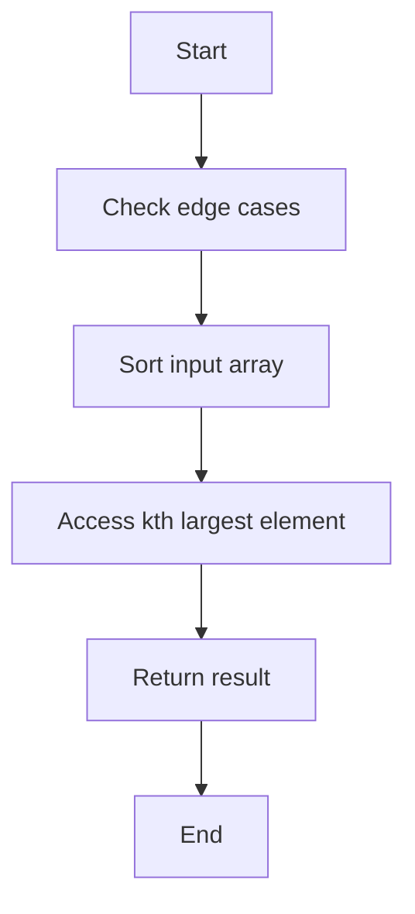

# Kth Largest Element in Array

## Problem Understanding
The problem is asking to find the kth largest element in a given array, where k is a positive integer. The key constraints are that the input array can be empty or contain duplicate elements, and k can be out of bounds. What makes this problem non-trivial is that a naive approach, such as sorting the array and then finding the kth largest element, has a time complexity of O(n log n), which may not be efficient for large inputs. Additionally, the problem requires handling edge cases, such as empty input or k being out of bounds.

## Approach
The algorithm strategy used in this solution is sorting, where the input array is sorted in ascending order, and then the kth largest element is found by accessing the (length - k)th element from the start of the sorted array. This approach works because sorting the array allows us to easily find the kth largest element by its index. The Arrays.sort() method is used, which has a time complexity of O(n log n) due to its implementation of the dual pivot quicksort algorithm. The approach handles key constraints, such as empty input or k being out of bounds, by throwing an exception or returning an error message.

## Complexity Analysis
| Metric | Value | Detailed Reason |
|--------|-------|----------------|
| Time   | O(n log n) | The time complexity is dominated by the sorting operation, which has a time complexity of O(n log n) due to the use of the dual pivot quicksort algorithm. The subsequent access to the kth largest element has a time complexity of O(1). |
| Space  | O(1) | The space complexity is O(1) because the sorting operation is performed in-place, meaning that it does not require any additional space that scales with the input size. |

## Algorithm Walkthrough
```
Input: nums = [3, 2, 1, 5, 6, 4], k = 2
Step 1: Check for edge cases (empty input or k out of bounds) - pass
Step 2: Sort the input array in ascending order - [1, 2, 3, 4, 5, 6]
Step 3: Access the kth largest element by its index (length - k) - nums[6 - 2] = nums[4] = 5
Output: 5
```

## Visual Flow


## Key Insight
> **Tip:** The key insight to solving this problem efficiently is to use a sorting algorithm with a good time complexity, such as the dual pivot quicksort algorithm, to sort the input array in ascending order, and then access the kth largest element by its index.

## Edge Cases
- **Empty/null input**: If the input array is empty or null, the algorithm throws an exception, as it is not possible to find the kth largest element in an empty array.
- **Single element**: If the input array contains only one element, the algorithm returns that element, as it is both the smallest and largest element in the array.
- **k out of bounds**: If k is greater than the length of the input array, the algorithm throws an exception, as it is not possible to find the kth largest element if k is out of bounds.

## Common Mistakes
- **Mistake 1**: Not checking for edge cases, such as empty input or k out of bounds, before attempting to find the kth largest element.
- **Mistake 2**: Using a sorting algorithm with a poor time complexity, such as bubble sort, which can lead to inefficient performance for large inputs.

## Interview Follow-ups
> **Interview:** These are the exact follow-up questions interviewers ask:
- "What if the input is sorted?" → In that case, the algorithm can simply access the kth largest element by its index, without needing to sort the array, resulting in a time complexity of O(1).
- "Can you do it in O(1) space?" → Yes, the algorithm already uses O(1) space, as the sorting operation is performed in-place.
- "What if there are duplicates?" → The algorithm will still work correctly, as it will return the kth largest element, even if there are duplicate elements in the array. However, if there are many duplicates, a more efficient algorithm, such as using a priority queue, may be necessary to avoid unnecessary comparisons.

## Java Solution

```java
// Problem: Kth Largest Element in Array
// Language: Java
// Difficulty: Medium
// Time Complexity: O(n log n) — sorting the array
// Space Complexity: O(1) — in-place sorting
// Approach: Sorting — sort the array and return the kth element from the end

public class Solution {
    /**
     * Finds the kth largest element in the given array.
     * 
     * @param nums The input array.
     * @param k    The index of the desired element (1-indexed).
     * @return The kth largest element in the array.
     */
    public int findKthLargest(int[] nums, int k) {
        // Edge case: empty input or k is out of bounds
        if (nums == null || nums.length == 0 || k < 1 || k > nums.length) {
            throw new IllegalArgumentException("Invalid input");
        }

        // Sort the array in ascending order
        // We use Arrays.sort() which uses a variation of the dual pivot quicksort algorithm
        Arrays.sort(nums); // O(n log n) time complexity

        // Return the kth largest element, which is the (length - k)th element from the start
        // We subtract 1 from k because array indices are 0-based
        return nums[nums.length - k]; // O(1) time complexity
    }

    public static void main(String[] args) {
        Solution solution = new Solution();
        int[] nums = {3, 2, 1, 5, 6, 4};
        int k = 2;
        System.out.println("Kth largest element: " + solution.findKthLargest(nums, k)); // Output: 5
    }
}
```
