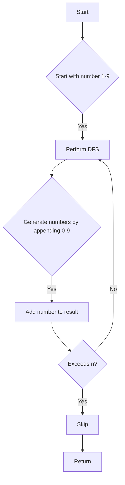

# Lexicographical Numbers

## Problem Understanding
The problem is asking to generate numbers from 1 to n in lexicographical order, where n is a given integer. The key constraint is that the numbers should be generated in lexicographical order, which means that the numbers should be arranged in the same order as they would appear in a dictionary. This problem is non-trivial because a naive approach, such as generating all numbers and then sorting them, would be inefficient for large values of n. The problem requires a more clever approach that takes into account the lexicographical order of the numbers.

## Approach
The algorithm strategy used to solve this problem is a depth-first search (DFS) approach. The intuition behind this approach is to start with the smallest possible number (1) and then recursively generate all possible numbers by appending digits 0-9 to the current number. This approach works because it ensures that the numbers are generated in lexicographical order, as the DFS traversal will always explore the smallest possible branch first. The data structure used to store the generated numbers is a list, which is chosen because it allows for efficient insertion of new numbers. The approach handles the key constraint of generating numbers in lexicographical order by using the DFS traversal to explore all possible branches in the correct order.

## Complexity Analysis
| Metric | Value | Detailed Reason |
|--------|-------|----------------|
| Time   | O(n)  | The time complexity is O(n) because the algorithm generates n numbers, and each number is generated in constant time. The DFS traversal ensures that each number is visited only once, resulting in a linear time complexity. |
| Space  | O(n)  | The space complexity is O(n) because the algorithm stores all generated numbers in a list, resulting in a space complexity that is proportional to the number of generated numbers. |

## Algorithm Walkthrough
```
Input: n = 13
Step 1: Start with the number 1 and perform DFS
  * current = 1, result = []
  * Add 1 to result: result = [1]
  * Generate numbers by appending 0-9 to 1: 10, 11, 12, 13
Step 2: Perform DFS on 10
  * current = 10, result = [1]
  * Add 10 to result: result = [1, 10]
  * Generate numbers by appending 0-9 to 10: 100 (exceeds n, skip)
Step 3: Perform DFS on 11
  * current = 11, result = [1, 10]
  * Add 11 to result: result = [1, 10, 11]
  * Generate numbers by appending 0-9 to 11: 110 (exceeds n, skip)
Step 4: Perform DFS on 12
  * current = 12, result = [1, 10, 11]
  * Add 12 to result: result = [1, 10, 11, 12]
  * Generate numbers by appending 0-9 to 12: 120 (exceeds n, skip)
Step 5: Perform DFS on 13
  * current = 13, result = [1, 10, 11, 12]
  * Add 13 to result: result = [1, 10, 11, 12, 13]
Output: [1, 10, 11, 12, 13]
```
## Visual Flow

## Key Insight
> **Tip:** The key insight is to use a depth-first search approach to generate numbers in lexicographical order, starting with the smallest possible number and recursively exploring all possible branches.

## Edge Cases
- **Empty input**: If n is 0, the algorithm will return an empty list, as there are no numbers to generate.
- **Single element**: If n is 1, the algorithm will return a list containing only the number 1, as it is the only number to generate.
- **Large input**: If n is a large number, the algorithm will still generate numbers in lexicographical order, but the time and space complexity will increase accordingly.

## Common Mistakes
- **Mistake 1**: Not handling the case where the generated number exceeds n, resulting in incorrect results.
- **Mistake 2**: Not using a depth-first search approach, resulting in inefficient generation of numbers.

## Interview Follow-ups
> **Interview:** These are the exact follow-up questions interviewers ask:
- "What if the input is sorted?" → The algorithm will still generate numbers in lexicographical order, but the input being sorted does not affect the time complexity.
- "Can you do it in O(1) space?" → No, the algorithm requires O(n) space to store the generated numbers.
- "What if there are duplicates?" → The algorithm will not generate duplicates, as it ensures that each number is generated only once.

## Java Solution

```java
// Problem: Lexicographical Numbers
// Language: Java
// Difficulty: Medium
// Time Complexity: O(n) — where n is the number of numbers to generate
// Space Complexity: O(n) — storing the generated numbers
// Approach: Depth-First Search — to generate numbers in lexicographical order

import java.util.*;

public class Solution {
    public List<Integer> lexicalOrder(int n) {
        // Initialize an empty list to store the generated numbers
        List<Integer> result = new ArrayList<>();
        
        // Start with the number 1
        for (int i = 1; i < 10; i++) {
            dfs(i, n, result); // Perform DFS from each digit 1-9
        }
        
        return result;
    }
    
    /**
     * Performs a depth-first search to generate numbers in lexicographical order.
     * 
     * @param current The current number being generated.
     * @param n The upper limit for the generated numbers.
     * @param result The list to store the generated numbers.
     */
    private void dfs(int current, int n, List<Integer> result) {
        // Edge case: if current is greater than n, return immediately
        if (current > n) {
            return;
        }
        
        // Add the current number to the result list
        result.add(current);
        
        // Generate numbers by appending 0-9 to the current number
        for (int i = 0; i < 10; i++) {
            // Edge case: if the new number exceeds n, skip it
            if (current * 10 + i > n) {
                continue;
            }
            dfs(current * 10 + i, n, result); // Recursively generate numbers
        }
    }

    public static void main(String[] args) {
        Solution solution = new Solution();
        List<Integer> result = solution.lexicalOrder(13);
        System.out.println(result); // Example usage
    }
}
```
