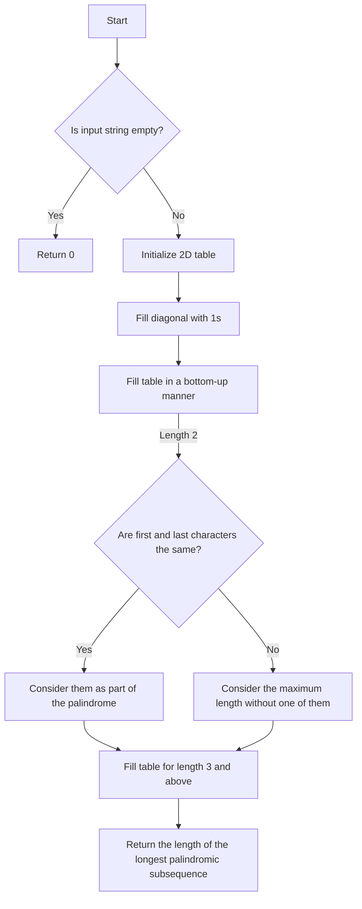

# Longest Palindromic Subsequence

## Problem Understanding
The problem asks for the length of the longest palindromic subsequence in a given string. A palindromic subsequence is a sequence of characters that reads the same backward as forward. The key constraints are that the input string can be empty or contain duplicate characters, and the subsequence does not need to be contiguous. This problem is non-trivial because a naive approach, such as checking all possible subsequences, would have an exponential time complexity due to the large number of possible subsequences.

## Approach
The approach to solving this problem is to use dynamic programming. The idea is to build up the lengths of palindromic subsequences from smaller to larger. We use a 2D table to store the lengths of palindromic subsequences, where the cell at position (i, j) represents the length of the longest palindromic subsequence in the substring from index i to j. We fill the table in a bottom-up manner, starting with the diagonal (i.e., single characters) and then moving to larger substrings. If the first and last characters of a substring are the same, we consider them as part of the palindrome; otherwise, we consider the maximum length without one of them. This approach works because it breaks down the problem into smaller subproblems and solves each subproblem only once.

## Complexity Analysis
| Metric | Value | Detailed Reason |
|--------|-------|----------------|
| Time   | O(n^2) | The time complexity is O(n^2) because we fill up a 2D table of size n x n, where n is the length of the input string. The outer loop iterates over the length of the substring, and the inner loop iterates over the starting index of the substring. |
| Space  | O(n^2) | The space complexity is O(n^2) because we store the lengths of palindromic subsequences in a 2D table of size n x n. This is necessary to avoid redundant calculations and to store the results of subproblems. |

## Algorithm Walkthrough
```
Input: "bbbab"
Step 1: Initialize the 2D table with zeros.
        dp = [
            [0, 0, 0, 0, 0],
            [0, 0, 0, 0, 0],
            [0, 0, 0, 0, 0],
            [0, 0, 0, 0, 0],
            [0, 0, 0, 0, 0]
        ]
Step 2: Fill the diagonal with 1s, since a single character is always a palindrome.
        dp = [
            [1, 0, 0, 0, 0],
            [0, 1, 0, 0, 0],
            [0, 0, 1, 0, 0],
            [0, 0, 0, 1, 0],
            [0, 0, 0, 0, 1]
        ]
Step 3: Fill the table in a bottom-up manner.
        For length 2:
            dp[0][1] = 2 (since "bb" is a palindrome)
            dp[1][2] = 1 (since "ba" is not a palindrome)
            dp[2][3] = 1 (since "ab" is not a palindrome)
            dp[3][4] = 2 (since "ab" is not a palindrome, but "bb" is)
        For length 3:
            dp[0][2] = 3 (since "bbb" is a palindrome)
            dp[1][3] = 2 (since "bab" is a palindrome)
            dp[2][4] = 2 (since "bab" is a palindrome)
        For length 4:
            dp[0][3] = 4 (since "bbab" is a palindrome)
            dp[1][4] = 3 (since "bbab" is a palindrome)
        For length 5:
            dp[0][4] = 4 (since "bbbab" is not a palindrome, but "bbab" is)
Output: 4
```

## Visual Flow


## Key Insight
> **Tip:** The key insight is to use dynamic programming to build up the lengths of palindromic subsequences from smaller to larger, avoiding redundant calculations by storing the results of subproblems in a 2D table.

## Edge Cases
- **Empty/null input**: If the input string is empty or null, the function returns 0, since there are no characters to form a palindrome.
- **Single element**: If the input string contains only one character, the function returns 1, since a single character is always a palindrome.
- **Duplicate characters**: If the input string contains duplicate characters, the function considers them as part of the palindrome if they are the same, and excludes one of them if they are different.

## Common Mistakes
- **Mistake 1**: Not initializing the 2D table with zeros, leading to incorrect results.
- **Mistake 2**: Not filling the diagonal with 1s, since a single character is always a palindrome.

## Interview Follow-ups
> **Interview:** These are the exact follow-up questions interviewers ask:
- "What if the input is sorted?" → The algorithm still works correctly, since it only considers the first and last characters of the substring, regardless of the order of the characters in between.
- "Can you do it in O(1) space?" → No, the algorithm requires O(n^2) space to store the lengths of palindromic subsequences in a 2D table.
- "What if there are duplicates?" → The algorithm considers duplicate characters as part of the palindrome if they are the same, and excludes one of them if they are different.

## Java Solution

```java
// Problem: Longest Palindromic Subsequence
// Language: Java
// Difficulty: Medium
// Time Complexity: O(n^2) — filling up a 2D table of size n x n
// Space Complexity: O(n^2) — storing the lengths of palindromic subsequences in a 2D table
// Approach: Dynamic Programming — building up the lengths of palindromic subsequences from smaller to larger

public class Solution {
    public int longestPalindromicSubsequence(String s) {
        // Edge case: empty string → return 0
        if (s == null || s.length() == 0) {
            return 0;
        }

        // Initialize a 2D table to store the lengths of palindromic subsequences
        int n = s.length();
        int[][] dp = new int[n][n];

        // Fill the diagonal with 1s, since a single character is always a palindrome
        for (int i = 0; i < n; i++) {
            dp[i][i] = 1; // every single character is a palindrome of length 1
        }

        // Fill the table in a bottom-up manner
        for (int length = 2; length <= n; length++) {
            for (int i = 0; i < n - length + 1; i++) {
                int j = i + length - 1;

                // If the first and last characters are the same, consider them as part of the palindrome
                if (s.charAt(i) == s.charAt(j)) {
                    // If the length is 2, the palindrome has length 2
                    if (length == 2) {
                        dp[i][j] = 2; // two identical characters form a palindrome of length 2
                    } else {
                        // Otherwise, add 2 to the length of the palindrome in the middle
                        dp[i][j] = dp[i + 1][j - 1] + 2; // extend the palindrome in the middle
                    }
                } else {
                    // If the first and last characters are different, consider the maximum length without one of them
                    dp[i][j] = Math.max(dp[i + 1][j], dp[i][j - 1]); // exclude one of the different characters
                }
            }
        }

        // The length of the longest palindromic subsequence is stored in the top-right corner of the table
        return dp[0][n - 1];
    }

    public static void main(String[] args) {
        Solution solution = new Solution();
        System.out.println(solution.longestPalindromicSubsequence("bbbab")); // Output: 4
        System.out.println(solution.longestPalindromicSubsequence("cbbd")); // Output: 2
        System.out.println(solution.longestPalindromicSubsequence("a")); // Output: 1
        System.out.println(solution.longestPalindromicSubsequence("")); // Output: 0
    }
}
```
