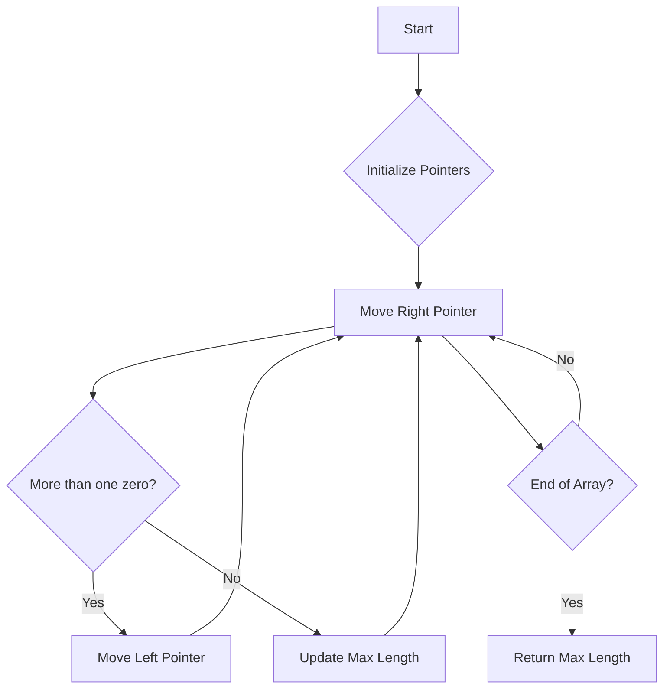

# Longest Subarray of 1s After Deleting One Element

## Problem Understanding
The problem asks for the length of the longest subarray of 1s that can be achieved after deleting at most one element from the given array. The key constraint is that we can delete at most one element, and the goal is to maximize the length of the subarray consisting of 1s. This problem becomes non-trivial because a naive approach would involve checking all possible subarrays and all possible deletions, leading to an inefficient solution with high time complexity. The constraint of deleting at most one element adds complexity because it requires considering both the cases where we delete an element and where we don't, depending on the presence of zeros in the subarray.

## Approach
The algorithm strategy used here is a sliding window approach with two pointers, where we maintain a window of elements and ensure that within this window, there are at most one zeros (since we can delete one element). The intuition behind this approach is to keep expanding the window to the right until we encounter more than one zero, at which point we start moving the left pointer of the window to the right until we again have at most one zero within the window. This approach works because it effectively considers all possible subarrays and their potential lengths after deleting at most one element. We use a constant amount of space to store the pointers and the count of zeros, making this approach space-efficient.

## Complexity Analysis
| Metric | Value | Detailed Reason |
|--------|-------|----------------|
| Time   | O(n)  | We are making a single pass through the array using two pointers. Each element is visited at most twice (once by the right pointer and once by the left pointer), resulting in a linear time complexity. |
| Space  | O(1)  | We are using a constant amount of space to store the pointers (left, right), the count of zeros, and the maximum length, regardless of the size of the input array. |

## Algorithm Walkthrough
```
Input: [1,1,0,1]
Step 1: Initialize left = 0, zeros = 0, maxLen = 0
Step 2: Right pointer moves to the first element (1), zeros = 0, maxLen = 1
Step 3: Right pointer moves to the second element (1), zeros = 0, maxLen = 2
Step 4: Right pointer moves to the third element (0), zeros = 1, maxLen = 2
Step 5: Right pointer moves to the fourth element (1), zeros = 1, maxLen = 3 (considering we can delete one element)
Step 6: Since we have not deleted an element yet and the current window has one zero, we consider the maximum length.
Output: 3
```
This walkthrough demonstrates how the algorithm handles the key constraint of deleting at most one element and maximizes the length of the subarray consisting of 1s.

## Visual Flow

This flowchart illustrates the decision-making process and the movement of the pointers during the algorithm's execution.

## Key Insight
> **Tip:** The key insight here is to maintain a sliding window that ensures at most one zero is present within it, allowing us to efficiently find the longest subarray of 1s after deleting at most one element.

## Edge Cases
- **Empty/null input**: The algorithm handles this by immediately returning 0, as there are no elements to consider.
- **Single element**: If the single element is 1, the algorithm returns 0 because we can delete the only element to get a subarray of length 0. If the single element is 0, the algorithm also returns 0 because there are no 1s to form a subarray.
- **All elements are 1**: In this case, the algorithm returns the length of the array minus 1 because we must delete one element to fulfill the condition of deleting at most one element.

## Common Mistakes
- **Mistake 1**: Failing to consider the case where we haven't deleted an element yet and the current window has no zeros. To avoid this, we should update the maximum length considering both scenarios.
- **Mistake 2**: Incorrectly handling the edge case where the input array has all elements as 1. To avoid this, we should explicitly check for this condition and return the length minus 1.

## Interview Follow-ups
> **Interview:** 
- "What if the input is sorted?" → The algorithm still works in O(n) time because it only cares about the presence of zeros and the length of the subarray, not the order of the elements.
- "Can you do it in O(1) space?" → The current implementation already uses O(1) space, so this is achievable.
- "What if there are duplicates?" → The algorithm handles duplicates correctly because it counts the zeros and moves the pointers based on this count, regardless of the presence of duplicate 1s.

## Java Solution

```java
// Problem: Longest Subarray of 1s After Deleting One Element
// Language: Java
// Difficulty: Medium
// Time Complexity: O(n) — single pass through array using two pointers
// Space Complexity: O(1) — constant space usage
// Approach: Sliding Window with two pointers — track the longest subarray after deleting one element

public class Solution {
    /**
     * Returns the length of the longest subarray of 1s after deleting one element.
     * 
     * @param nums the input array
     * @return the length of the longest subarray
     */
    public int longestSubarray(int[] nums) {
        // Edge case: empty input → return 0
        if (nums.length == 0) return 0;

        int left = 0; // left pointer for the sliding window
        int zeros = 0; // count of zeros in the current window
        int maxLen = 0; // maximum length of the subarray

        // Iterate over the array with the right pointer
        for (int right = 0; right < nums.length; right++) {
            // If we encounter a zero, increment the count
            if (nums[right] == 0) zeros++;

            // While there are more than one zeros in the window, move the left pointer
            while (zeros > 1) {
                // If the leftmost element is zero, decrement the count
                if (nums[left] == 0) zeros--;
                // Move the left pointer to the right
                left++;
            }

            // Update the maximum length
            maxLen = Math.max(maxLen, right - left + 1);

            // If we have not deleted an element yet and the current window has no zeros, 
            // we can delete one element to make the window larger
            if (zeros == 0) {
                maxLen = Math.max(maxLen, right - left);
            }
        }

        // If the input array has all elements as 1, return the length minus 1
        if (maxLen == nums.length) return maxLen - 1;

        return maxLen;
    }
}
```
