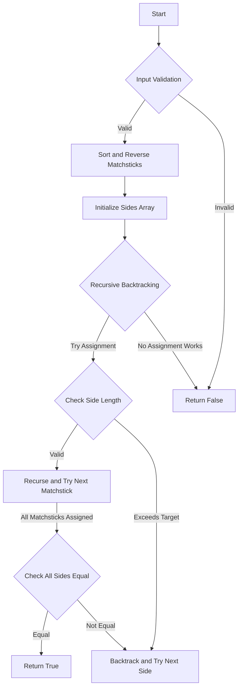

# Matchsticks to Square

## Problem Understanding
The problem is asking whether it's possible to form a square using a given set of matchsticks, where each matchstick has a specific length. The key constraint is that the total length of all matchsticks must be divisible by 4, and each side of the square must have the same length. What makes this problem non-trivial is that there are many possible ways to assign matchsticks to each side, and a naive approach would involve trying all possible combinations, leading to an exponential time complexity. The problem also requires handling edge cases, such as empty input or a total length that is not divisible by 4.

## Approach
The algorithm strategy used here is recursive backtracking with four-way partitioning, where each matchstick is assigned to one of the four sides of the square. The intuition behind this approach is to try all possible assignments of matchsticks to sides and backtrack when a dead end is reached. The mathematical reasoning behind this approach is that it guarantees an exhaustive search of all possible solutions. The data structure used is an array to keep track of the assigned lengths of each side. The approach handles the key constraints by checking if the total length is divisible by 4 and if each side has the same length after assigning all matchsticks.

## Complexity Analysis
| Metric | Value | Detailed Reason |
|--------|-------|----------------|
| Time   | O(4^n) | The algorithm tries all possible assignments of matchsticks to sides, where n is the number of matchsticks. In the worst case, each matchstick can be assigned to one of the four sides, leading to 4^n possible assignments. |
| Space  | O(n) | The recursion stack size is proportional to the number of matchsticks, as each recursive call adds a new layer to the stack. |

## Algorithm Walkthrough
```
Input: [1, 1, 2, 2, 2]
Step 1: Sort matchsticks in descending order and reverse the array: [2, 2, 2, 1, 1]
Step 2: Initialize sides array: [0, 0, 0, 0]
Step 3: Start recursive backtracking:
    - Try assigning the first matchstick (2) to each side:
        - Assign to side 0: [2, 0, 0, 0]
        - Recurse and try assigning the next matchstick (2) to each side:
            - Assign to side 0: [4, 0, 0, 0]
            - Recurse and try assigning the next matchstick (2) to each side:
                - Assign to side 1: [4, 2, 0, 0]
                - Recurse and try assigning the next matchstick (1) to each side:
                    - Assign to side 2: [4, 2, 1, 0]
                    - Recurse and try assigning the next matchstick (1) to each side:
                        - Assign to side 3: [4, 2, 1, 1]
                        - Check if all sides have the same length: true
                        - Return true
Output: true
```
## Visual Flow


## Key Insight
> **Tip:** The key insight is to use recursive backtracking with four-way partitioning to try all possible assignments of matchsticks to sides, and to use a sides array to keep track of the assigned lengths of each side.

## Edge Cases
- **Empty/null input**: The algorithm returns false, as there are no matchsticks to form a square.
- **Single element**: The algorithm returns false, as a single matchstick cannot form a square.
- **Total length not divisible by 4**: The algorithm returns false, as it is impossible to form a square with a total length that is not divisible by 4.

## Common Mistakes
- **Mistake 1**: Not checking if the total length is divisible by 4 before trying to form a square → to avoid this, add a check at the beginning of the algorithm.
- **Mistake 2**: Not using recursive backtracking to try all possible assignments of matchsticks to sides → to avoid this, use a recursive approach with four-way partitioning.

## Interview Follow-ups
> **Interview:** 
- "What if the input is sorted?" → The algorithm still works, but the sorting step can be skipped, as the input is already sorted.
- "Can you do it in O(1) space?" → No, the algorithm requires O(n) space to store the recursion stack and the sides array.
- "What if there are duplicates?" → The algorithm still works, as it tries all possible assignments of matchsticks to sides, regardless of duplicates.

## Java Solution

```java
// Problem: Matchsticks to Square
// Language: Java
// Difficulty: Medium
// Time Complexity: O(4^n) — recursive backtracking with 4 possible assignments for each matchstick
// Space Complexity: O(n) — recursion stack size
// Approach: Recursive backtracking with four-way partitioning — assign each matchstick to one of four sides

import java.util.Arrays;

public class Solution {
    public boolean makesquare(int[] matchsticks) {
        // Edge case: empty input → return false
        if (matchsticks == null || matchsticks.length == 0) return false;

        int totalLength = 0; // calculate total length of all matchsticks
        for (int matchstick : matchsticks) {
            totalLength += matchstick; // sum up all matchstick lengths
        }

        // Edge case: total length is not divisible by 4 → cannot form a square
        if (totalLength % 4 != 0) return false;

        int sideLength = totalLength / 4; // calculate target length for each side
        int[] sides = new int[4]; // initialize sides array to keep track of assigned lengths

        // Sort matchsticks in descending order to handle longer matchsticks first
        Arrays.sort(matchsticks);
        reverseArray(matchsticks); // reverse the sorted array

        return backtrack(matchsticks, sides, 0, sideLength); // start recursive backtracking
    }

    private boolean backtrack(int[] matchsticks, int[] sides, int index, int sideLength) {
        // Base case: all matchsticks have been assigned → check if all sides have reached the target length
        if (index == matchsticks.length) {
            return allSidesEqual(sides, sideLength); // check if all sides have the same length
        }

        // Try assigning the current matchstick to each of the four sides
        for (int i = 0; i < 4; i++) {
            // Check if assigning the current matchstick to side i would exceed the target length
            if (sides[i] + matchsticks[index] > sideLength) {
                continue; // skip this assignment if it would exceed the target length
            }

            // Assign the current matchstick to side i and recurse
            sides[i] += matchsticks[index]; // assign the matchstick to side i
            if (backtrack(matchsticks, sides, index + 1, sideLength)) {
                return true; // if the recursive call returns true, return true
            }

            // Backtrack: undo the assignment and try the next side
            sides[i] -= matchsticks[index]; // undo the assignment
        }

        return false; // if no assignment works, return false
    }

    private boolean allSidesEqual(int[] sides, int sideLength) {
        // Check if all sides have the same length
        for (int side : sides) {
            if (side != sideLength) {
                return false; // if any side has a different length, return false
            }
        }
        return true; // if all sides have the same length, return true
    }

    private void reverseArray(int[] array) {
        int left = 0; // left index
        int right = array.length - 1; // right index

        while (left < right) {
            // Swap elements at left and right indices
            int temp = array[left];
            array[left] = array[right];
            array[right] = temp;

            // Move indices towards the center
            left++;
            right--;
        }
    }

    public static void main(String[] args) {
        Solution solution = new Solution();
        int[] matchsticks = {1, 1, 2, 2, 2};
        System.out.println(solution.makesquare(matchsticks)); // Output: true
    }
}
```
