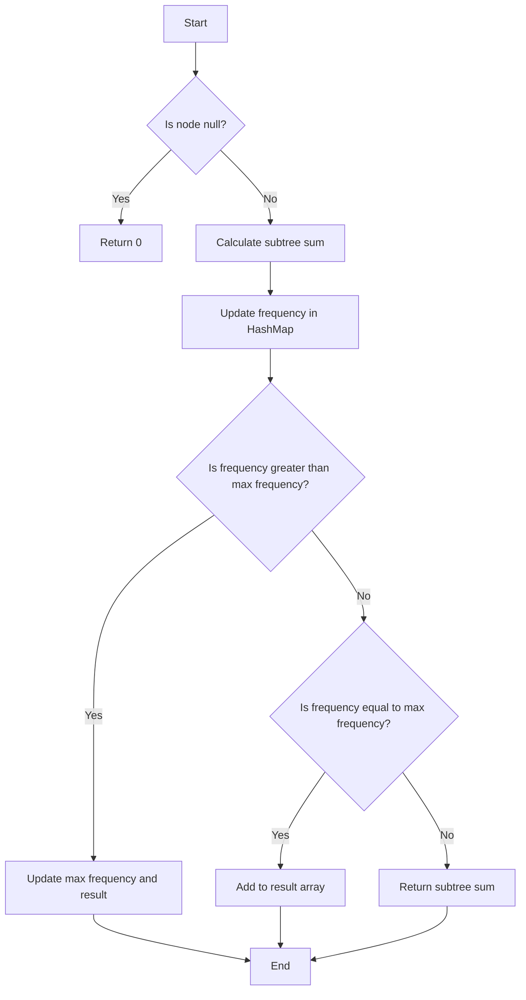

# Most Frequent Subtree Sum

## Problem Understanding
The problem asks us to find the most frequent subtree sum in a given binary tree. A subtree sum is the sum of all node values in a subtree. The key constraint is that we need to consider all possible subtrees, including single nodes and the entire tree. This problem is non-trivial because a naive approach would involve calculating the sum of each subtree multiple times, leading to exponential time complexity.

## Approach
The algorithm strategy used is recursive depth-first search (DFS) with a HashMap to store the frequency of subtree sums. The intuition behind this approach is to calculate the sum of each subtree and update its frequency in the HashMap. We use a recursive DFS because it allows us to efficiently traverse the tree and calculate the sum of each subtree. The HashMap is used to store the frequency of subtree sums, enabling us to find the most frequent sum in linear time.

## Complexity Analysis
| Metric | Value | Detailed Reason |
|--------|-------|----------------|
| Time   | O(n)  | We perform a single pass through the tree, where n is the number of nodes. Each node is visited once, and the operations performed at each node (calculating the sum and updating the frequency) take constant time. |
| Space  | O(n)  | We use a HashMap to store the frequency of subtree sums, which can store at most n elements in the worst case (when all subtree sums are unique). Additionally, the recursion stack can go up to n levels in the worst case (when the tree is skewed). |

## Algorithm Walkthrough
```
Input: 
     5
    / \
   2   3

Step 1: Start DFS from the root (5)
  - Calculate the sum of the subtree rooted at 5: 5 + dfs(2) + dfs(3)
  - dfs(2) returns 2 + dfs(null) + dfs(null) = 2 + 0 + 0 = 2
  - dfs(3) returns 3 + dfs(null) + dfs(null) = 3 + 0 + 0 = 3
  - Sum of subtree rooted at 5: 5 + 2 + 3 = 10
  - Update frequency of 10: frequencyMap.put(10, 1)

Step 2: Update max frequency and result if needed
  - frequencyMap.get(10) = 1, maxFrequency = 0
  - Update max frequency: maxFrequency = 1
  - Update result: result = [10]

Output: [10]
```

## Visual Flow


## Key Insight
> **Tip:** The key insight is to use a HashMap to store the frequency of subtree sums, allowing us to find the most frequent sum in linear time.

## Edge Cases
- **Empty tree**: If the input tree is empty (null), the function returns an empty array.
- **Single node tree**: If the input tree has only one node, the function returns an array containing the value of that node.
- **Tree with duplicate subtree sums**: If the tree has multiple subtrees with the same sum, the function returns an array containing all such sums.

## Common Mistakes
- **Mistake 1: Not handling null nodes**: Failure to handle null nodes can lead to NullPointerExceptions. To avoid this, we need to check for null nodes before calculating the subtree sum.
- **Mistake 2: Not updating max frequency correctly**: If the frequency of a subtree sum is greater than the current max frequency, we need to update the max frequency and reset the result array. If the frequency is equal to the max frequency, we need to add the subtree sum to the result array.

## Interview Follow-ups
> **Interview:** These are the exact follow-up questions interviewers ask:
- "What if the input tree is very large?" → We can use an iterative approach instead of recursive DFS to avoid stack overflow errors.
- "Can you optimize the space complexity?" → We can use a more efficient data structure, such as a HashSet, to store the subtree sums, but this would require additional processing to find the most frequent sum.
- "What if there are multiple most frequent subtree sums?" → Our current implementation already handles this case by storing all such sums in the result array.

## Java Solution

```java
// Problem: Most Frequent Subtree Sum
// Language: Java
// Difficulty: Medium
// Time Complexity: O(n) — single pass through tree, where n is the number of nodes
// Space Complexity: O(n) — HashMap stores at most n elements, and recursion stack can go up to n levels
// Approach: Recursive DFS with HashMap frequency counting — for each subtree, calculate its sum and update frequency

import java.util.HashMap;
import java.util.Map;

public class Solution {
    private Map<Integer, Integer> frequencyMap; // to store frequency of subtree sums
    private int maxFrequency; // to store maximum frequency seen so far
    private int[] result; // to store the most frequent subtree sum(s)

    public int[] findFrequentTreeSum(TreeNode root) {
        // Edge case: empty tree → return empty array
        if (root == null) return new int[0];
        
        frequencyMap = new HashMap<>();
        maxFrequency = 0;
        result = new int[0];
        
        // Start DFS from the root
        dfs(root);
        
        return result;
    }

    private int dfs(TreeNode node) {
        // Base case: empty subtree (null node) → return 0
        if (node == null) return 0;
        
        // Recursively calculate the sum of the current subtree
        int subtreeSum = node.val + dfs(node.left) + dfs(node.right);
        
        // Update frequency of the current subtree sum
        frequencyMap.put(subtreeSum, frequencyMap.getOrDefault(subtreeSum, 0) + 1);
        
        // Update max frequency and result if needed
        if (frequencyMap.get(subtreeSum) > maxFrequency) {
            maxFrequency = frequencyMap.get(subtreeSum);
            result = new int[] {subtreeSum}; // reset result array
        } else if (frequencyMap.get(subtreeSum) == maxFrequency) {
            // If frequency is the same as max frequency, add to result array
            int[] newArray = new int[result.length + 1];
            System.arraycopy(result, 0, newArray, 0, result.length);
            newArray[result.length] = subtreeSum;
            result = newArray;
        }
        
        return subtreeSum; // return the sum of the current subtree
    }

    // Definition for a binary tree node.
    public static class TreeNode {
        int val;
        TreeNode left;
        TreeNode right;
        TreeNode() {}
        TreeNode(int val) { this.val = val; }
        TreeNode(int val, TreeNode left, TreeNode right) {
            this.val = val;
            this.left = left;
            this.right = right;
        }
    }
}
```
