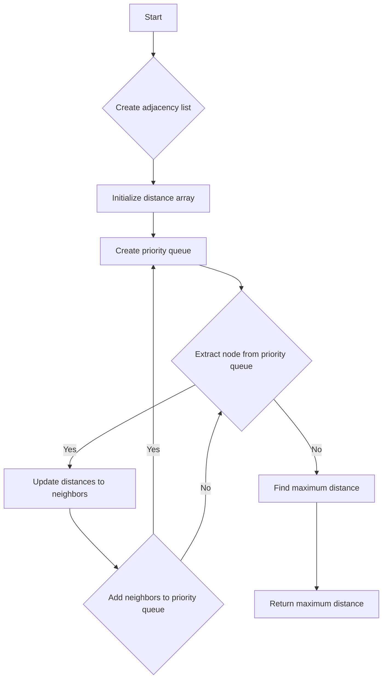

# Network Delay Time

## Problem Understanding
The Network Delay Time problem asks to find the maximum time it takes for all nodes in a network to receive a signal sent from a specific node. The network is represented as a directed graph, where each edge has a weight representing the time it takes to send a signal through that edge. The problem requires finding the shortest path from the source node to all other nodes and returning the maximum time taken. The key constraint is that the graph may not be connected, and some nodes may not receive the signal. The problem is non-trivial because a naive approach, such as using a simple breadth-first search or depth-first search, would not be able to handle the weighted edges and find the shortest path efficiently.

## Approach
The approach to solve this problem uses Dijkstra's algorithm with a priority queue to find the shortest path from the source node to all other nodes. The algorithm starts by creating an adjacency list representation of the graph, where each node is associated with a list of its neighbors and the weights of the edges to those neighbors. The algorithm then initializes a distance array with infinity for all nodes, except for the source node, which is set to 0. The priority queue is used to keep track of the nodes with the minimum distance that need to be processed next. The algorithm iterates over the nodes in the priority queue, updating the distances to their neighbors and adding them to the priority queue if necessary. The algorithm finally returns the maximum distance in the distance array, which represents the network delay time. This approach works because Dijkstra's algorithm is guaranteed to find the shortest path to all nodes in a weighted graph, and the priority queue allows for efficient selection of the next node to process.

## Complexity Analysis
| Metric | Value | Detailed Reason |
|--------|-------|----------------|
| Time   | O(n + m log m) | The time complexity is dominated by the Dijkstra's algorithm, which takes O(n + m log m) time, where n is the number of nodes and m is the number of edges. The priority queue operations (insertion and deletion) take O(log m) time. The adjacency list creation takes O(m) time, and the distance array initialization takes O(n) time. |
| Space  | O(n + m) | The space complexity is dominated by the adjacency list representation of the graph, which takes O(m) space, and the distance array, which takes O(n) space. The priority queue also takes O(n) space in the worst case. |

## Algorithm Walkthrough
```
Input: times = [[2, 1, 1], [2, 3, 1], [3, 4, 1]], n = 4, k = 2
Step 1: Create adjacency list representation of the graph
  - Node 2: [(1, 1), (3, 1)]
  - Node 3: [(4, 1)]
Step 2: Initialize distance array with infinity for all nodes
  - distance = [Integer.MAX_VALUE, Integer.MAX_VALUE, 0, Integer.MAX_VALUE, Integer.MAX_VALUE]
Step 3: Create priority queue with source node
  - pq = [(2, 0)]
Step 4: Iterate over nodes in priority queue
  - Node 2:
    - Distance to node 1: 1
    - Distance to node 3: 1
    - Add node 1 to priority queue: [(1, 1)]
    - Add node 3 to priority queue: [(3, 1)]
  - Node 1:
    - No neighbors
  - Node 3:
    - Distance to node 4: 2
    - Add node 4 to priority queue: [(4, 2)]
Step 5: Find maximum distance in distance array
  - maxDistance = 2
Output: 2
```

## Visual Flow


## Key Insight
> **Tip:** The key insight is to use Dijkstra's algorithm with a priority queue to efficiently find the shortest path to all nodes in the graph, which allows for the calculation of the network delay time.

## Edge Cases
- **Empty/null input**: If the input is empty or null, the algorithm will throw an exception or return an error, as there is no graph to process.
- **Single element**: If the graph has only one node, the algorithm will return 0, as there is no delay time.
- **Disjoint graph**: If the graph is disjoint, the algorithm will return -1, as some nodes will not receive the signal.

## Common Mistakes
- **Mistake 1**: Not using a priority queue to select the next node to process, which can lead to incorrect results or inefficient processing.
- **Mistake 2**: Not updating the distances to the neighbors of a node correctly, which can lead to incorrect results.

## Interview Follow-ups
> **Interview:** 
- "What if the input is sorted?" → The algorithm will still work correctly, as the priority queue will ensure that the nodes are processed in the correct order.
- "Can you do it in O(1) space?" → No, as the algorithm requires at least O(n) space to store the distance array and O(m) space to store the adjacency list.
- "What if there are duplicates?" → The algorithm will work correctly, as the priority queue will ensure that each node is processed only once.

## Java Solution

```java
// Problem: Network Delay Time
// Language: Java
// Difficulty: Medium
// Time Complexity: O(n + m log m) — Dijkstra's algorithm with priority queue
// Space Complexity: O(n + m) — adjacency list and distance array
// Approach: Dijkstra's algorithm with priority queue — find shortest path to all nodes

import java.util.*;

class Solution {
    public int networkDelayTime(int[][] times, int n, int k) {
        // Create adjacency list representation of the graph
        Map<Integer, List<int[]>> graph = new HashMap<>();
        for (int[] time : times) {
            int source = time[0];
            int destination = time[1];
            int weight = time[2];
            // Initialize adjacency list for source node if not present
            graph.computeIfAbsent(source, x -> new ArrayList<>());
            // Add edge to adjacency list
            graph.get(source).add(new int[] {destination, weight});
        }

        // Initialize distance array with infinity for all nodes
        int[] distance = new int[n + 1];
        Arrays.fill(distance, Integer.MAX_VALUE);
        // Distance to source node is 0
        distance[k] = 0;

        // Create priority queue with source node
        PriorityQueue<int[]> pq = new PriorityQueue<>((a, b) -> a[1] - b[1]);
        pq.offer(new int[] {k, 0});

        while (!pq.isEmpty()) {
            // Extract node with minimum distance from priority queue
            int[] node = pq.poll();
            int currentNode = node[0];
            int currentDistance = node[1];
            // Skip if current distance is greater than already found distance
            if (currentDistance > distance[currentNode]) {
                continue;
            }
            // Iterate over all neighbors of the current node
            for (int[] neighbor : graph.getOrDefault(currentNode, new ArrayList<>())) {
                int neighborNode = neighbor[0];
                int weight = neighbor[1];
                // Calculate new distance to neighbor node
                int newDistance = currentDistance + weight;
                // Update distance to neighbor node if new distance is less
                if (newDistance < distance[neighborNode]) {
                    distance[neighborNode] = newDistance;
                    // Add neighbor node to priority queue
                    pq.offer(new int[] {neighborNode, newDistance});
                }
            }
        }

        // Find maximum distance in distance array
        int maxDistance = 0;
        for (int i = 1; i <= n; i++) {
            // Edge case: if distance to any node is infinity, return -1
            if (distance[i] == Integer.MAX_VALUE) {
                return -1;
            }
            maxDistance = Math.max(maxDistance, distance[i]);
        }
        // Return maximum distance as network delay time
        return maxDistance;
    }

    public static void main(String[] args) {
        Solution solution = new Solution();
        int[][] times = {{2, 1, 1}, {2, 3, 1}, {3, 4, 1}};
        int n = 4;
        int k = 2;
        int result = solution.networkDelayTime(times, n, k);
        System.out.println("Network delay time: " + result);
    }
}
```
