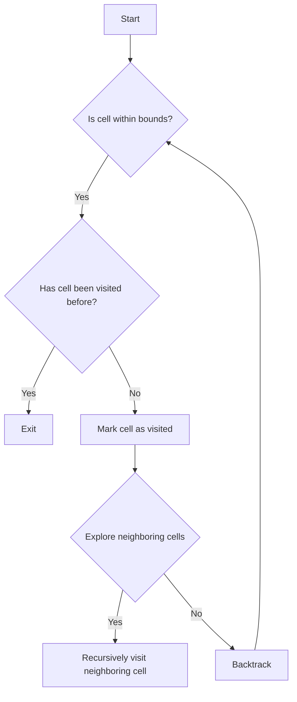

# Pacific Atlantic Water Flow

## Problem Understanding
The Pacific Atlantic Water Flow problem asks us to find all the cells in a given grid that can flow to both the Pacific and Atlantic oceans. The grid represents a map of heights, where each cell can flow to its neighboring cells if the neighboring cell has a higher or equal height. The key constraint is that we need to find cells that can flow to both oceans, which means we need to consider the flow from both the Pacific and Atlantic sides. This problem is non-trivial because a naive approach would involve checking all possible paths from each cell to both oceans, which would result in an exponential time complexity.

## Approach
The algorithm strategy is to use depth-first search (DFS) from both the Pacific and Atlantic sides to identify cells that can flow to both oceans. The intuition behind this approach is that if a cell can flow to the Pacific ocean, it must be reachable from the Pacific side, and similarly, if a cell can flow to the Atlantic ocean, it must be reachable from the Atlantic side. We use two separate sets, `pacificReachable` and `atlanticReachable`, to store the cells that can flow to each ocean. We perform DFS from the Pacific side by starting from the leftmost column and topmost row, and from the Atlantic side by starting from the rightmost column and bottommost row. This approach works because it allows us to efficiently identify the cells that can flow to both oceans by finding the intersection of the two sets.

## Complexity Analysis
| Metric | Value | Detailed Reason |
|--------|-------|----------------|
| Time   | O(m*n) | The time complexity is O(m*n) because we visit each cell once during the DFS traversal from both the Pacific and Atlantic sides. The number of cells is m*n, where m is the number of rows and n is the number of columns. |
| Space  | O(m*n) | The space complexity is O(m*n) because we use two separate sets, `pacificReachable` and `atlanticReachable`, to store the cells that can flow to each ocean. Each set has a maximum size of m*n, which occurs when all cells can flow to both oceans. |

## Algorithm Walkthrough
```
Input: 
[
  [1,2,2,3,5],
  [3,2,3,4,4],
  [2,4,5,3,1],
  [6,7,1,4,5],
  [5,1,1,2,4]
]
Step 1: Initialize pacificReachable and atlanticReachable sets
Step 2: Perform DFS from Pacific side
  - Start from the leftmost column: [0,0], [1,0], [2,0], [3,0], [4,0]
  - Start from the topmost row: [0,0], [0,1], [0,2], [0,3], [0,4]
Step 3: Perform DFS from Atlantic side
  - Start from the rightmost column: [0,4], [1,4], [2,4], [3,4], [4,4]
  - Start from the bottommost row: [4,0], [4,1], [4,2], [4,3], [4,4]
Step 4: Find the intersection of cells that can flow to both oceans
  - [0,4], [1,3], [1,4], [2,2], [3,1], [3,2], [4,0]
Output: 
[
  [0,4],
  [1,3],
  [1,4],
  [2,2],
  [3,1],
  [3,2],
  [4,0]
]
```
## Visual Flow

## Key Insight
> **Tip:** The key insight is to use DFS to identify cells that can flow to both oceans by finding the intersection of the two sets, `pacificReachable` and `atlanticReachable`, which allows us to efficiently solve the problem with a time complexity of O(m*n).

## Edge Cases
- **Empty input**: If the input grid is empty, the algorithm returns an empty list because there are no cells to flow to either ocean.
- **Single element**: If the input grid has only one cell, the algorithm returns a list containing the coordinates of that cell if it can flow to both oceans.
- **Grid with no flow**: If the input grid has no cells that can flow to both oceans, the algorithm returns an empty list.

## Common Mistakes
- **Mistake 1**: Not checking if a cell has been visited before, which can lead to infinite loops. To avoid this, we use a `reachable` set to keep track of visited cells.
- **Mistake 2**: Not exploring neighboring cells with a higher or equal height, which can lead to missing cells that can flow to both oceans. To avoid this, we use a `directions` array to explore all neighboring cells.

## Interview Follow-ups
> **Interview:** These are the exact follow-up questions interviewers ask:
- "What if the input is sorted?" → The algorithm still works with a time complexity of O(m*n) because we need to visit each cell to determine if it can flow to both oceans.
- "Can you do it in O(1) space?" → No, we cannot do it in O(1) space because we need to use two separate sets, `pacificReachable` and `atlanticReachable`, to store the cells that can flow to each ocean, which requires O(m*n) space.
- "What if there are duplicates?" → The algorithm can handle duplicates by using a `reachable` set to keep track of visited cells, which ensures that we do not visit the same cell multiple times.

## Java Solution

```java
// Problem: Pacific Atlantic Water Flow
// Language: Java
// Difficulty: Medium
// Time Complexity: O(m*n) — visiting each cell once
// Space Complexity: O(m*n) — storing visited cells in sets
// Approach: Depth-First Search from both Pacific and Atlantic sides — checking which cells can flow to both oceans

class Solution {
    public List<List<Integer>> pacificAtlantic(int[][] heights) {
        // Get the number of rows and columns
        int rows = heights.length;
        // Edge case: empty input → return empty list
        if (rows == 0) return new ArrayList<>();
        int cols = heights[0].length;
        
        // Initialize sets to store cells that can flow to Pacific and Atlantic
        boolean[][] pacificReachable = new boolean[rows][cols];
        boolean[][] atlanticReachable = new boolean[rows][cols];
        
        // Perform DFS from Pacific side
        for (int i = 0; i < rows; i++) {
            dfs(heights, pacificReachable, i, 0); // Start from the leftmost column
        }
        for (int j = 0; j < cols; j++) {
            dfs(heights, pacificReachable, 0, j); // Start from the topmost row
        }
        
        // Perform DFS from Atlantic side
        for (int i = 0; i < rows; i++) {
            dfs(heights, atlanticReachable, i, cols - 1); // Start from the rightmost column
        }
        for (int j = 0; j < cols; j++) {
            dfs(heights, atlanticReachable, rows - 1, j); // Start from the bottommost row
        }
        
        // Find the intersection of cells that can flow to both oceans
        List<List<Integer>> result = new ArrayList<>();
        for (int i = 0; i < rows; i++) {
            for (int j = 0; j < cols; j++) {
                if (pacificReachable[i][j] && atlanticReachable[i][j]) {
                    result.add(Arrays.asList(i, j)); // Add cell coordinates to the result
                }
            }
        }
        
        return result;
    }
    
    private void dfs(int[][] heights, boolean[][] reachable, int i, int j) {
        // Check if the cell is within bounds and has not been visited before
        if (i < 0 || i >= heights.length || j < 0 || j >= heights[0].length || reachable[i][j]) {
            return; // Exit if the cell is out of bounds or already visited
        }
        
        // Mark the cell as visited
        reachable[i][j] = true;
        
        // Explore neighboring cells with a higher or equal height
        int[][] directions = {{-1, 0}, {1, 0}, {0, -1}, {0, 1}};
        for (int[] direction : directions) {
            int ni = i + direction[0];
            int nj = j + direction[1];
            if (ni >= 0 && ni < heights.length && nj >= 0 && nj < heights[0].length && heights[ni][nj] >= heights[i][j]) {
                dfs(heights, reachable, ni, nj); // Recursively visit the neighboring cell
            }
        }
    }
}
```
