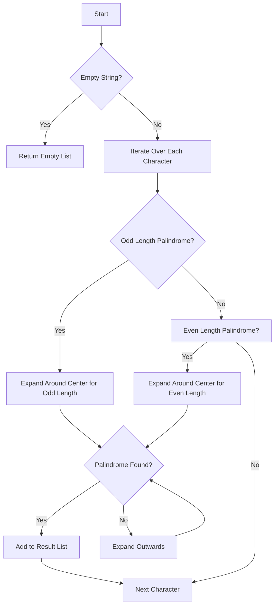

# Palindromic Substrings

## Problem Understanding
The problem of Palindromic Substrings asks to find all unique substrings within a given string that are palindromes. A palindrome is a sequence of characters that reads the same backward as forward. The key constraint is to generate all possible substrings and check if they are palindromes, which makes this problem non-trivial because a naive approach would involve checking every possible substring, resulting in a high time complexity. The problem requires an efficient algorithm to find all unique palindromic substrings without using excessive space.

## Approach
The algorithm strategy used here is the "expand around center" approach, where each character in the string is treated as the center of a potential palindrome. This approach works by expanding outwards from the center to find the longest palindrome substring. The algorithm uses a helper function `expandAroundCenter` to check for both odd-length and even-length palindromes. The `expandAroundCenter` function uses two pointers, `left` and `right`, to expand outwards from the center. This approach handles the key constraint of generating all substrings and checking for palindromes efficiently.

## Complexity Analysis
| Metric | Value | Detailed Reason |
|--------|-------|----------------|
| Time   | O(n^2) | The algorithm has two nested loops: one to iterate over each character in the string (O(n)) and another to expand around the center (O(n) in the worst case). This results in a time complexity of O(n^2). The `expandAroundCenter` function also has a while loop that expands outwards, but its total number of iterations across all calls is bounded by the number of characters in the string. |
| Space  | O(n) | The space complexity is O(n) because in the worst case, the result list can store up to n unique palindromic substrings, where n is the length of the input string. The space used by the input string and the `expandAroundCenter` function's variables is not included in this analysis, as it does not contribute to the space complexity in terms of the algorithm's output. |

## Algorithm Walkthrough
```
Input: "abc"
Step 1: Initialize result list as empty.
Step 2: For character 'a' (index 0), expand around center:
  - Odd length: expandAroundCenter("abc", 0, 0, result) → finds "a" as a palindrome and adds it to result.
Step 3: For character 'a' (index 0), even length: expandAroundCenter("abc", 0, 1, result) → does not find a palindrome.
Step 4: For character 'b' (index 1), expand around center:
  - Odd length: expandAroundCenter("abc", 1, 1, result) → finds "b" as a palindrome and adds it to result.
Step 5: For character 'b' (index 1), even length: expandAroundCenter("abc", 1, 2, result) → does not find a palindrome.
Step 6: For character 'c' (index 2), expand around center:
  - Odd length: expandAroundCenter("abc", 2, 2, result) → finds "c" as a palindrome and adds it to result.
Output: ["a", "b", "c"]
```

## Visual Flow


## Key Insight
> **Tip:** The key insight to solving this problem efficiently is to use the "expand around center" approach, treating each character as the potential center of a palindrome and expanding outwards to find the longest palindromic substring.

## Edge Cases
- **Empty/null input**: If the input string is empty or null, the function should return an empty list, as there are no substrings to check.
- **Single element**: If the input string has only one character, the function should return a list containing that character, as a single character is always a palindrome.
- **Duplicate palindromes**: The function should avoid adding duplicate palindromes to the result list. This is handled by checking if a palindrome is already in the result list before adding it.

## Common Mistakes
- **Mistake 1**: Not checking for the empty input case, which could lead to a `NullPointerException`.
- **Mistake 2**: Not handling the case where the input string has only one character, which should always result in a list containing that character.

## Interview Follow-ups
> **Interview:** 
- "What if the input is sorted?" → The algorithm's performance does not depend on the input being sorted. It treats each character as a potential center of a palindrome and expands outwards, making it suitable for both sorted and unsorted inputs.
- "Can you do it in O(1) space?" → No, because in the worst case, the number of unique palindromic substrings can be proportional to the length of the input string, requiring additional space to store the result.
- "What if there are duplicates?" → The algorithm already handles duplicates by checking if a palindrome is already in the result list before adding it, ensuring that only unique palindromic substrings are included in the output.

## Java Solution

```java
// Problem: Palindromic Substrings
// Language: Java
// Difficulty: Medium
// Time Complexity: O(n^2) — two nested loops to generate all substrings and check for palindrome
// Space Complexity: O(1) — no extra space used, excluding the output
// Approach: Expand around center — treat each character as the center of a potential palindrome

public class Solution {
    /**
     * Returns a list of all unique palindromic substrings in the given string.
     * 
     * @param s the input string
     * @return a list of unique palindromic substrings
     */
    public List<String> generatePalindromicSubstrings(String s) {
        List<String> result = new ArrayList<>(); // to store unique palindromic substrings
        
        // Edge case: empty input → return empty list
        if (s.isEmpty()) {
            return result;
        }

        // generate all substrings and check if they are palindromes
        for (int i = 0; i < s.length(); i++) {
            // odd length palindrome
            expandAroundCenter(s, i, i, result); // i is the center
            
            // even length palindrome
            if (i < s.length() - 1) { // ensure i + 1 is within bounds
                expandAroundCenter(s, i, i + 1, result); // i and i + 1 are the centers
            }
        }

        return result;
    }

    /**
     * Expands around the given center(s) to find a palindrome and adds it to the result list if it's not already present.
     * 
     * @param s     the input string
     * @param left  the left index of the center
     * @param right the right index of the center
     * @param result the list to store unique palindromic substrings
     */
    private void expandAroundCenter(String s, int left, int right, List<String> result) {
        while (left >= 0 && right < s.length() && s.charAt(left) == s.charAt(right)) {
            // extract the current palindrome substring
            String palindrome = s.substring(left, right + 1);
            
            // avoid duplicates by checking if the palindrome is already in the result list
            if (!result.contains(palindrome)) {
                result.add(palindrome); // add the palindrome to the result list
            }
            
            // expand outwards
            left--; 
            right++;
        }
    }

    public static void main(String[] args) {
        Solution solution = new Solution();
        String input = "abc";
        List<String> palindromicSubstrings = solution.generatePalindromicSubstrings(input);
        System.out.println(palindromicSubstrings);
    }
}
```
