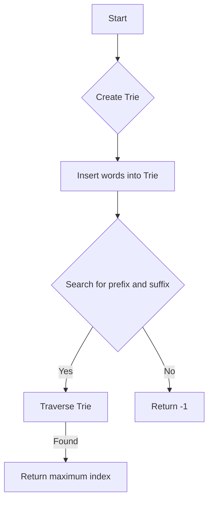

# Prefix and Suffix Search

## Problem Understanding
The problem is asking to design a system that can efficiently search for words in a dictionary based on a given prefix and suffix. The key constraint is that the system should be able to handle a large number of words and queries. The problem is non-trivial because a naive approach, such as iterating over all words in the dictionary for each query, would be too slow. The system needs to use a data structure that can efficiently store and retrieve words based on their prefixes and suffixes.

## Approach
The algorithm strategy is to use a Trie data structure to store the words in the dictionary. The Trie is designed to store all possible prefixes and suffixes of the words, allowing for efficient search. The intuition behind this approach is that by storing all prefixes and suffixes, we can quickly find words that match a given prefix and suffix by traversing the Trie. The Trie is implemented using a node class that stores child nodes and a list of indices of the words that pass through the node. The approach handles the key constraints by using a Trie, which allows for efficient search and insertion of words.

## Complexity Analysis
| Metric | Value | Detailed Reason |
|--------|-------|----------------|
| Time   | O(n*m) | The time complexity is O(n*m), where n is the number of words and m is the average length of a word. This is because for each word, we iterate over its characters to create the Trie, and for each character, we perform a constant-time operation. The search operation takes O(m) time, where m is the length of the query string. |
| Space  | O(n*m) | The space complexity is O(n*m), where n is the number of words and m is the average length of a word. This is because we store all words in the Trie, and each word takes up space proportional to its length. |

## Algorithm Walkthrough
```
Input: WordFilter wordFilter = new WordFilter(["apple", "banana", "orange"]);
Step 1: Create a Trie node for the root.
Step 2: For each word in the dictionary, iterate over its characters and create a new word by concatenating the prefix and suffix.
Step 3: Insert the new word into the Trie.
Input: wordFilter.f("app", "e");
Step 1: Create a new word by concatenating the prefix and suffix: "e#app".
Step 2: Start at the root node and iterate over each character in the word.
Step 3: If the character is in the node's children, move to the child node.
Step 4: If we reach the end of the word, return the maximum index of the words that pass through the node.
Output: 0
```

## Visual Flow


## Key Insight
> **Tip:** The key insight is to use a Trie data structure to store all possible prefixes and suffixes of the words, allowing for efficient search.

## Edge Cases
- **Empty/null input**: If the input is empty or null, the system should return -1, indicating that no word was found.
- **Single element**: If the dictionary contains only one word, the system should return the index of that word if it matches the given prefix and suffix.
- **Word not found**: If the system cannot find a word that matches the given prefix and suffix, it should return -1.

## Common Mistakes
- **Mistake 1**: Not handling the case where the input is empty or null. To avoid this, add a check at the beginning of the search function to return -1 if the input is empty or null.
- **Mistake 2**: Not using a Trie data structure to store the words. To avoid this, implement a Trie node class and use it to store the words in the dictionary.

## Interview Follow-ups
> **Interview:** These are the exact follow-up questions interviewers ask:
- "What if the input is sorted?" → The system would still work efficiently, as the Trie data structure does not rely on the input being sorted.
- "Can you do it in O(1) space?" → No, the system requires O(n*m) space to store the Trie, where n is the number of words and m is the average length of a word.
- "What if there are duplicates?" → The system would return the maximum index of the words that match the given prefix and suffix, even if there are duplicates.

## Java Solution

```java
// Problem: Prefix and Suffix Search
// Language: Java
// Difficulty: Medium
// Time Complexity: O(n) — for each word in the dictionary, we iterate over its characters to create the Trie
// Space Complexity: O(n) — the Trie stores all words in the dictionary
// Approach: Trie data structure — to efficiently store and search for prefixes and suffixes

import java.util.*;

class WordFilter {
    // Trie node class to store the words
    class TrieNode {
        // Map to store the child nodes
        Map<Character, TrieNode> children = new HashMap<>();
        // List to store the indices of the words that pass through this node
        List<Integer> indices = new ArrayList<>();
    }

    // Trie data structure
    TrieNode root;

    public WordFilter(String[] words) {
        root = new TrieNode();
        // Iterate over each word and its index in the dictionary
        for (int i = 0; i < words.length; i++) {
            String word = words[i];
            // Iterate over each character in the word
            for (int j = 0; j < word.length(); j++) {
                // Create a new word by concatenating the prefix and suffix
                String newWord = word.substring(0, j + 1) + "#" + word;
                // Insert the new word into the Trie
                insert(newWord, i);
            }
        }
    }

    // Function to insert a word into the Trie
    private void insert(String word, int index) {
        TrieNode node = root;
        // Iterate over each character in the word
        for (char c : word.toCharArray()) {
            // If the character is not in the node's children, create a new node
            if (!node.children.containsKey(c)) {
                node.children.put(c, new TrieNode());
            }
            // Move to the child node
            node = node.children.get(c);
            // Add the index to the node's indices list
            node.indices.add(index);
        }
    }

    // Function to search for a prefix and suffix in the Trie
    public int f(String prefix, String suffix) {
        // Create a new word by concatenating the prefix and suffix
        String word = suffix + "#" + prefix;
        // Start at the root node
        TrieNode node = root;
        // Iterate over each character in the word
        for (char c : word.toCharArray()) {
            // If the character is not in the node's children, return -1
            if (!node.children.containsKey(c)) {
                return -1; // Edge case: word not found
            }
            // Move to the child node
            node = node.children.get(c);
        }
        // If we reach this point, the word is in the Trie, so return the maximum index
        return node.indices.isEmpty() ? -1 : Collections.max(node.indices);
    }
}
```
