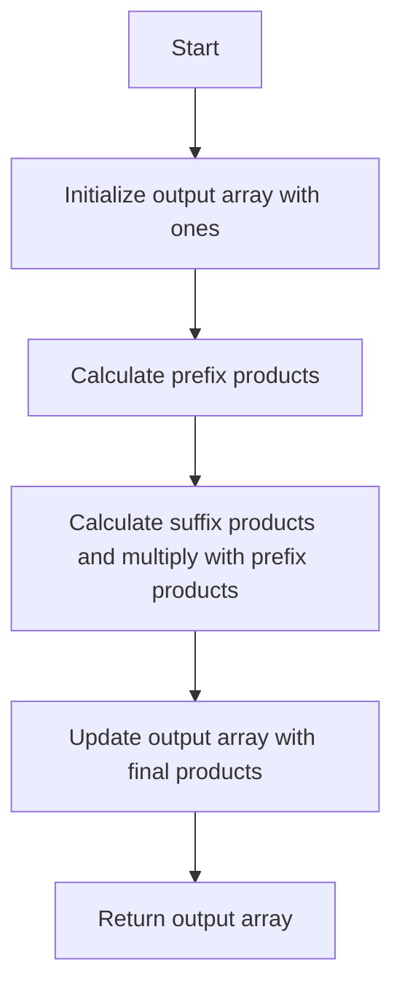

# Product of Array Except Self

## Problem Understanding
The problem asks for an array where each element at index i is the product of all numbers in the input array except the one at i. The key constraint is that the solution should be achieved with a time complexity of O(n) and a space complexity of O(1), excluding the output array. The problem is non-trivial because a naive approach, such as calculating the product of all numbers except the current one for each index, would result in a time complexity of O(n^2), which is inefficient. The given solution code achieves the required time and space complexities using a prefix and suffix product calculation approach.

## Approach
The algorithm strategy used is to calculate the prefix and suffix products for each index in the input array. The prefix product for an index is the product of all numbers to the left of that index, and the suffix product is the product of all numbers to the right of that index. The final product for each index is the product of its prefix and suffix products. This approach works because it avoids the need to recalculate the product of all numbers except the current one for each index, reducing the time complexity to O(n). The solution uses an output array to store the prefix products and a variable to store the suffix product, which is updated iteratively.

## Complexity Analysis
| Metric | Value | Detailed Reason |
|--------|-------|----------------|
| Time   | O(n)  | The solution makes two passes through the input array: one to calculate the prefix products and another to calculate the suffix products. Each pass takes O(n) time, resulting in a total time complexity of O(n). |
| Space  | O(1)  | Excluding the output array, the solution uses a constant amount of space to store the suffix product variable and other variables. The output array is not included in the space complexity calculation as per the problem statement. |

## Algorithm Walkthrough
```
Input: [1, 2, 3, 4]
Step 1: Initialize output array with ones: [1, 1, 1, 1]
Step 2: Calculate prefix products:
  - output[0] = 1 (prefix product for first element is 1)
  - output[1] = output[0] * nums[0] = 1 * 1 = 1
  - output[2] = output[1] * nums[1] = 1 * 2 = 2
  - output[3] = output[2] * nums[2] = 2 * 3 = 6
  Output array after prefix product calculation: [1, 1, 2, 6]
Step 3: Calculate suffix products and multiply with prefix products:
  - suffixProduct = 1 (suffix product for last element is 1)
  - output[3] *= suffixProduct = 6 * 1 = 6
  - suffixProduct *= nums[3] = 1 * 4 = 4
  - output[2] *= suffixProduct = 2 * 4 = 8
  - suffixProduct *= nums[2] = 4 * 3 = 12
  - output[1] *= suffixProduct = 1 * 12 = 12
  - suffixProduct *= nums[1] = 12 * 2 = 24
  - output[0] *= suffixProduct = 1 * 24 = 24
  Final output array: [24, 12, 8, 6]
Output: [24, 12, 8, 6]
```
## Visual Flow

## Key Insight
> **Tip:** The key insight is to calculate the prefix and suffix products separately and then multiply them to get the final product for each index, avoiding the need for redundant calculations and reducing the time complexity to O(n).

## Edge Cases
- **Empty/null input**: If the input array is empty or null, the solution throws an exception, as there is no valid output for an empty input.
- **Single element**: If the input array has only one element, the solution returns an array with a single element, which is 1, since the product of all numbers except the current one is 1.
- **Input array with zeros**: If the input array contains zeros, the solution correctly calculates the product of all numbers except the current one by treating zeros as any other number. However, if there are multiple zeros in the input array, the product of all numbers except the current one will be zero for all indices except those where the current number is zero.

## Common Mistakes
- **Mistake 1**: Not initializing the output array with ones, which is necessary for the prefix product calculation. → To avoid this mistake, ensure that the output array is initialized with ones before calculating the prefix products.
- **Mistake 2**: Not updating the suffix product variable correctly, which can lead to incorrect results. → To avoid this mistake, ensure that the suffix product variable is updated correctly after calculating the product for each index.

## Interview Follow-ups
> **Interview:** These are the exact follow-up questions interviewers ask:
- "What if the input is sorted?" → The solution still works correctly, as the prefix and suffix product calculations are independent of the input order.
- "Can you do it in O(1) space?" → No, the solution requires O(1) space excluding the output array, but it is not possible to do it in O(1) space including the output array, as we need to store the output for each index.
- "What if there are duplicates?" → The solution correctly handles duplicates, as the prefix and suffix product calculations treat duplicates as any other number.

## Java Solution

```java
// Problem: Product of Array Except Self
// Language: Java
// Difficulty: Medium
// Time Complexity: O(n) — two passes through array to calculate prefix and suffix products
// Space Complexity: O(1) — excluding output array, only using constant space
// Approach: Prefix and suffix product calculation — calculate products of all numbers to the left and right of each index

public class Solution {
    /**
     * Returns an array where each element at index i is the product of all numbers in the input array except the one at i.
     * 
     * @param nums Input array of integers.
     * @return Array of products.
     */
    public int[] productExceptSelf(int[] nums) {
        // Edge case: empty input → throw exception
        if (nums == null || nums.length == 0) {
            throw new IllegalArgumentException("Input array is empty");
        }

        // Edge case: input array with one element → return array with one element (which is 1)
        if (nums.length == 1) {
            return new int[] {1};
        }

        // Initialize output array with ones
        int[] output = new int[nums.length];

        // Calculate prefix products (product of all numbers to the left of each index)
        output[0] = 1; // prefix product for first element is 1
        for (int i = 1; i < nums.length; i++) {
            // prefix product for current element is prefix product of previous element times the previous element
            output[i] = output[i - 1] * nums[i - 1];
        }

        // Calculate suffix products (product of all numbers to the right of each index) and multiply with prefix products
        int suffixProduct = 1; // suffix product for last element is 1
        for (int i = nums.length - 1; i >= 0; i--) {
            // update output array with product of prefix and suffix products for current element
            output[i] *= suffixProduct;
            // update suffix product for next element
            suffixProduct *= nums[i];
        }

        return output;
    }

    public static void main(String[] args) {
        Solution solution = new Solution();
        int[] nums = {1, 2, 3, 4};
        int[] result = solution.productExceptSelf(nums);
        // Print result
        for (int num : result) {
            System.out.print(num + " ");
        }
    }
}
```
