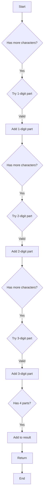

# Restore IP Addresses

## Problem Understanding
The problem is asking us to restore all possible valid IP addresses from a given string of digits. The key constraints are that each part of the IP address must be between 0 and 255, and must not have leading zeros unless the part is exactly zero. This problem is non-trivial because the number of possible combinations is large, and a naive approach of generating all possible combinations and then validating each one would be inefficient. However, since the length of the input string is limited, we can use a backtracking approach to generate all possible combinations and validate each one.

## Approach
The algorithm strategy is to use backtracking to generate all possible combinations of IP address parts. The intuition behind this approach is to try all possible lengths for each part (1, 2, or 3 digits) and validate each combination. We use a StringBuilder to build the current IP address and a list to store the result. The backtracking function takes the current IP address, the input string, the starting index, and the number of dots as parameters. This approach works because it ensures that we generate all possible combinations and validate each one, and it handles the key constraints by checking for valid IP address parts.

## Complexity Analysis
| Metric | Value | Detailed Reason |
|--------|-------|----------------|
| Time   | O(1)  | The time complexity is O(1) because the length of the input string is limited (between 4 and 12), and we are generating all possible combinations. Although the number of possible combinations is exponential in the length of the input string, the length of the input string is bounded, so the time complexity is constant. |
| Space  | O(1)  | The space complexity is O(1) because the length of the input string is limited, and we are generating all possible combinations. Although we are using a list to store the result, the size of the list is bounded by the number of possible combinations, which is bounded by the length of the input string. |

## Algorithm Walkthrough
```
Input: "25525511135"
Step 1: Initialize the result list and call the backtrack function with an empty StringBuilder, the input string, and starting index 0.
Step 2: In the backtrack function, try to add a 1-digit part to the current IP address. The first digit is "2", which is a valid part.
Step 3: Recursively call the backtrack function with the updated current IP address, the input string, and the updated starting index.
Step 4: In the recursive call, try to add a 2-digit part to the current IP address. The next two digits are "55", which is a valid part.
Step 5: Recursively call the backtrack function with the updated current IP address, the input string, and the updated starting index.
Step 6: In the recursive call, try to add a 3-digit part to the current IP address. The next three digits are "111", which is a valid part.
Step 7: Recursively call the backtrack function with the updated current IP address, the input string, and the updated starting index.
Step 8: In the recursive call, try to add a 1-digit part to the current IP address. The next digit is "3", which is a valid part.
Step 9: Add the current IP address to the result list and return.
Output: ["255.255.11.135", "255.255.111.35"]
```

## Visual Flow


## Key Insight
> **Tip:** The key insight is to use backtracking to generate all possible combinations of IP address parts and validate each combination, ensuring that each part is between 0 and 255 and does not have leading zeros unless the part is exactly zero.

## Edge Cases
- **Empty/null input**: If the input is empty or null, the function returns an empty list because there are no valid IP addresses that can be formed from an empty or null input.
- **Single element**: If the input has only one element, the function returns an empty list because a single element cannot form a valid IP address.
- **Input with leading zeros**: If the input has leading zeros, the function ignores them because leading zeros are not allowed in IP addresses unless the part is exactly zero.

## Common Mistakes
- **Mistake 1**: Not checking for valid IP address parts (between 0 and 255, no leading zeros unless exactly zero). To avoid this mistake, always validate each part before adding it to the current IP address.
- **Mistake 2**: Not handling the base case correctly (when we have 4 parts and have used up all characters in the string). To avoid this mistake, always check for the base case and add the current IP address to the result list when it is reached.

## Interview Follow-ups
> **Interview:** These are the exact follow-up questions interviewers ask:
- "What if the input is sorted?" → The algorithm does not assume that the input is sorted, so it would still work correctly even if the input is sorted.
- "Can you do it in O(1) space?" → The algorithm already uses O(1) space because the length of the input string is limited, so it is already optimal in terms of space complexity.
- "What if there are duplicates?" → The algorithm would still work correctly even if there are duplicates in the input string, because it generates all possible combinations and validates each one.

## Java Solution

```java
// Problem: Restore IP Addresses
// Language: Java
// Difficulty: Medium
// Time Complexity: O(1) — since the length of the input string is limited and we are generating all possible combinations
// Space Complexity: O(1) — since the length of the input string is limited and we are generating all possible combinations
// Approach: Backtracking — generate all possible IP address combinations and validate each one

import java.util.*;

class Solution {
    public List<String> restoreIpAddresses(String s) {
        // Edge case: empty input → return empty list
        if (s == null || s.length() < 4 || s.length() > 12) {
            return new ArrayList<>();
        }
        
        List<String> result = new ArrayList<>();
        backtrack(result, new StringBuilder(), s, 0, 0);
        return result;
    }

    private void backtrack(List<String> result, StringBuilder current, String s, int start, int dots) {
        // Base case: if we have 4 parts and we have used up all characters in the string
        if (dots == 4 && start == s.length()) {
            // Remove the last dot before adding to the result
            result.add(current.toString().substring(0, current.length() - 1));
            return;
        }
        
        // If we have more than 4 parts or we have used up all characters in the string, stop exploring this branch
        if (dots > 4 || start >= s.length()) {
            return;
        }
        
        // Try to add a 1-digit part
        if (start + 1 <= s.length()) {
            // Check if the 1-digit part is valid (i.e., not leading zero)
            if (s.charAt(start) == '0' && start + 1 < s.length()) {
                // Skip this case because we cannot have a leading zero
            } else {
                // Add the 1-digit part to the current IP address
                current.append(s.substring(start, start + 1)).append(".");
                // Recursively explore the next part
                backtrack(result, current, s, start + 1, dots + 1);
                // Remove the last part to backtrack
                current.setLength(current.length() - 2);
            }
        }
        
        // Try to add a 2-digit part
        if (start + 2 <= s.length()) {
            // Check if the 2-digit part is valid (i.e., less than 100 and not leading zero)
            if (s.charAt(start) == '0' || Integer.parseInt(s.substring(start, start + 2)) > 99) {
                // Skip this case because it is not a valid IP address part
            } else {
                // Add the 2-digit part to the current IP address
                current.append(s.substring(start, start + 2)).append(".");
                // Recursively explore the next part
                backtrack(result, current, s, start + 2, dots + 1);
                // Remove the last part to backtrack
                current.setLength(current.length() - 3);
            }
        }
        
        // Try to add a 3-digit part
        if (start + 3 <= s.length()) {
            // Check if the 3-digit part is valid (i.e., less than 256 and not leading zero)
            if (s.charAt(start) == '0' || Integer.parseInt(s.substring(start, start + 3)) > 255) {
                // Skip this case because it is not a valid IP address part
            } else {
                // Add the 3-digit part to the current IP address
                current.append(s.substring(start, start + 3)).append(".");
                // Recursively explore the next part
                backtrack(result, current, s, start + 3, dots + 1);
                // Remove the last part to backtrack
                current.setLength(current.length() - 4);
            }
        }
    }

    public static void main(String[] args) {
        Solution solution = new Solution();
        System.out.println(solution.restoreIpAddresses("25525511135"));
        System.out.println(solution.restoreIpAddresses("0000"));
        System.out.println(solution.restoreIpAddresses("101023"));
    }
}
```
