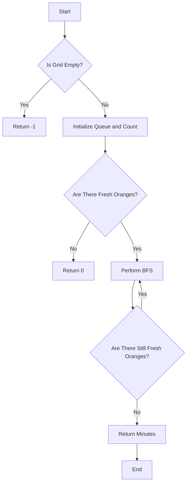

# Rotting Oranges

## Problem Understanding
The problem involves a grid of oranges where each cell can be either a fresh orange (1), a rotting orange (2), or empty (0). The task is to determine the minimum number of minutes until no fresh oranges are left, assuming that a rotting orange can rot its adjacent fresh oranges. The key constraint is that the rotting process only occurs between adjacent cells, which implies a need for a localized, iterative approach. This problem is non-trivial because a naive approach, such as trying all possible combinations of rotting oranges, would be computationally expensive due to the exponential number of possibilities.

## Approach
The algorithm strategy employed here is a Breadth-First Search (BFS) traversal with the aid of a queue. The intuition behind this approach is to utilize the queue to keep track of rotting oranges and then systematically check their neighbors to simulate the spread of rot. This approach works because BFS allows for the exploration of all cells at a given distance (i.e., time step) before moving on to the next level, which aligns with the requirement of tracking the minimum number of minutes. The use of a queue to store rotting oranges and their positions enables efficient management of the spread process. By iterating through the grid and updating the queue accordingly, this approach handles the key constraint of localized rotting efficiently.

## Complexity Analysis
| Metric | Value | Detailed Reason |
|--------|-------|----------------|
| Time   | O(n*m) | The algorithm performs a constant amount of work for each cell in the grid, where n is the number of rows and m is the number of columns. This includes initializing the queue and then performing BFS, which visits each cell at most once. |
| Space  | O(n*m) | The space complexity is due to the queue that stores at most n*m elements in the worst case, where every cell in the grid is a rotting orange. |

## Algorithm Walkthrough
```
Input: 
[
  [2, 1, 1],
  [1, 1, 0],
  [0, 1, 1]
]
Step 1: Initialize queue with rotting oranges and count fresh oranges
- Queue: [(0,0)]
- Fresh count: 5
Step 2: Perform BFS for the first level
- Dequeue (0,0), explore neighbors
  - (0,1) is fresh, rot it and enqueue: [(0,1)]
  - (0,2) is fresh, rot it and enqueue: [(0,1), (0,2)]
  - (1,0) is fresh, rot it and enqueue: [(0,1), (0,2), (1,0)]
- Fresh count: 2
- Minutes: 1
Step 3: Perform BFS for the next level
- Dequeue (0,1), explore neighbors
  - (1,1) is fresh, rot it and enqueue: [(0,2), (1,0), (1,1)]
- Dequeue (0,2), explore neighbors
  - No fresh neighbors
- Dequeue (1,0), explore neighbors
  - No fresh neighbors
- Fresh count: 1
- Minutes: 2
...
Output: 4
```
This walkthrough demonstrates how the algorithm iteratively updates the grid and the queue to track the spread of rotting oranges and calculate the minimum number of minutes until all fresh oranges are rotten.

## Visual Flow

This flowchart illustrates the main decision paths of the algorithm, including handling edge cases and the iterative BFS process.

## Key Insight
> **Tip:** The key to solving this problem efficiently is recognizing that BFS is the perfect algorithm for simulating the spread of rotting oranges, as it naturally handles the exploration of neighbors in a level-by-level manner, which corresponds to the passage of time.

## Edge Cases
- **Empty/null input**: If the input grid is empty or null, the algorithm returns -1, as there are no oranges to consider.
- **Single element**: If the grid contains a single element, the algorithm behaves as expected, returning 0 if the element is not a fresh orange or -1 if it's an empty cell, highlighting the importance of initial condition checks.
- **No fresh oranges**: If there are no fresh oranges in the grid, the algorithm returns 0, as there are no oranges to rot, demonstrating the handling of a specific boundary condition.

## Common Mistakes
- **Mistake 1**: Not properly initializing the queue with all rotting oranges before starting the BFS traversal. To avoid this, ensure that the initial iteration over the grid enqueues all rotting oranges.
- **Mistake 2**: Failing to decrement the fresh orange count when an orange is rotten. This can be avoided by including the decrement operation within the loop that checks and updates neighbors.

## Interview Follow-ups
> **Interview:** 
- "What if the input is sorted?" → The sorting of the input grid does not affect the algorithm's performance or correctness since the BFS traversal is based on the spatial relationships between cells, not their values.
- "Can you do it in O(1) space?" → Achieving O(1) space complexity is not feasible with the standard BFS approach, as it requires a queue to store the cells to be processed. However, one might explore in-place algorithms or those that utilize the input grid itself as additional space, though such approaches would likely be highly complex and unconventional.
- "What if there are duplicates?" → The presence of duplicate values (e.g., multiple rotting oranges in the same position) does not affect the algorithm's logic, as each cell is processed based on its current state and position, not its value's uniqueness.

## Java Solution

```java
// Problem: Rotting Oranges
// Language: Java
// Difficulty: Medium
// Time Complexity: O(n*m) — BFS traversal of the grid
// Space Complexity: O(n*m) — queue stores at most n*m elements
// Approach: BFS traversal with queue — for each cell, check its neighbors

import java.util.LinkedList;
import java.util.Queue;

public class Solution {
    public int orangesRotting(int[][] grid) {
        // Edge case: empty grid → return -1
        if (grid == null || grid.length == 0) return -1;

        int rows = grid.length;
        int cols = grid[0].length;
        int freshCount = 0; // count of fresh oranges
        Queue<int[]> queue = new LinkedList<>(); // queue to store rotting oranges

        // Initialize queue with rotting oranges and count fresh oranges
        for (int i = 0; i < rows; i++) {
            for (int j = 0; j < cols; j++) {
                if (grid[i][j] == 2) { // rotting orange
                    queue.offer(new int[] {i, j}); // add to queue
                } else if (grid[i][j] == 1) { // fresh orange
                    freshCount++;
                }
            }
        }

        // Edge case: no fresh oranges → return 0
        if (freshCount == 0) return 0;

        int minutes = 0; // minutes passed
        int[][] directions = {{-1, 0}, {1, 0}, {0, -1}, {0, 1}}; // possible directions

        while (!queue.isEmpty() && freshCount > 0) {
            int size = queue.size(); // size of the current level
            for (int i = 0; i < size; i++) {
                int[] current = queue.poll(); // dequeue current orange
                int x = current[0];
                int y = current[1];

                // Check all neighbors of the current orange
                for (int[] direction : directions) {
                    int newX = x + direction[0];
                    int newY = y + direction[1];

                    // Check if the neighbor is within bounds and is a fresh orange
                    if (newX >= 0 && newX < rows && newY >= 0 && newY < cols && grid[newX][newY] == 1) {
                        grid[newX][newY] = 2; // rot the neighbor
                        queue.offer(new int[] {newX, newY}); // add to queue
                        freshCount--; // decrement fresh count
                    }
                }
            }
            minutes++; // increment minutes
        }

        // Edge case: not all fresh oranges are rotten → return -1
        if (freshCount > 0) return -1;

        return minutes;
    }

    public static void main(String[] args) {
        Solution solution = new Solution();
        int[][] grid = {{2, 1, 1}, {1, 1, 0}, {0, 1, 1}};
        System.out.println(solution.orangesRotting(grid));
    }
}
```
