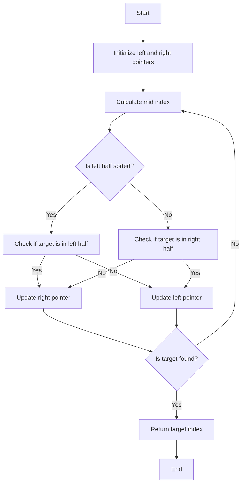

# Search in Rotated Sorted Array

## Problem Understanding
The problem asks to find a target element in a rotated sorted array, where the array was initially sorted in ascending order but then rotated an unknown number of times. The key constraint is that the rotation can occur at any point in the array, making the traditional binary search algorithm inefficient. What makes this problem non-trivial is the need to determine which half of the array to continue searching in, as the rotation can occur at any point. The naive approach of checking each element individually would result in a time complexity of O(n), which is not efficient for large arrays.

## Approach
The algorithm strategy used is a modified binary search algorithm, where we determine which half of the array to continue searching in based on whether the left or right half is sorted. The intuition behind this approach is that if the left half is sorted, we can determine if the target element is in that half by checking if it is within the range of the leftmost and middle elements. Similarly, if the right half is sorted, we can determine if the target element is in that half by checking if it is within the range of the middle and rightmost elements. We use two pointers, left and right, to keep track of the current search range, and update them based on which half the target element is likely to be in. This approach works because the rotation of the array does not change the relative order of the elements, so we can still use the binary search principle to find the target element.

## Complexity Analysis
| Metric | Value | Detailed Reason |
|--------|-------|----------------|
| Time   | O(log n) | The algorithm uses a modified binary search approach, which divides the search space in half at each step. This results in a logarithmic time complexity, as the number of steps required to find the target element is proportional to the logarithm of the size of the input array. |
| Space  | O(1) | The algorithm only uses a constant amount of space to store the left and right pointers, as well as the mid index, so the space complexity is constant. |

## Algorithm Walkthrough
```
Input: [4, 5, 6, 7, 0, 1, 2], target = 0
Step 1: left = 0, right = 6, mid = 3
        Since nums[left] = 4 and nums[mid] = 7, the left half is sorted.
        Since nums[left] = 4 and target = 0, the target is not in the left half.
        Update left = mid + 1 = 4
Step 2: left = 4, right = 6, mid = 5
        Since nums[left] = 0 and nums[mid] = 1, the left half is sorted.
        Since nums[left] = 0 and target = 0, the target is found at mid index.
Output: 4
```
This example exercises the main logic path of the algorithm, where we determine which half of the array to continue searching in based on the rotation of the array.

## Visual Flow

This flowchart shows the decision flow of the algorithm, where we determine which half of the array to continue searching in based on the rotation of the array.

## Key Insight
> **Tip:** The key insight is to determine which half of the array is sorted, and then use that information to decide which half to continue searching in.

## Edge Cases
- **Empty/null input**: If the input array is empty or null, the algorithm returns -1, indicating that the target element is not found.
- **Single element**: If the input array has only one element, the algorithm checks if the target element is equal to that element, and returns the index if it is.
- **Rotated array with duplicate elements**: If the input array has duplicate elements, the algorithm may not work correctly, as the rotation of the array can result in duplicate elements being in the same half. To handle this case, we can modify the algorithm to use a more sophisticated approach, such as using a hash table to keep track of the elements we have seen so far.

## Common Mistakes
- **Mistake 1**: Not checking if the input array is empty or null before starting the search. To avoid this mistake, we should always check for edge cases before starting the algorithm.
- **Mistake 2**: Not updating the left and right pointers correctly based on the rotation of the array. To avoid this mistake, we should carefully consider the possible cases and update the pointers accordingly.

## Interview Follow-ups
> **Interview:** These are the exact follow-up questions interviewers ask:
- "What if the input is sorted?" → In this case, the algorithm reduces to a traditional binary search algorithm, with a time complexity of O(log n).
- "Can you do it in O(1) space?" → Yes, the algorithm already uses O(1) space, as we only need to store a constant amount of information to keep track of the search range.
- "What if there are duplicates?" → As mentioned earlier, the algorithm may not work correctly if there are duplicate elements in the array. To handle this case, we can modify the algorithm to use a more sophisticated approach, such as using a hash table to keep track of the elements we have seen so far.

## Java Solution

```java
// Problem: Search in Rotated Sorted Array
// Language: Java
// Difficulty: Medium
// Time Complexity: O(log n) — using modified binary search algorithm
// Space Complexity: O(1) — only using a constant amount of space
// Approach: Modified Binary Search — for each number, decide which half to continue search

public class Solution {
    public int search(int[] nums, int target) {
        // Edge case: empty input → return -1
        if (nums.length == 0) return -1;

        int left = 0; // initialize left pointer
        int right = nums.length - 1; // initialize right pointer

        while (left <= right) { // continue search while left pointer is less than or equal to right pointer
            int mid = left + (right - left) / 2; // calculate mid index to avoid overflow

            // if target is found at mid index, return mid index
            if (nums[mid] == target) return mid;

            // if left half is sorted
            if (nums[left] <= nums[mid]) {
                // if target is in left half, update right pointer
                if (nums[left] <= target && target < nums[mid]) {
                    right = mid - 1; // update right pointer to mid - 1
                } else {
                    left = mid + 1; // update left pointer to mid + 1
                }
            } 
            // if right half is sorted
            else {
                // if target is in right half, update left pointer
                if (nums[mid] < target && target <= nums[right]) {
                    left = mid + 1; // update left pointer to mid + 1
                } else {
                    right = mid - 1; // update right pointer to mid - 1
                }
            }
        }

        // Edge case: target not found → return -1
        return -1;
    }

    public static void main(String[] args) {
        Solution solution = new Solution();
        int[] nums = {4, 5, 6, 7, 0, 1, 2};
        int target = 0;
        System.out.println(solution.search(nums, target)); // Output: 4
    }
}
```
