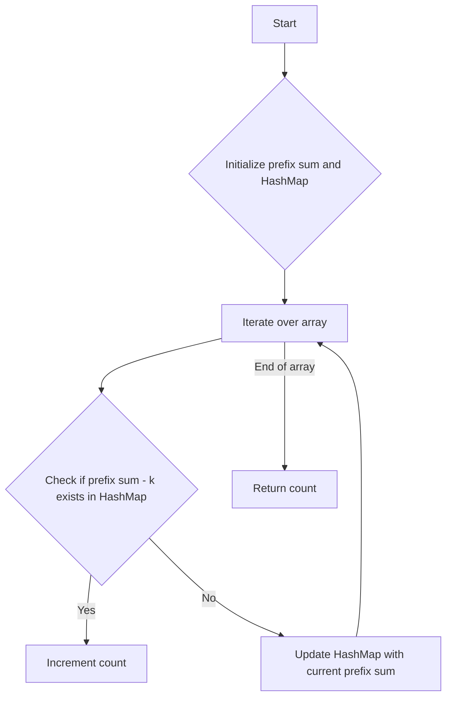

# Subarray Sum Equals K

## Problem Understanding
The problem is asking to find the number of contiguous subarrays in a given array that sum up to a specific target value `k`. The key constraint is that the subarrays must be contiguous, meaning that the elements must be next to each other in the original array. This problem is non-trivial because a naive approach, such as checking every possible subarray, would have a time complexity of O(n^2), which is inefficient for large inputs. The problem requires a more efficient algorithm that can take advantage of the properties of prefix sums.

## Approach
The algorithm strategy is to use a prefix sum approach with a HashMap to store the prefix sums and their counts. The intuition behind this approach is that if a prefix sum minus `k` exists in the HashMap, it means that there is a subarray that sums up to `k` ending at the current position. The HashMap is used to store the prefix sums and their counts, allowing us to efficiently look up the count of prefix sums that are equal to the current prefix sum minus `k`. This approach works because it allows us to avoid recalculating the sum of subarrays and instead focus on the differences between prefix sums.

## Complexity Analysis
| Metric | Value | Detailed Reason |
|--------|-------|----------------|
| Time   | O(n)  | The algorithm makes a single pass through the array, and each operation (HashMap lookup and update) takes constant time. |
| Space  | O(n)  | The HashMap stores at most n elements, where n is the length of the input array. In the worst-case scenario, every prefix sum is unique, resulting in a HashMap with n elements. |

## Algorithm Walkthrough
```
Input: [1, 1, 1], k = 2
Step 1: Initialize prefix sum = 0, count = 0, and HashMap with {0: 1}
Step 2: Iterate over the array:
  - num = 1, prefix sum = 1, HashMap = {0: 1, 1: 1}
  - num = 1, prefix sum = 2, HashMap = {0: 1, 1: 1, 2: 1}, count += 1 (because prefix sum - k = 0 exists in HashMap)
  - num = 1, prefix sum = 3, HashMap = {0: 1, 1: 1, 2: 1, 3: 1}, count += 1 (because prefix sum - k = 1 exists in HashMap)
Output: count = 2
```
## Visual Flow

## Key Insight
> **Tip:** The key insight is to use a HashMap to store prefix sums and their counts, allowing for efficient lookup and update of prefix sums that are equal to the current prefix sum minus `k`.

## Edge Cases
- **Empty/null input**: The algorithm handles this case implicitly, as the loop will not execute and the count will remain 0.
- **Single element**: The algorithm handles this case correctly, as it will check if the single element is equal to `k` and update the count accordingly.
- **All elements are equal to `k`**: The algorithm handles this case correctly, as it will increment the count for each element that is equal to `k`.

## Common Mistakes
- **Mistake 1**: Using a naive approach that checks every possible subarray, resulting in a time complexity of O(n^2). To avoid this, use a prefix sum approach with a HashMap.
- **Mistake 2**: Not initializing the HashMap with a count of 1 for the prefix sum 0, which is necessary to handle cases where the sum equals `k`. To avoid this, initialize the HashMap with {0: 1}.

## Interview Follow-ups
> **Interview:** 
- "What if the input is sorted?" → The algorithm will still work correctly, as it only relies on the prefix sums and their counts, not on the order of the elements.
- "Can you do it in O(1) space?" → No, the algorithm requires O(n) space to store the HashMap, which is necessary to efficiently look up and update prefix sums.
- "What if there are duplicates?" → The algorithm will handle duplicates correctly, as it uses a HashMap to store the counts of prefix sums, which allows for efficient lookup and update of duplicate prefix sums.

## Java Solution

```java
// Problem: Subarray Sum Equals K
// Language: java
// Difficulty: Medium
// Time Complexity: O(n) — single pass through array using HashMap
// Space Complexity: O(n) — HashMap stores at most n elements
// Approach: Prefix sum with HashMap — for each prefix sum, check if its difference with k exists

public class Solution {
    public int subarraySum(int[] nums, int k) {
        // Initialize count of subarrays with sum k
        int count = 0;
        
        // Initialize prefix sum
        int prefixSum = 0;
        
        // Initialize HashMap to store prefix sums and their counts
        java.util.HashMap<Integer, Integer> prefixSumMap = new java.util.HashMap<>();
        
        // Initialize count of prefix sum 0 to 1 (for cases where sum equals k)
        prefixSumMap.put(0, 1); // Base case: sum equals 0
        
        // Iterate over the array
        for (int num : nums) {
            // Update prefix sum
            prefixSum += num; // Add current number to prefix sum
            
            // Check if prefix sum minus k exists in HashMap
            if (prefixSumMap.containsKey(prefixSum - k)) {
                // If it exists, increment count by the number of times it appears
                count += prefixSumMap.get(prefixSum - k); // Increment count
            }
            
            // Update count of current prefix sum in HashMap
            prefixSumMap.put(prefixSum, prefixSumMap.getOrDefault(prefixSum, 0) + 1); // Update count
        }
        
        // Edge case: empty input → return 0
        // This case is handled implicitly, as the loop will not execute and count will remain 0
        
        return count;
    }

    public static void main(String[] args) {
        Solution solution = new Solution();
        int[] nums = {1, 1, 1};
        int k = 2;
        System.out.println(solution.subarraySum(nums, k));  // Output: 2
    }
}
```
