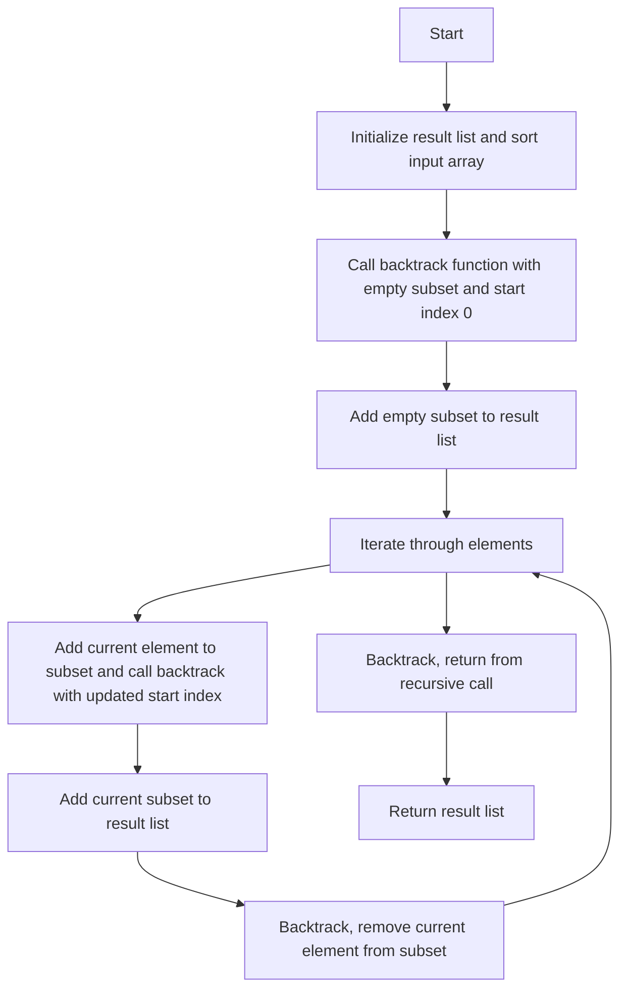

# Subsets

## Problem Understanding
The problem asks to generate all possible subsets of a given set of integers. The key constraint is that the input can be any array of integers, and the solution should handle empty or null inputs. What makes this problem non-trivial is the exponential number of subsets (2^n) that need to be generated, making a naive approach (e.g., using nested loops) impractical. The problem also requires the subsets to be in lexicographic order, which adds an additional layer of complexity.

## Approach
The algorithm strategy used here is backtracking recursive subset generation. The intuition behind it is to explore all possible branches of subset generation by including or excluding each element from the subset. This approach works because it systematically generates all possible combinations of elements, ensuring that no subset is missed. The data structure used is a list of lists, where each inner list represents a subset. The approach handles key constraints by sorting the input array to ensure lexicographic ordering and by using a recursive helper function to generate subsets.

## Complexity Analysis
| Metric | Value | Detailed Reason |
|--------|-------|----------------|
| Time   | O(2^n) | The algorithm generates all possible subsets, which is 2^n for n elements. Each recursive call branches into two paths (include or exclude the current element), resulting in an exponential time complexity. |
| Space  | O(2^n) | The algorithm stores all generated subsets in the result list, which requires O(2^n) space. The recursive call stack also uses O(n) space in the worst case, but it is dominated by the space required to store the subsets. |

## Algorithm Walkthrough
```
Input: [1, 2, 3]
Step 1: Initialize result list and sort input array: [1, 2, 3]
Step 2: Call backtrack function with empty subset and start index 0
  - Add empty subset to result list: [[]]
  - Iterate through elements: 
    - Add 1 to subset: [1], call backtrack with start index 1
      - Add [1] to result list: [[], [1]]
      - Iterate through remaining elements: 
        - Add 2 to subset: [1, 2], call backtrack with start index 2
          - Add [1, 2] to result list: [[], [1], [1, 2]]
          - Iterate through remaining elements: 
            - Add 3 to subset: [1, 2, 3], call backtrack with start index 3
              - Add [1, 2, 3] to result list: [[], [1], [1, 2], [1, 2, 3]]
            - Backtrack, remove 3 from subset: [1, 2]
          - Backtrack, remove 2 from subset: [1]
        - Add 3 to subset: [1, 3], call backtrack with start index 3
          - Add [1, 3] to result list: [[], [1], [1, 2], [1, 2, 3], [1, 3]]
        - Backtrack, remove 3 from subset: [1]
      - Backtrack, remove 2 from subset: []
    - Add 2 to subset: [2], call backtrack with start index 2
      - Add [2] to result list: [[], [1], [1, 2], [1, 2, 3], [1, 3], [2]]
      - Iterate through remaining elements: 
        - Add 3 to subset: [2, 3], call backtrack with start index 3
          - Add [2, 3] to result list: [[], [1], [1, 2], [1, 2, 3], [1, 3], [2], [2, 3]]
        - Backtrack, remove 3 from subset: [2]
      - Backtrack, remove 2 from subset: []
    - Add 3 to subset: [3], call backtrack with start index 3
      - Add [3] to result list: [[], [1], [1, 2], [1, 2, 3], [1, 3], [2], [2, 3], [3]]
Output: [[], [1], [1, 2], [1, 2, 3], [1, 3], [2], [2, 3], [3]]
```

## Visual Flow


## Key Insight
> **Tip:** The key insight here is that by using a recursive backtracking approach, we can systematically generate all possible subsets of the input array, ensuring that no subset is missed and that the subsets are in lexicographic order.

## Edge Cases
- **Empty/null input**: If the input array is empty or null, the algorithm returns a result list containing an empty subset. This is because the empty subset is a valid subset of an empty set.
- **Single element**: If the input array contains only one element, the algorithm returns a result list containing two subsets: the empty subset and a subset containing the single element.
- **Duplicate elements**: If the input array contains duplicate elements, the algorithm may generate duplicate subsets. To avoid this, the algorithm sorts the input array to ensure that duplicate elements are adjacent, and then skips duplicate elements during the backtracking process.

## Common Mistakes
- **Mistake 1**: Not sorting the input array before generating subsets, which can result in subsets that are not in lexicographic order. To avoid this, always sort the input array before generating subsets.
- **Mistake 2**: Not using a recursive backtracking approach, which can result in missed subsets or incorrect subset generation. To avoid this, use a recursive backtracking approach to systematically generate all possible subsets.

## Interview Follow-ups
> **Interview:** These are the exact follow-up questions interviewers ask:
- "What if the input is sorted?" → The algorithm still works correctly, but it can be optimized by avoiding the sorting step.
- "Can you do it in O(1) space?" → No, it is not possible to generate all subsets of an input array in O(1) space, because the output size is exponential in the input size.
- "What if there are duplicates?" → The algorithm can be modified to skip duplicate elements during the backtracking process, ensuring that duplicate subsets are not generated.

## Java Solution

```java
// Problem: Subsets
// Language: Java
// Difficulty: Medium
// Time Complexity: O(2^n) — generating all possible subsets of n elements
// Space Complexity: O(2^n) — storing all subsets of n elements
// Approach: Backtracking recursive subset generation — for each element, include or exclude it from the subset

import java.util.*;

public class Solution {
    public List<List<Integer>> subsets(int[] nums) {
        // Initialize result list to store all subsets
        List<List<Integer>> result = new ArrayList<>();
        
        // Edge case: empty input → return empty result list
        if (nums == null || nums.length == 0) {
            result.add(new ArrayList<>()); // include empty subset for empty input
            return result;
        }
        
        // Sort the input array for consistent subset ordering
        Arrays.sort(nums); // sorting to ensure subsets are in lexicographic order
        
        // Call recursive helper function to generate all subsets
        backtrack(result, new ArrayList<>(), nums, 0);
        
        return result;
    }
    
    private void backtrack(List<List<Integer>> result, List<Integer> current, int[] nums, int start) {
        // Add the current subset to the result list
        result.add(new ArrayList<>(current)); // create a copy to avoid modifying the original subset
        
        // Iterate through the remaining elements to generate more subsets
        for (int i = start; i < nums.length; i++) {
            // Add the current element to the subset
            current.add(nums[i]); // include the current element in the subset
            
            // Recursively generate subsets with the current element
            backtrack(result, current, nums, i + 1); // exclude duplicates by starting from i + 1
            
            // Remove the current element to backtrack and explore other branches
            current.remove(current.size() - 1); // remove the last added element to backtrack
        }
    }
}
```
