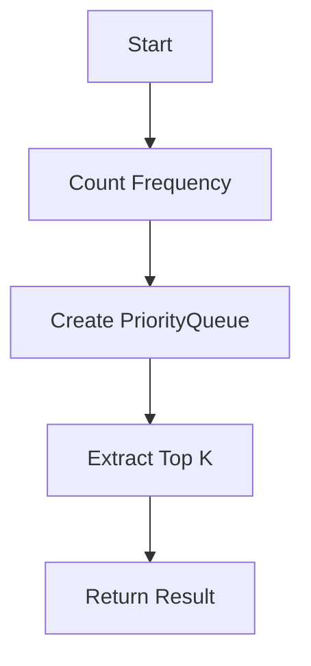

# Top K Frequent Elements

## Problem Understanding
The Top K Frequent Elements problem asks to find the k most frequent elements in an array of integers. The key constraint is that the input array can be large, and we need to find the top k elements efficiently. The problem becomes non-trivial because a naive approach, such as sorting the array and then counting the frequency of each element, would have a high time complexity. Additionally, the problem requires handling edge cases such as an empty input array or an array with a single element.

## Approach
The algorithm strategy used here is a combination of a HashMap to count the frequency of each element and a PriorityQueue to find the top k frequent elements. The intuition behind this approach is to first count the frequency of each element using a HashMap, which has an average time complexity of O(1) for insertions and lookups. Then, we use a PriorityQueue to store the top k frequent elements, where the priority is based on the frequency of each element. This approach works because the PriorityQueue automatically orders the elements based on their frequency, and we can extract the top k elements in O(n log k) time complexity. The HashMap and PriorityQueue data structures are chosen because they provide efficient insertion, lookup, and ordering operations.

## Complexity Analysis
| Metric | Value | Detailed Reason |
|--------|-------|----------------|
| Time   | O(n log k) | The time complexity is dominated by the PriorityQueue operations. We first iterate over the input array to count the frequency of each element, which takes O(n) time. Then, we add all elements to the PriorityQueue, which takes O(n log n) time in the worst case. However, since we only need to extract the top k elements, the time complexity reduces to O(n log k). |
| Space  | O(n) | The space complexity is dominated by the HashMap, which stores the frequency of each element. In the worst case, if all elements are unique, the HashMap will store n elements, resulting in a space complexity of O(n). The PriorityQueue also stores at most n elements, but its space complexity is also bounded by O(n). |

## Algorithm Walkthrough
```
Input: nums = [1, 1, 1, 2, 2, 3], k = 2
Step 1: Create a HashMap to count the frequency of each element
    frequencyMap = {1: 3, 2: 2, 3: 1}
Step 2: Create a PriorityQueue to store the top k frequent elements
    queue = [(1, 3), (2, 2), (3, 1)]
Step 3: Extract the top k elements from the queue
    result = [1, 2]
Output: [1, 2]
```
In this example, we first count the frequency of each element using a HashMap. Then, we create a PriorityQueue to store the top k frequent elements. Finally, we extract the top k elements from the queue and return the result.

## Visual Flow

This flowchart shows the main steps of the algorithm: counting the frequency of each element, creating a PriorityQueue, extracting the top k elements, and returning the result.

## Key Insight
> **Tip:** The key insight is to use a PriorityQueue to automatically order the elements based on their frequency, allowing us to extract the top k elements efficiently.

## Edge Cases
- **Empty/null input**: If the input array is empty or null, we return an empty array. This is because there are no elements to process, and the result is undefined.
- **Single element**: If the input array contains a single element, we return an array containing that element. This is because the single element is the most frequent element by default.
- **All elements have the same frequency**: If all elements have the same frequency, we return any k elements. This is because the problem does not specify a tiebreaker, and any k elements are valid.

## Common Mistakes
- **Mistake 1**: Not handling the edge case of an empty input array. To avoid this, we need to check for null or empty input and return an empty array.
- **Mistake 2**: Not using a PriorityQueue to order the elements based on their frequency. To avoid this, we need to use a PriorityQueue with a custom comparator that orders elements based on their frequency.

## Interview Follow-ups
> **Interview:** These are the exact follow-up questions interviewers ask:
- "What if the input is sorted?" → The algorithm still works, but the time complexity remains O(n log k) because we need to count the frequency of each element and extract the top k elements.
- "Can you do it in O(1) space?" → No, we cannot do it in O(1) space because we need to store the frequency of each element and the top k elements.
- "What if there are duplicates?" → The algorithm handles duplicates correctly because we count the frequency of each element using a HashMap. If there are duplicates, they will be counted correctly, and the top k elements will be extracted correctly.

## Java Solution

```java
// Problem: Top K Frequent Elements
// Language: Java
// Difficulty: Medium
// Time Complexity: O(n log k) — using PriorityQueue to store top k frequent elements
// Space Complexity: O(n) — HashMap stores frequency of each element and PriorityQueue stores top k elements
// Approach: HashMap frequency count and PriorityQueue — for each element, count frequency and use PriorityQueue to find top k

import java.util.*;

public class Solution {
    public int[] topKFrequent(int[] nums, int k) {
        // Edge case: empty input → return empty array
        if (nums == null || nums.length == 0) {
            return new int[0];
        }

        // Count frequency of each element
        Map<Integer, Integer> frequencyMap = new HashMap<>();
        for (int num : nums) {
            // For each number, increment its frequency count in the map
            frequencyMap.put(num, frequencyMap.getOrDefault(num, 0) + 1);
        }

        // Use PriorityQueue to store top k frequent elements
        PriorityQueue<Map.Entry<Integer, Integer>> queue = new PriorityQueue<>(
            // Comparator to compare entries based on frequency in descending order
            (a, b) -> b.getValue() - a.getValue()
        );
        queue.addAll(frequencyMap.entrySet());

        // Extract top k elements from the queue
        int[] result = new int[k];
        for (int i = 0; i < k; i++) {
            // Remove the top element from the queue and add it to the result array
            result[i] = queue.poll().getKey();
        }

        return result;
    }

    public static void main(String[] args) {
        Solution solution = new Solution();
        int[] nums = {1, 1, 1, 2, 2, 3};
        int k = 2;
        int[] result = solution.topKFrequent(nums, k);
        System.out.println("Top K Frequent Elements: ");
        for (int num : result) {
            System.out.print(num + " ");
        }
    }
}
```
