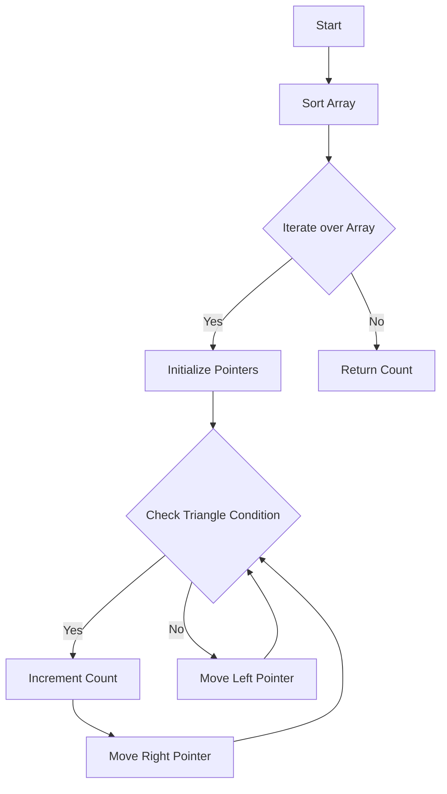

# Triangle

## Problem Understanding
The problem is asking to find the number of valid triangles that can be formed from a given array of integers, where a valid triangle is one where the sum of the lengths of any two sides is greater than the length of the third side. The key constraint is that the array may contain duplicate values, and the solution must be able to handle this. What makes this problem non-trivial is that a naive approach would involve checking all possible combinations of three numbers in the array, which would result in a time complexity of O(n^3), making it inefficient for large inputs.

## Approach
The algorithm strategy used here is sorting and two-pointer technique. The array is first sorted in ascending order, and then for each element in the array, two pointers are used to find all pairs of numbers that can form a triangle with the current element. The intuition behind this approach is that if the sum of the two smallest sides is greater than the largest side, then all pairs of numbers between the two pointers will also form a triangle. This approach works because the array is sorted, ensuring that the two smallest sides are always on the left. The data structure used is an array, which is modified in-place, and two pointers, which are used to traverse the array.

## Complexity Analysis
| Metric | Value | Detailed Reason |
|--------|-------|----------------|
| Time   | O(n^2) | The outer loop iterates over the array, and the inner while loop also iterates up to n times in the worst case. The sorting operation takes O(n log n) time, but it is dominated by the O(n^2) time complexity of the two nested loops. |
| Space  | O(1)  | No extra space is used, as the input array is modified in-place and only a constant amount of space is used to store the pointers and the count. |

## Algorithm Walkthrough
```
Input: [2, 2, 3, 4]
Step 1: Sort the array in ascending order → [2, 2, 3, 4]
Step 2: Initialize count to 0 and iterate over the array starting from the third element (index 2)
Step 3: For the element at index 2 (value 3), initialize two pointers, left at index 0 and right at index 1
Step 4: Check if the sum of the two smallest sides (2 + 2) is greater than the largest side (3) → yes
Step 5: Increment the count by the difference between the two pointers (1) → count = 1
Step 6: Move the right pointer to the left → right = 0
Step 7: Repeat steps 4-6 until the two pointers meet
Step 8: For the element at index 3 (value 4), initialize two pointers, left at index 0 and right at index 2
Step 9: Check if the sum of the two smallest sides (2 + 2) is greater than the largest side (4) → yes
Step 10: Increment the count by the difference between the two pointers (2) → count = 3
Output: 3
```

## Visual Flow


## Key Insight
> **Tip:** The key insight here is that if the sum of the two smallest sides is greater than the largest side, then all pairs of numbers between the two pointers will also form a triangle, allowing us to increment the count by the difference between the two pointers.

## Edge Cases
- **Empty/null input**: If the input array is empty or null, the function will return 0, as no triangles can be formed.
- **Single element**: If the input array contains only one element, the function will return 0, as no triangles can be formed.
- **Duplicate values**: If the input array contains duplicate values, the function will still work correctly, as the sorting step will group duplicate values together, and the two-pointer technique will handle them correctly.

## Common Mistakes
- **Mistake 1**: Not handling the case where the input array contains duplicate values. → To avoid this, make sure to test the function with input arrays containing duplicate values.
- **Mistake 2**: Not sorting the array before iterating over it. → To avoid this, make sure to include the sorting step in the function.

## Interview Follow-ups
> **Interview:** These are the exact follow-up questions interviewers ask:
- "What if the input is sorted?" → In that case, the time complexity would still be O(n^2), as the two-pointer technique would still be used to find all pairs of numbers that can form a triangle.
- "Can you do it in O(1) space?" → No, it's not possible to solve this problem in O(1) space, as the input array needs to be sorted, which requires O(n log n) time and O(1) space in the best case.
- "What if there are duplicates?" → The function will still work correctly, as the sorting step will group duplicate values together, and the two-pointer technique will handle them correctly.

## Java Solution

```java
// Problem: Triangle
// Language: Java
// Difficulty: Medium
// Time Complexity: O(n^2) — two nested loops to check all possible triangles
// Space Complexity: O(1) — no extra space used, only modifying input array
// Approach: Sorting and two-pointer technique — sort the array and check if the sum of the two smallest sides is greater than the largest side

public class Solution {
    public int triangleNumber(int[] nums) {
        // Edge case: empty input → return 0
        if (nums.length < 3) return 0;

        // Sort the array in ascending order
        Arrays.sort(nums); // This is done to ensure the two smallest sides are always on the left

        int count = 0; // Initialize count of triangles

        // Iterate over the array
        for (int i = 2; i < nums.length; i++) {
            // Initialize two pointers, one at the start and one at the second element
            int left = 0, right = i - 1;

            // Continue the loop until the two pointers meet
            while (left < right) {
                // Check if the sum of the two smallest sides is greater than the largest side
                if (nums[left] + nums[right] > nums[i]) {
                    // If it is, increment the count by the difference between the two pointers
                    // This is because all pairs (left, j) where j > right will also form a triangle
                    count += right - left; 
                    right--; // Move the right pointer to the left
                } else {
                    left++; // Move the left pointer to the right
                }
            }
        }

        return count; // Return the total count of triangles
    }
}
```
