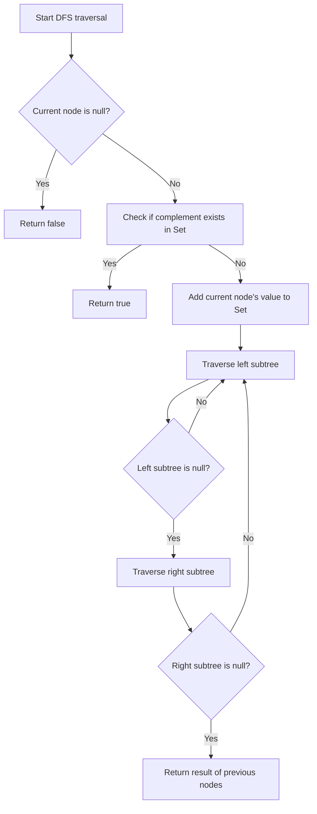

# Two Sum IV - Input is a BST

## Problem Understanding
The problem is asking to find if there exist two nodes in a Binary Search Tree (BST) that add up to a given target sum `k`. The key constraint is that the input is a BST, which means for any node, all elements in its left subtree are smaller, and all elements in its right subtree are larger. This makes the problem non-trivial because a naive approach would be to check every pair of nodes, resulting in a time complexity of O(n^2). However, leveraging the properties of a BST allows for a more efficient solution.

## Approach
The algorithm strategy is to use a Set to store the values of the nodes as we traverse the BST. For each node, we check if its complement (the value needed to reach the target sum `k`) exists in the Set. If it does, we return true. If not, we add the current node's value to the Set and continue traversing. This approach works because the Set allows for efficient lookup of complements, and the BST property ensures that we can efficiently traverse the tree. The Set data structure is chosen because it provides constant time complexity for both insertion and lookup operations, which is crucial for achieving an overall time complexity of O(n).

## Complexity Analysis
| Metric | Value | Detailed Reason |
|--------|-------|----------------|
| Time   | O(n)  | We visit each node in the BST once, and for each node, we perform a constant time lookup in the Set. The depth-first search (DFS) traversal of the BST takes O(n) time, where n is the number of nodes in the tree. |
| Space  | O(n)  | In the worst case, the Set stores at most n elements, where n is the number of nodes in the BST. This occurs when the BST is skewed to one side, essentially becoming a linked list. |

## Algorithm Walkthrough
```
Input: 
      5
     / \
    3   6
   / \   \
  2   4   7
Target sum k = 9

Step 1: Start DFS traversal from the root node (5)
  - Create a Set values = {}
  - Check if complement of 5 (4) exists in values: No
  - Add 5 to values: values = {5}
  - Traverse left subtree

Step 2: Traverse left subtree of 5
  - Current node is 3
  - Check if complement of 3 (6) exists in values: No
  - Add 3 to values: values = {5, 3}
  - Traverse left subtree of 3

Step 3: Traverse left subtree of 3
  - Current node is 2
  - Check if complement of 2 (7) exists in values: No
  - Add 2 to values: values = {5, 3, 2}
  - Traverse right subtree of 3

Step 4: Traverse right subtree of 3
  - Current node is 4
  - Check if complement of 4 (5) exists in values: Yes
  - Return true because the sum of 4 and 5 equals the target sum k = 9

Output: true
```
This walkthrough illustrates how the algorithm efficiently finds two nodes in the BST that add up to the target sum.

## Visual Flow

This flowchart represents the decision-making process and the traversal of the BST.

## Key Insight
> **Tip:** The key to solving this problem efficiently is to leverage the properties of a BST and use a Set for fast lookup of complements, allowing the algorithm to scale linearly with the size of the input tree.

## Edge Cases
- **Empty/null input**: If the input BST is null or empty, the algorithm will correctly return false because there are no nodes to consider.
- **Single element**: If the BST contains only one node, the algorithm will return false unless the target sum `k` is twice the value of that node, in which case it will return true.
- **Unbalanced BST**: If the BST is highly unbalanced (essentially a linked list), the algorithm still works correctly but may use more space in the Set for storing node values, leading to a space complexity of O(n).

## Common Mistakes
- **Mistake 1**: Not leveraging the BST property, leading to an inefficient solution that checks every pair of nodes. → **Avoidance**: Use the BST property to guide the traversal and complement lookup.
- **Mistake 2**: Using a data structure other than a Set for storing node values, which could lead to slower lookup times. → **Avoidance**: Choose a data structure like a Set that provides constant time complexity for both insertion and lookup operations.

## Interview Follow-ups
> **Interview:** These are the exact follow-up questions interviewers ask:
- "What if the input is sorted?" → The input is already a BST, which is a sorted data structure. The algorithm takes advantage of this property.
- "Can you do it in O(1) space?" → No, because we need to store the values of the nodes we've seen so far, which requires at least O(n) space in the worst case.
- "What if there are duplicates?" → The algorithm will still work correctly because it checks for the existence of a complement in the Set, regardless of whether there are duplicate values in the BST.

## Java Solution

```java
// Problem: Two Sum IV - Input is a BST
// Language: Java
// Difficulty: Medium
// Time Complexity: O(n) — we visit each node in the BST once using Set
// Space Complexity: O(n) — Set stores at most n elements
// Approach: Set complement lookup — for each node, check if its complement exists

import java.util.*;

class Solution {
    public boolean findTarget(TreeNode root, int k) {
        // Create a Set to store the values of the nodes we've seen so far
        Set<Integer> values = new HashSet<>();
        
        // Perform an in-order traversal of the BST
        return dfs(root, k, values);
    }
    
    private boolean dfs(TreeNode node, int k, Set<Integer> values) {
        // Edge case: if the node is null, return false
        if (node == null) return false;
        
        // Check if the complement of the current node's value exists in the Set
        if (values.contains(k - node.val)) return true;
        
        // Add the current node's value to the Set
        values.add(node.val);
        
        // Recursively search the left and right subtrees
        return dfs(node.left, k, values) || dfs(node.right, k, values);
    }
}

class TreeNode {
    int val;
    TreeNode left;
    TreeNode right;
    TreeNode() {}
    TreeNode(int val) { this.val = val; }
    TreeNode(int val, TreeNode left, TreeNode right) {
        this.val = val;
        this.left = left;
        this.right = right;
    }
}
```
