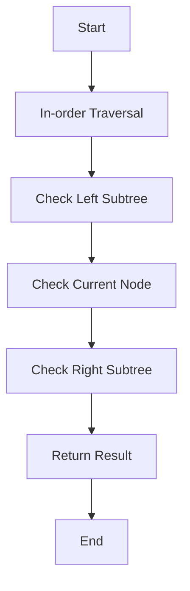

# Validate Binary Search Tree

## Problem Understanding
The problem asks us to validate whether a given binary tree is a Binary Search Tree (BST) or not. A BST is a binary tree where for each node, all elements in its left subtree are less than the node, and all elements in its right subtree are greater than the node. The key constraint here is that the tree must satisfy the BST property for all nodes. What makes this problem non-trivial is that a naive approach, such as checking each node's value against its children, would not be sufficient to guarantee the BST property for the entire tree.

## Approach
The algorithm strategy used here is an in-order traversal of the binary tree, which visits nodes in ascending order if the tree is a valid BST. The intuition behind this approach is that if the tree is a valid BST, the in-order traversal will yield a sorted sequence of node values. We use a recursive in-order traversal function to visit each node in the tree, checking if the current node's value is within the valid range. The `prev` variable is used to keep track of the previous node's value, allowing us to check if the current node's value is greater than the previous one. This approach handles the key constraint by ensuring that each node's value is within the valid range.

## Complexity Analysis
| Metric | Value | Detailed Reason |
|--------|-------|----------------|
| Time   | O(n)  | The in-order traversal visits each node in the tree once, resulting in a time complexity of O(n), where n is the number of nodes in the tree. The recursive calls do not add to the time complexity since each node is visited only once. |
| Space  | O(n)  | The space complexity is O(n) due to the recursion stack, which can go up to n levels in the worst case, such as when the input tree is skewed to one side. The `prev` variable uses constant space, so it does not affect the overall space complexity. |

## Algorithm Walkthrough
```
Input: 
     2
    / \
   1   3

Step 1: Start with the root node (2) and recursively call inOrderTraversal on its left child (1)
State: prev = null

Step 2: Recursively call inOrderTraversal on the left child of node 1 (null)
State: prev = null

Step 3: Since the left child of node 1 is null, return true and update prev to 1
State: prev = 1

Step 4: Recursively call inOrderTraversal on the right child of node 1 (null)
State: prev = 1, return true

Step 5: Return to node 2, check if its value (2) is greater than prev (1), update prev to 2
State: prev = 2

Step 6: Recursively call inOrderTraversal on the right child of node 2 (3)
State: prev = 2

Step 7: Recursively call inOrderTraversal on the left child of node 3 (null)
State: prev = 2

Step 8: Since the left child of node 3 is null, return true and update prev to 3
State: prev = 3

Step 9: Recursively call inOrderTraversal on the right child of node 3 (null)
State: prev = 3, return true

Step 10: Return to node 3, check if its value (3) is greater than prev (2), update prev to 3
State: prev = 3, return true

Output: true (the input tree is a valid BST)
```

## Visual Flow


## Key Insight
> **Tip:** The key insight here is that an in-order traversal of a valid BST will always yield a sorted sequence of node values, allowing us to validate the tree by checking if the sequence is sorted.

## Edge Cases
- **Empty/null input**: If the input tree is empty (i.e., the root is null), the function returns true, since an empty tree is considered a valid BST.
- **Single element**: If the input tree has only one node, the function returns true, since a single-node tree is a valid BST.
- **Duplicate values**: If the input tree contains duplicate values, the function returns false, since a valid BST cannot have duplicate values.

## Common Mistakes
- **Mistake 1: Not checking for duplicate values**: Failing to check for duplicate values can lead to incorrect results, as a valid BST cannot have duplicate values. To avoid this, always check if the current node's value is greater than the previous node's value.
- **Mistake 2: Not handling edge cases**: Not handling edge cases, such as an empty input tree or a single-node tree, can lead to incorrect results. To avoid this, always check for these edge cases and return the correct result.

## Interview Follow-ups
> **Interview:** These are the exact follow-up questions interviewers ask:
- "What if the input is sorted?" → The algorithm will still work correctly, as the in-order traversal will yield a sorted sequence of node values, which is the expected result for a valid BST.
- "Can you do it in O(1) space?" → No, the algorithm requires O(n) space due to the recursion stack, which can go up to n levels in the worst case. However, we can use an iterative approach to reduce the space complexity to O(h), where h is the height of the tree.
- "What if there are duplicates?" → The algorithm will return false, as a valid BST cannot have duplicate values. To handle duplicates, we can modify the algorithm to allow for duplicate values, but this would require additional logic and potentially affect the time and space complexity.

## Java Solution

```java
// Problem: Validate Binary Search Tree
// Language: Java
// Difficulty: Medium
// Time Complexity: O(n) — in-order traversal visits each node once
// Space Complexity: O(n) — in the worst case, the recursion stack can go up to n levels
// Approach: In-order traversal validation — checks if the in-order traversal of the tree is sorted

public class Solution {
    private Long prev = null; // Initialize previous node value to null

    public boolean isValidBST(TreeNode root) {
        // Edge case: empty tree is a valid BST
        if (root == null) return true;

        // Perform in-order traversal and check if the tree is a valid BST
        return inOrderTraversal(root);
    }

    private boolean inOrderTraversal(TreeNode node) {
        // Base case: empty subtree is a valid BST
        if (node == null) return true;

        // Recursively traverse the left subtree
        if (!inOrderTraversal(node.left)) return false; // If the left subtree is not a valid BST, return false

        // Check if the current node's value is within the valid range
        if (prev != null && node.val <= prev) return false; // If the current node's value is not greater than the previous node's value, return false
        prev = (long) node.val; // Update the previous node's value

        // Recursively traverse the right subtree
        return inOrderTraversal(node.right);
    }

    // Definition for a binary tree node.
    public static class TreeNode {
        int val;
        TreeNode left;
        TreeNode right;
        TreeNode() {}
        TreeNode(int val) { this.val = val; }
        TreeNode(int val, TreeNode left, TreeNode right) {
            this.val = val;
            this.left = left;
            this.right = right;
        }
    }
}
```
